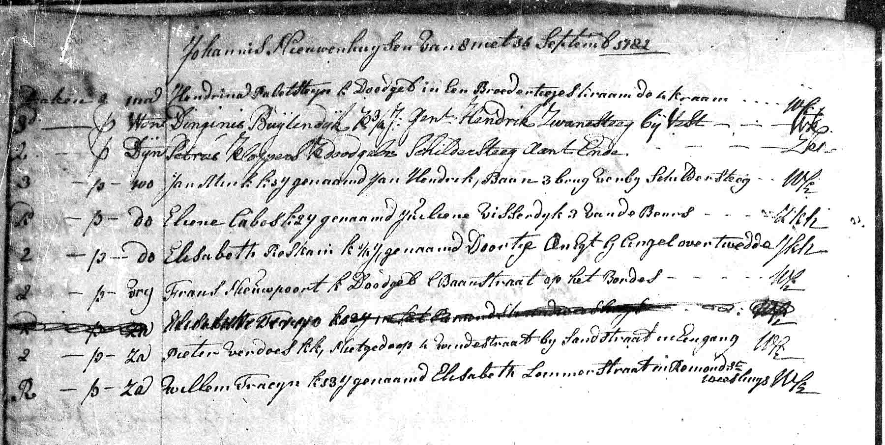

# Burials in Rotterdam (1782-1784)

## Burial of Justine (1782)

{ loading=lazy }

*September 12, 1782 - Burial of Justine*

---

### Document Information

| Field | Value |
|------|------|
| **Document Type** | DTB Rotterdam Begraven |
| **Date** | September 12, 1782 |
| **Deceased** | Justine Cabos |
| **Age** | approx. 2 years |
| **Parents** | Etienne Cabos and Maria Justine Siercken |

### Description

On **September 12, 1782**, little Justine was buried - just under two years after her birth on September 4, 1780. High child mortality was a tragic normality in the 18th century.

---

## Burial of Marie Christine (1784)

{ loading=lazy }

*"overledene was 5 1/4 jaar; Visserdijk Galanteriwinkel"*

*In June 1784, Marie Christine died in Rotterdam (5 1/4 years old). Entry for Christine in the burial register, DTB Rotterdam Begraven.*

---

### Document Information

| Field | Value |
|------|------|
| **Document Type** | DTB Rotterdam Begraven |
| **Date** | June 1784 |
| **Deceased** | Marie Christine Cabos |
| **Age** | 5 1/4 years |
| **Residence** | Vissersdijk, Haberdashery Shop |

### Transcription

> *"overledene was 5 1/4 jaar; Visserdijk Galanteriwinkel"*

**Translation:**
*"The deceased was 5 1/4 years old; Vissersdijk, Haberdashery Shop"*

### Description

In June 1784, the Cabos family suffered a heavy blow: **Marie Christine**, only 5 1/4 years old, died. She had been born in Stettin (ca. 1779) and experienced the move to Rotterdam as a small child.

The sober entry in the burial register notes the family's address: **Vissersdijk, Haberdashery Shop** - an indication that the family was still operating their business at this time.

---

## The Tragedy of Child Loss

Within two years, the Cabos family lost two children:

| Child | Birth | Death | Age |
|------|--------|-----|-------|
| Justine | Sept. 4, 1780 | Sept. 12, 1782 | approx. 2 years |
| Marie Christine | ca. 1779 | June 1784 | 5 1/4 years |

### Child Mortality in the 18th Century

High child mortality was one of the great tragedies of the era. Approximately one-third of all children died before their fifth birthday. Common causes of death included:

- Infectious diseases (measles, smallpox, scarlet fever)
- Diarrheal diseases
- Pneumonia
- Malnutrition

The loss of children was part of the sad reality of many families - including the Cabos family.

---

[← Back to Overview](index.md)
