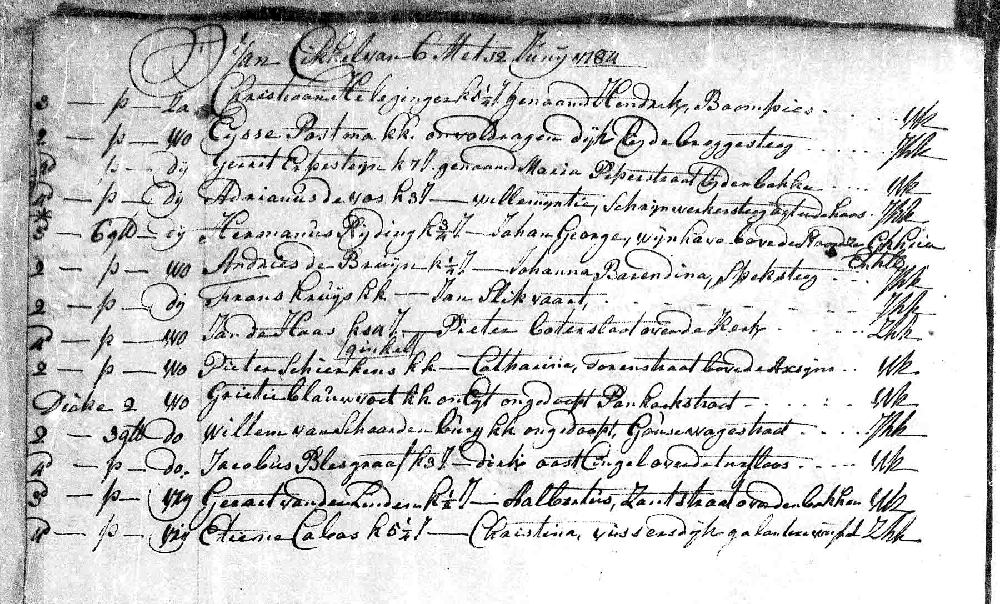

# Begräbnisse in Rotterdam (1782-1784)

## Begräbnis Justine (1782)

{ loading=lazy }

*12.9.1782 Begräbnis Justine*

!!! info "Bildhinweis"
    Bitte fügen Sie das Bild `begraebnis-justine-1782.jpg` in den Ordner `docs/images/` ein.

---

### Dokumentinformationen

| Feld | Wert |
|------|------|
| **Dokumenttyp** | DTB Rotterdam Begraven |
| **Datum** | 12. September 1782 |
| **Verstorbene** | Justine Cabos |
| **Alter** | ca. 2 Jahre |
| **Eltern** | Etienne Cabos und Maria Justine Siercken |

### Beschreibung

Am **12. September 1782** wurde die kleine Justine beerdigt - nur knapp zwei Jahre nach ihrer Geburt am 4. September 1780. Die hohe Kindersterblichkeit war im 18. Jahrhundert tragische Normalität.

---

## Begräbnis Marie Christine (1784)

{ loading=lazy }

*"overledene was 5 1/4 jaar; Visserdijk Galanteriwinkel"*

*Am 11. Juni 1784 stirbt Marie Christine in Rotterdam (5 1/4 Jahr alt). Eintrag zu Christine im Begräbnisbuch, DTB Rotterdam Begraven.*

---

### Dokumentinformationen

| Feld | Wert |
|------|------|
| **Dokumenttyp** | DTB Rotterdam Begraven |
| **Datum** | 11. Juni 1784 |
| **Verstorbene** | Marie Christine Cabos |
| **Alter** | 5 1/4 Jahre |
| **Wohnort** | Vissersdijk, Galanteriewarengeschäft |

### Transkription

> *"overledene was 5 1/4 jaar; Visserdijk Galanteriwinkel"*

**Übersetzung:**
*"Die Verstorbene war 5 1/4 Jahre alt; Vissersdijk, Galanteriewarengeschäft"*

### Beschreibung

Im Juni 1784 traf die Familie Cabos ein schwerer Schlag: **Marie Christine**, erst 5 1/4 Jahre alt, starb. Sie war noch in Stettin geboren worden (ca. 1779) und hatte den Umzug nach Rotterdam als kleines Kind miterlebt.

Der nüchterne Eintrag im Begräbnisbuch vermerkt die Adresse der Familie: **Vissersdijk, Galanteriewarengeschäft** - ein Hinweis darauf, dass die Familie zu diesem Zeitpunkt noch ihr Geschäft betrieb.

---

## Die Tragik des Kinderverlusts

Innerhalb von zwei Jahren verlor die Familie Cabos zwei Kinder:

| Kind | Geburt | Tod | Alter |
|------|--------|-----|-------|
| Justine | 4. Sept. 1780 | 12. Sept. 1782 | ca. 2 Jahre |
| Marie Christine | ca. 1779 | Juni 1784 | 5 1/4 Jahre |

### Kindersterblichkeit im 18. Jahrhundert

Die hohe Kindersterblichkeit war eine der großen Tragödien der Zeit. Etwa ein Drittel aller Kinder starb vor dem fünften Lebensjahr. Häufige Todesursachen waren:

- Infektionskrankheiten (Masern, Pocken, Scharlach)
- Durchfallerkrankungen
- Lungenentzündung
- Mangelernährung

Der Verlust von Kindern gehörte zum traurigen Alltag vieler Familien - auch der Familie Cabos.

---

[← Zurück zur Übersicht](index.md)
