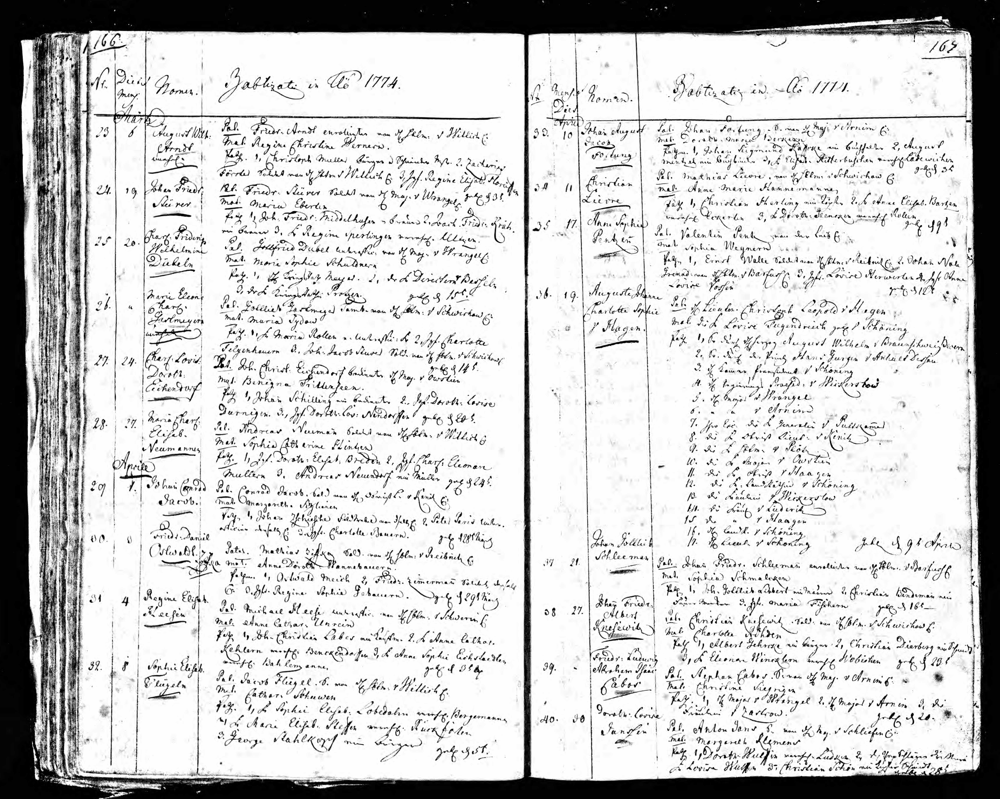
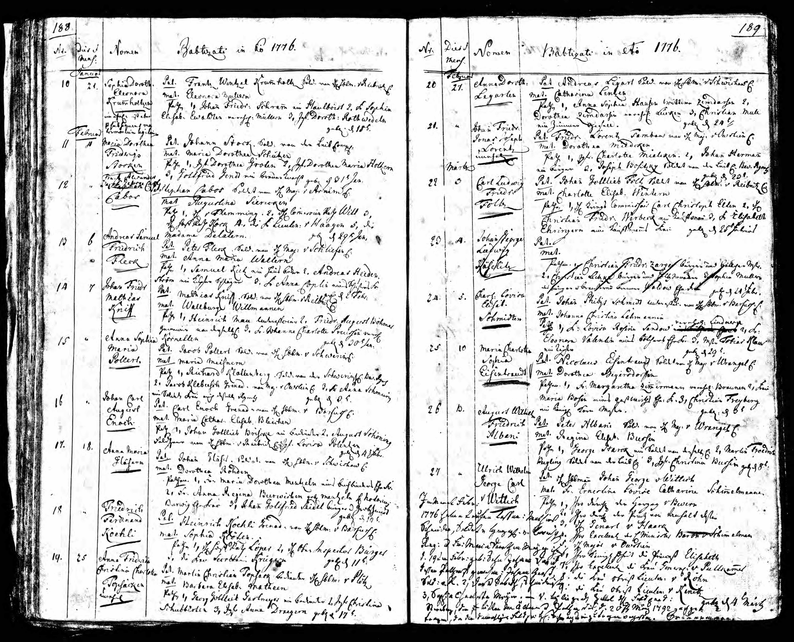
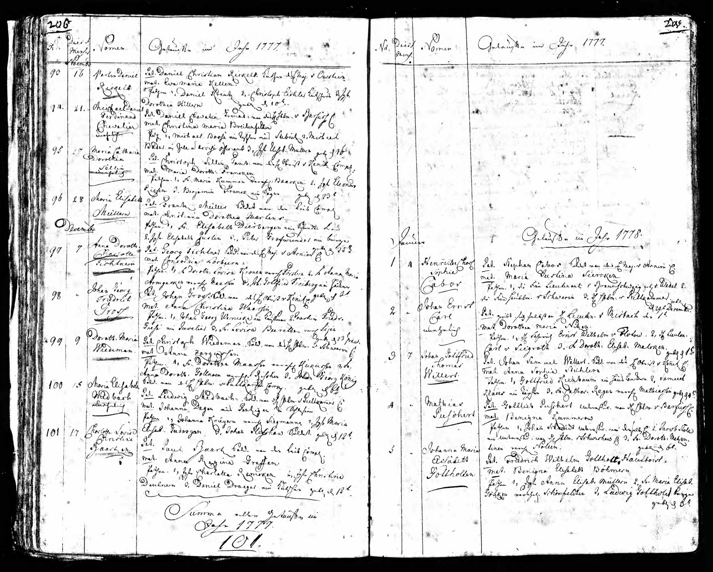

# Births of Children in Stettin (1772-1777)

Between the years 1772 and 1777, four children were born in Stettin to the couple Stephan Cabos and Maria Justine Siercken.

---

## Johann Carl Abraham (1772)

{ loading=lazy }

> *"Taufe 3.Dez.1772 — Pat. Stephan Cabos Soldat von H. Major v. Arnim — Mat. Justine Siercken — Pathen: 1. H. Meyer, 2. Webern"*

*Baptism on December 3, 1772. Father: Stephan Cabos, soldier under Major von Arnim. Mother: Justine Siercken. Godparents: 1. Mr. Meyer, 2. Webern*

### Document Information

| Field | Value |
|------|------|
| **Date of Birth** | November 29, 1772 |
| **Date of Baptism** | December 3, 1772 |
| **Location** | Stettin, Prussia |
| **Father** | Stephan Cabos (soldier) |
| **Mother** | Maria Justine Siercken |

### Description

**Johann Carl Abraham** was the first child of Stephan and Maria Justine Cabos. He was born only a few months after his parents' wedding on July 16, 1772.

---

## Friedrich Ludwig Abraham Isaac (1774)

{ loading=lazy }

> *"Pat: Stephan Cabos, S. von H. Maj. v Arnim — Mat: Christine Siegrigen — Pathen: 1. H. Major v. Wrangel, 2. H. Major v. Arnim, 3. Die Fräulein v. Zarkow"*

*Father: Stephan Cabos, soldier under Major von Arnim. Mother: Christine Siercken. Godparents: 1. Major von Wrangel, 2. Major von Arnim, 3. Miss von Zarkow.*

### Document Information

| Field | Value |
|------|------|
| **Date of Birth** | April 27, 1774 |
| **Date of Baptism** | - |
| **Location** | Stettin, Prussia |
| **Father** | Stephan Cabos (soldier) |
| **Mother** | Maria Justine Siercken |

### Description

**Friedrich Ludwig Abraham Isaac** was the second child. He came to Hamburg around 1794, became a citizen there on March 28, 1806, and married Anna Monica Jacobsen, widow Nettelbroth, on May 4, 1806, at the Hamburger Michel. The marriage register gives his trade as **"Mahler"** (painter). Afterwards, he moved to Königsberg.

---

## Franz Alexander George Carl (1776)

{ loading=lazy }

*Baptism entry #12 in the church register of the Garrison Church Stettin. Franz Alexander George Carl Cabos, born January 29, 1776.*

### Document Information

| Field | Value |
|------|------|
| **Date of Birth** | January 29, 1776 |
| **Date of Baptism** | - |
| **Location** | Stettin, Prussia |
| **Father** | Stephan Cabos (soldier) |
| **Mother** | Maria Justine Siercken |

### Description

**Franz Alexander George Carl** was the third child of the family.

---

## Henriette Charlotte Sophie (1777)

{ loading=lazy }

> *"Henriette Charl. Sophie Cabos — Pat. Stephan Cabos Soldat von dem H Maj v Arnim — Mat Marie Justine Siercken — Pathen: 1. Die Frau Lieutenant v Braunschweig geb v Wedel, 2. Frau Haubtm. v Schwerin, 3. H... v Puttkammer — Geboren 29. Dezember 1777"*

*Henriette Charlotte Sophie Cabos. Father: Stephan Cabos, soldier under Major von Arnim. Mother: Marie Justine Siercken. Godparents: 1. Mrs. Lieutenant von Braunschweig, née von Wedel, 2. Mrs. Captain von Schwerin, 3. Mr. ... von Puttkammer. Born December 29, 1777.*

### Document Information

| Field | Value |
|------|------|
| **Date of Birth** | December 29, 1777 |
| **Date of Baptism** | - |
| **Location** | Stettin, Prussia |
| **Father** | Stephan Cabos (soldier) |
| **Mother** | Maria Justine Siercken |

### Description

**Henriette Charlotte Sophie** was the fourth child and the first daughter of the family. She was born shortly before the outbreak of the War of the Bavarian Succession.

---

## The Godparents

Notable are the high-ranking godparents of the children, which demonstrate that Stephan Cabos, despite his simple soldier status, cultivated connections in higher circles:

- **Major von Wrangel**
- **Major von Arnim** (Stephan Cabos's company commander)
- **Mrs. Lieutenant von Braunschweig**

These noble godparents were a sign of esteem and of the social advancement of the Cabos family within Prussian garrison society.

---

## Overview

| Child | Date of Birth | Special Notes |
|------|--------------|----------------|
| Johann Carl Abraham | November 29, 1772 | First child |
| Friedrich Ludwig Abraham Isaac | April 27, 1774 | Later citizen in Hamburg, then Königsberg |
| Franz Alexander George Carl | January 29, 1776 | - |
| Henriette Charlotte Sophie | December 29, 1777 | First daughter |

---

[← Back to Overview](index.md)
