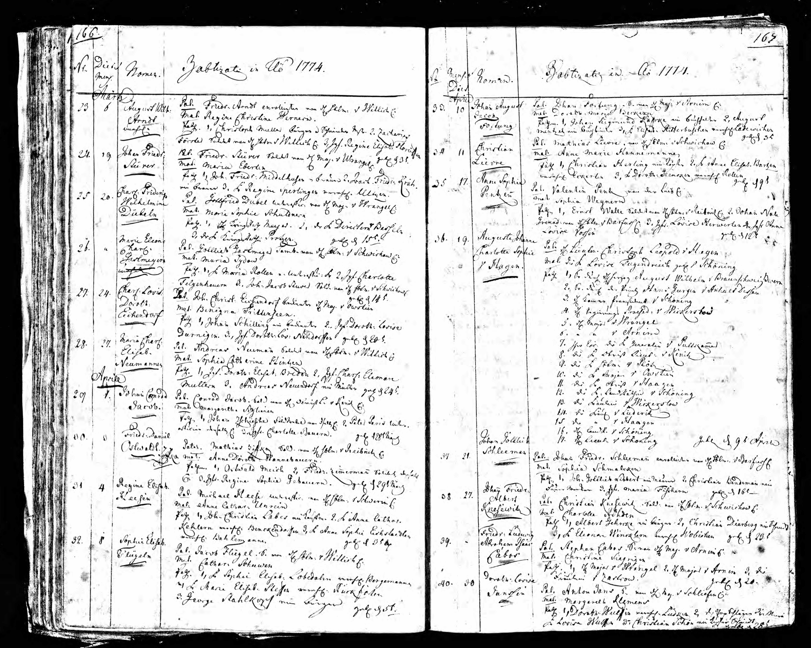
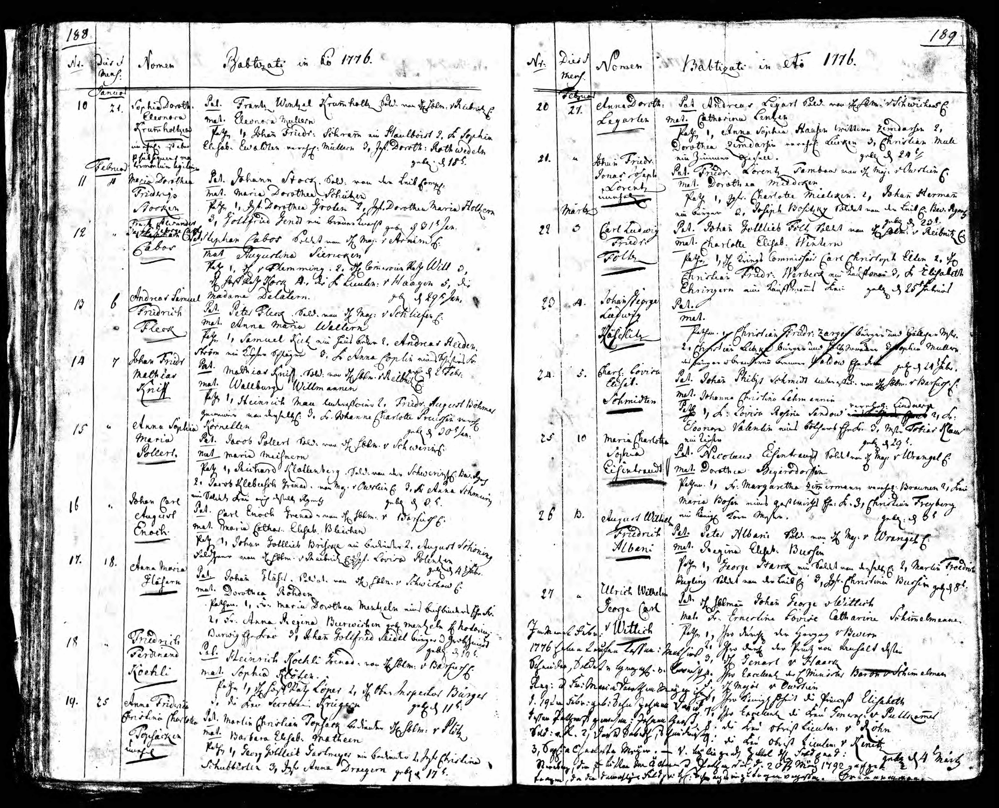

# Geburten der Kinder in Stettin (1772-1777)

In den Jahren 1772 bis 1777 wurden in Stettin vier Kinder des Ehepaares Stephan Cabos und Maria Justine Siercken geboren.

---

## Johann Carl Abraham (1772)

{ loading=lazy }

> *"Taufe 3.Dez.1772 — Pat. Stephan Cabos Soldat von H. Major v. Arnim — Mat. Justine Siercken — Pathen: 1. H. Meyer, 2. Webern"*

*Taufe am 3. Dezember 1772. Vater: Stephan Cabos, Soldat unter Herrn Major von Arnim. Mutter: Justine Siercken. Paten: 1. Herr Meyer, 2. Webern*

### Dokumentinformationen

| Feld | Wert |
|------|------|
| **Geburtsdatum** | 29. November 1772 |
| **Taufdatum** | 3. Dezember 1772 |
| **Ort** | Stettin, Preußen |
| **Vater** | Stephan Cabos (Soldat) |
| **Mutter** | Maria Justine Siercken |

### Beschreibung

**Johann Carl Abraham** war das erste Kind von Stephan und Maria Justine Cabos. Er wurde nur wenige Monate nach der Hochzeit seiner Eltern am 16. Juli 1772 geboren.

!!! note "Namensabweichungen in den Kirchenbüchern"
    In verschiedenen Stettiner Taufeinträgen erscheint der Name der Mutter in unterschiedlichen Schreibweisen, darunter auch als **"Christine Siegrigen"** (siehe Friedrich Ludwig, 1774). Dies sind phonetische Verschreibungen von **"Justine Siercken"** bzw. **"Maria Justine Siercken"**. Solche Variationen waren in handschriftlichen Kirchenbüchern des 18. Jahrhunderts üblich, besonders bei ungewöhnlichen oder fremdländischen Namen. Die Identität der Mutter ist durch die Hochzeitsurkunde von 1772 und spätere Dokumente eindeutig als Maria Justine Siercken belegt.

---

## Friedrich Ludwig Abraham Isaac (1774)

{ loading=lazy }

> *"Pat: Stephan Cabos, S. von H. Maj. v Arnim — Mat: Christine Siegrigen — Pathen: 1. H. Major v. Wrangel, 2. H. Major v. Arnim, 3. Die Fräulein v. Zarkow"*

*Vater: Stephan Cabos, Soldat unter Herrn Major von Arnim. Mutter: Christine Siegrigen [= Justine Siercken]. Paten: 1. Herr Major von Wrangel, 2. Herr Major von Arnim, 3. Fräulein von Zarkow.*

### Dokumentinformationen

| Feld | Wert |
|------|------|
| **Geburtsdatum** | 27. April 1774 |
| **Taufdatum** | - |
| **Ort** | Stettin, Preußen |
| **Vater** | Stephan Cabos (Soldat) |
| **Mutter** | Maria Justine Siercken |

### Beschreibung

**Friedrich Ludwig Abraham Isaac** war das zweite Kind. Er ging später nach Hamburg, wurde dort am 28. März 1806 Bürger und heiratete am 4. Mai 1806 Anna Monica Jacobsen im Hamburger Michel. Danach zog er nach Königsberg.

---

## Franz Alexander George Carl (1776)

{ loading=lazy }

*Taufeintrag #12 im Kirchenbuch der Garnisonkirche Stettin. Franz Alexander George Carl Cabos, geboren am 29. Januar 1776.*

### Dokumentinformationen

| Feld | Wert |
|------|------|
| **Geburtsdatum** | 29. Januar 1776 |
| **Taufdatum** | 29. Januar 1776 |
| **Ort** | Stettin, Preußen |
| **Vater** | Stephan Cabos (Soldat) |
| **Mutter** | Maria Justine Siercken |
| **Kirchenbuch** | Garnisonkirche Stettin, Eintrag #12 |

### Beschreibung

**Franz Alexander George Carl** war das dritte Kind der Familie, geboren am 29. Januar 1776 in Stettin. Der Taufeintrag findet sich im Kirchenbuch der Garnisonkirche als Eintrag Nummer 12.

---

## Henriette Charlotte Sophie (1777)

{ loading=lazy }

> *"Henriette Charl. Sophie Cabos — Pat. Stephan Cabos Soldat von dem H Maj v Arnim — Mat Marie Justine Siercken — Pathen: 1. Die Frau Lieutenant v Braunschweig geb v Wedel, 2. Frau Haubtm. v Schwerin, 3. H... v Puttkammer — Geboren 29. Dezember 1777"*

*Henriette Charlotte Sophie Cabos. Vater: Stephan Cabos, Soldat unter Herrn Major von Arnim. Mutter: Marie Justine Siercken. Paten: 1. Frau Lieutenant von Braunschweig, geborene von Wedel, 2. Frau Hauptmann von Schwerin, 3. Herr ... von Puttkammer. Geboren am 29. Dezember 1777.*

### Dokumentinformationen

| Feld | Wert |
|------|------|
| **Geburtsdatum** | 29. Dezember 1777 |
| **Taufdatum** | - |
| **Ort** | Stettin, Preußen |
| **Vater** | Stephan Cabos (Soldat) |
| **Mutter** | Maria Justine Siercken |

### Beschreibung

**Henriette Charlotte Sophie** war das vierte Kind und die erste Tochter der Familie. Sie wurde kurz vor dem Ausbruch des Bayerischen Erbfolgekrieges geboren.

---

## Die Taufpaten

Bemerkenswert sind die hochrangigen Taufpaten der Kinder, die zeigen, dass Stephan Cabos trotz seines einfachen Soldatenstandes Verbindungen in höhere Kreise pflegte:

- **Major von Wrangel**
- **Major von Arnim** (der Kompaniechef von Stephan Cabos)
- **Frau Lieutenant von Braunschweig**

Diese adeligen Paten waren ein Zeichen der Wertschätzung und des sozialen Aufstiegs der Familie Cabos innerhalb der preußischen Garnisonsgesellschaft.

---

## Übersicht

| Kind | Geburtsdatum | Besonderheiten |
|------|--------------|----------------|
| Johann Carl Abraham | 29. November 1772 | Erstes Kind |
| Friedrich Ludwig Abraham Isaac | 27. April 1774 | Später Bürger in Hamburg, dann Königsberg |
| Franz Alexander George Carl | 29. Januar 1776 | - |
| Henriette Charlotte Sophie | 29. Dezember 1777 | Erste Tochter |

---

[← Zurück zur Übersicht](index.md)
