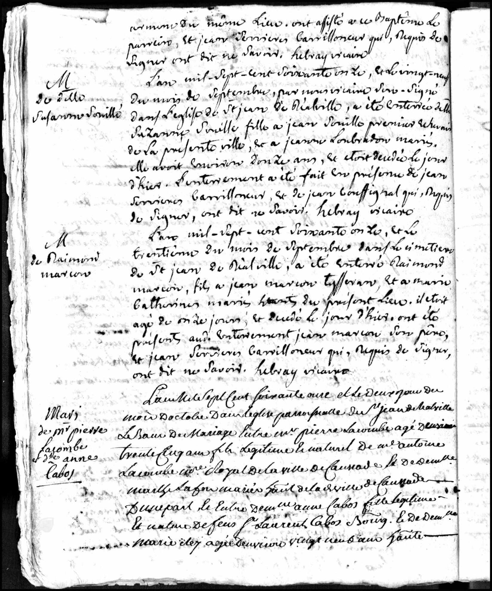
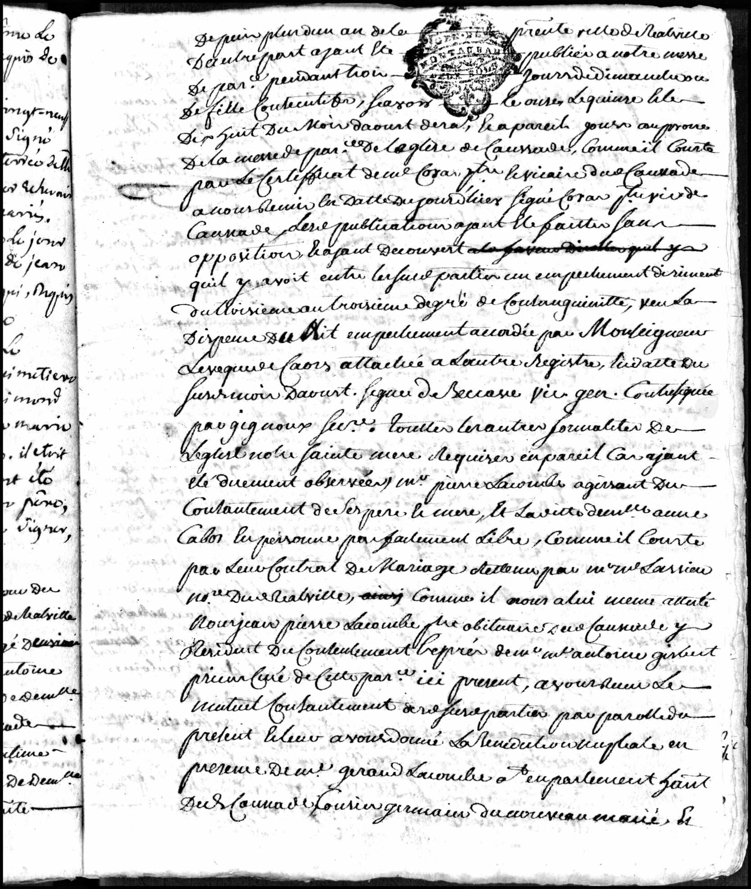
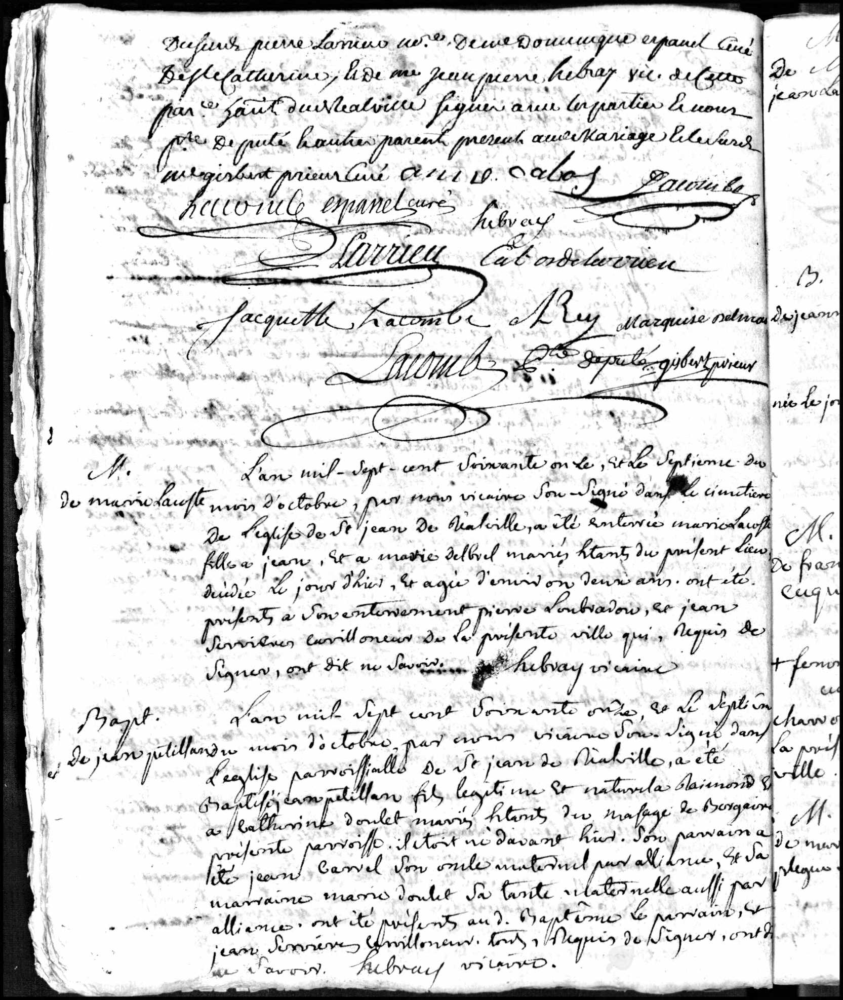

# Anne Cabos - Etiennes Schwester (Hochzeit 1771)

## Die Dokumente

### Heiratseintrag (Seite 1)

{ loading=lazy }

*Beginn des Heiratseintrags "Mari. de Mr Pierre Lacombe et dlle Anne Cabos" im Kirchenregister von Saint-Jean de Réalville, 2. Oktober 1771 (unterer Teil der Seite).*

### Heiratseintrag (Seite 2)

{ loading=lazy }

### Heiratseintrag (Seite 3)

{ loading=lazy }

---

## Dokumentinformationen

| Feld | Wert |
|------|------|
| **Dokumenttyp** | Kirchenbucheintrag (Heirat) |
| **Datum** | 2. Oktober 1771 |
| **Ort** | Pfarrkirche Saint-Jean de Réalville (bei Caussade) |
| **Bräutigam** | Pierre Lacombe, ca. 35 Jahre, Sohn von Antoine Lacombe aus Caussade und Marthe Lafon |
| **Braut** | Anne Cabos, ca. 29 Jahre, Tochter des **verstorbenen** ("feu") Laurens Cabos, Bürger, und der Marie Rey |
| **Besonderheit** | Dispens wegen Blutsverwandtschaft im dritten Grad, erteilt vom Bischof von Cahors |
| **Quelle** | Tarn-et-Garonne, Frankreich, Geburts-, Heirats- und Sterberegister, 1750-1912 |

---

## Transkription (Auszug)

Der lange Eintrag ist teilweise schwer zu entziffern. Die wesentlichen Passagen lauten:

> *"L'an mille sept cent soixante onze et le deux[ième] jour du mois d'octobre dans l'église paroissiale de St Jean de Réalville [...] entre Mr Pierre Lacombe agé d'environ trente cinq ans, fils légitime et naturel de Mr Antoine Lacombe [...] royal de la ville de Caussade et de demoiselle Marthe Lafon mariés [...] de la d[ite] ville de Caussade d'une part; et l'autre demoiselle Anne Cabos, fille légitime et naturelle de **feu** Sr Laurent Cabos bourg[eois] et de demoiselle Marie Rey, agée d'environ vingt neuf ans [...]"*

*Im Jahr 1771, am zweiten Tag des Monats Oktober, in der Pfarrkirche von Saint-Jean de Réalville [...] zwischen Herrn Pierre Lacombe, etwa 35 Jahre alt, ehelicher und leiblicher Sohn des Herrn Antoine Lacombe [...] der Stadt Caussade und der Demoiselle Marthe Lafon, Eheleute aus der genannten Stadt Caussade, einerseits; und andererseits Demoiselle Anne Cabos, eheliche und leibliche Tochter des **verstorbenen** Herrn Laurent Cabos, Bürger, und der Demoiselle Marie Rey, etwa 29 Jahre alt [...]*

Der weitere Text vermerkt:

- Die dreimalige Verkündigung der Aufgebote ohne Einspruch
- Ein **Ehehindernis der Blutsverwandtschaft im dritten Grad** ("empêchement dirimant du troisième au troisième degré de consanguinité"), das durch eine **Dispens des Bischofs von Cahors** ("Monseigneur l'Evêque de Cahors") aufgehoben wurde
- Einen **Ehevertrag**, aufgenommen von Notar Larrieu in Réalville
- Als Zeugen u.a. Géraud Lacombe, Cousin des Bräutigams

---

## Bedeutung: Anne Cabos - Etiennes Schwester

!!! warning "Wichtige Entdeckung"
    Dieses Dokument beweist, dass Etienne Cabos auch eine **Schwester namens Anne** hatte - und es liefert nebenbei die einzige bekannte Eingrenzung des Todesdatums von Vater Laurens Cabos!

### Was wir über Anne wissen

| Fakt | Details |
|------|---------|
| **Name** | Anne Cabos |
| **Geburt** | ca. 1742 (aus der Altersangabe "etwa 29 Jahre" errechnet) |
| **Eltern** | Laurens Cabos und Marie Rey (identisch mit Etiennes Eltern) |
| **Hochzeit** | 2. Oktober 1771 in Saint-Jean de Réalville |
| **Ehemann** | Pierre Lacombe (ca. 1736), Sohn von Antoine Lacombe aus Caussade |

### Der Vater war 1771 bereits tot

Der Eintrag bezeichnet Anne als Tochter von **"feu Sr Laurent Cabos"** - des *verstorbenen* Herrn Laurent Cabos. Damit lässt sich das Todesdatum von Etiennes Vater erstmals eingrenzen:

- **Februar 1760**: Laurens lebt noch - er entlässt seinen Sohn Jean im [Ehevertrag](hochzeit-jean-1760.md) aus der väterlichen Gewalt
- **Oktober 1771**: Laurens ist tot

**Laurens Cabos starb also zwischen Februar 1760 und Oktober 1771.** Bemerkenswert ist die zeitliche Nähe zu Etiennes Auswanderung: Nur neun Monate nach Annes Hochzeit, im Juli 1772, heiratet Etienne in Stettin. Ob der Tod des Vaters (und eine mögliche Erbteilung) den Anstoß zur Auswanderung gab, ist nicht belegt - aber eine naheliegende Vermutung.

### Die Verbindung zur Familie Lacombe

Die Familie Lacombe war mit den Cabos offenbar eng verflochten:

- Bereits beim [Ehevertrag von Bruder Jean (1760)](hochzeit-jean-1760.md) waren **Pierre Lacombe** (Praktiker) und **Laurent Teulières** als *Cousins des Bräutigams* Zeugen - der Ehevertrag wurde zudem von einem **Notar Lacombe** aufgenommen
- Die Dispens wegen **Blutsverwandtschaft im dritten Grad** bestätigt: Pierre Lacombe und Anne Cabos waren miteinander verwandt

Die Heirat innerhalb der Verwandtschaft war im Bürgertum kleiner Städte nicht ungewöhnlich - sie hielt Besitz und Geschäftsbeziehungen in der Familie.

### Eine katholische Trauung

Anders als Bruder Jean, der 1760 "im Désert" (im Untergrund) protestantisch getraut wurde, heiratete Anne 1771 in einer **katholischen Pfarrkirche** mit bischöflicher Dispens - ein weiteres Beispiel dafür, wie die Familie Cabos zwischen erzwungener katholischer Konformität und protestantischer Tradition lavierte.

---

## Die erweiterte Familie Cabos

| Person | Rolle | Lebensdaten | Quelle |
|--------|-------|-------------|--------|
| **Laurent/Laurens Cabos** | Vater | ? - zwischen 1760 und 1771 | Hochzeit 1729, Ehevertrag 1760, Heirat Anne 1771 ("feu") |
| **Marie Rey** | Mutter | ? - ? | Hochzeit 1729, Taufen |
| **??? Cabos** | Ältester Sohn? (in effigie verurteilt, geflohen?) | vor 1737 - ? | Bulletin 1907 |
| **Jean Cabos** | Sohn | ca. 1730? - 1796 | Hochzeit 1760, Tod 1796 |
| **Etienne Cabos** | Sohn | 1737 - 1808 | Taufe 1737, Tod Berlin 1808 |
| **Pierre Cabos** | Sohn | 1740 - ? | Taufe 1740 |
| **Anne Cabos** | Tochter | ca. 1742 - ? | Heirat 1771 |

!!! question "Offene Fragen"
    - **Taufeintrag Anne**: Annes Taufe (ca. 1742) müsste sich im Kirchenregister von Caussade finden lassen
    - **Nachkommen**: Hatten Anne und Pierre Lacombe Kinder?
    - **Der Verwandtschaftsgrad**: Über wen genau waren Lacombe und Cabos im dritten Grad verwandt? Die Antwort könnte weitere Familienmitglieder erschließen
    - **Sterbedatum Laurens**: Der Begräbniseintrag von Laurens Cabos (zwischen 1760 und 1771) müsste in Caussade zu finden sein

---

## Quellen

- Kirchenregister Saint-Jean de Réalville, Heiratseintrag 2. Oktober 1771
- Tarn-et-Garonne, Frankreich, Geburts-, Heirats- und Sterberegister, 1750-1912
- [Archives départementales de Tarn-et-Garonne](https://archivesdepartementales.ledepartement82.fr/)

---

[← Zurück zur Übersicht](index.md)
