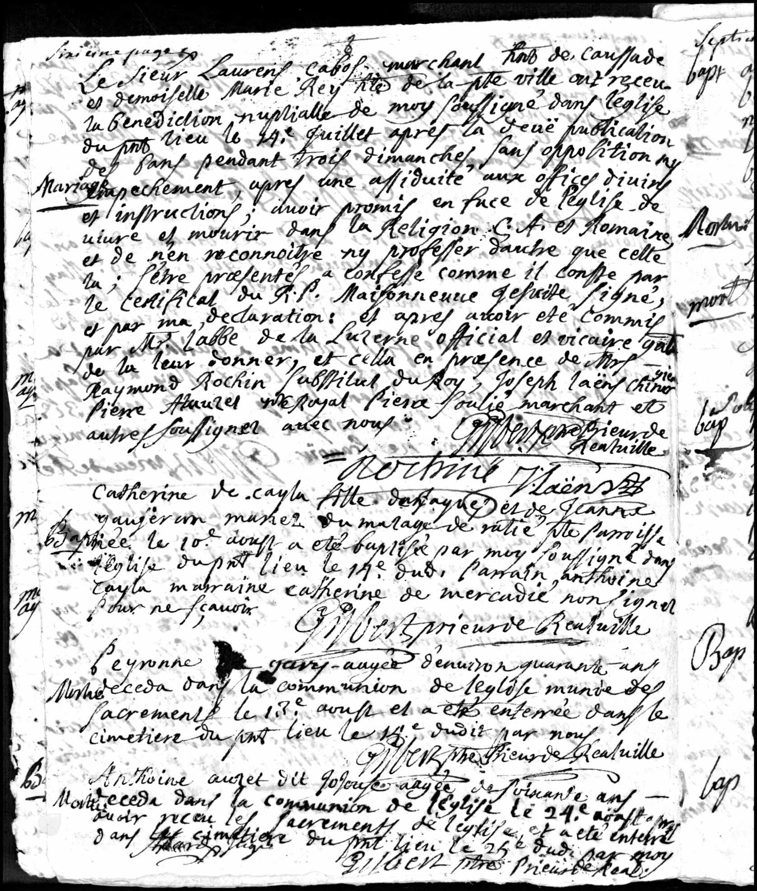

# Marriage of Laurens Cabos and Marie Rey (1729)

{ loading=lazy }

> *"Le Sieur Laurens Cabos merchant hab de Caussade et demoiselle Marie Rey hte de la pte ville ont receu la benediction nuptialle de moy soussigne dans l'eglise dupnt lieu le 14e Juillet apres la devë publication des sans pendant trois dimanches, sans opposition my (se) Mariage empechement, apres une affiduite aux offices diviny et instructions ; avoir promis en face de l'eglise de vivre et mourir dans la Religion C'et et Romaine, et de nen reconnaitre ny professer dautre que cette la ; s'etre praesentes a confesse comme il conste par le certificat du RP. Maisonneuve gesuite signe, et par ma declaration, et apres avoir eté commis par Mr Jabbe de la Luzerne official et vicaire qu de la leur donner, et cella en presence de Mrs Raymond Rochin substitut du Roy, Joseph Laëns chirugien Pierre Aluures e?? Royal Pierre Soulie marchant et autres soussignez avec nous"*

*Mr. Laurens Cabos, merchant from Caussade, and Miss Marie Rey from the small town received my blessing as undersigned in the church of the place on July 14, after the announcements were published for three Sundays without opposition or impediment to this marriage. After they promised before the church to live and die in the Catholic and Roman Religion and to recognize or profess no other than this; after they presented themselves for confession as confirmed by the certificate of Father Maisonneuve, Jesuit, signed, and by my declaration, and after having been commissioned by Mr. Jabbe de la Luzerne, official and vicar, to marry them, and this in the presence of Messrs. Raymond Rochin, substitute of the King, Joseph Laëns, surgeon, Pierre Aluures, royal ??, Pierre Joulie, merchant, and others who signed with us.*

---

## Document Information

| Field | Value |
|------|------|
| **Document Type** | Church Register Entry (Marriage) |
| **Date** | July 14, 1729 |
| **Location** | Caussade, Tarn-et-Garonne, France |
| **Groom** | Laurens Cabos (Merchant) |
| **Bride** | Marie Rey |
| **Priest** | Jesuit Father Maisonneuve |

---

## Description

On **July 14, 1729**, **Laurens Cabos**, father of Etienne, and **Marie Rey** were married in Caussade. The wedding was performed in the Catholic Church - as required by French law at that time. For Protestants, there was no legal possibility of a Reformed ceremony.

### Witnesses

The presence of high-ranking witnesses at the ceremony demonstrates the social status of the Cabos family:

- **Raymond Rochin** - Substitute of the King
- **Joseph Laens** - Surgeon

### Historical Context

The fact that the ceremony took place before a Jesuit father is noteworthy. The Jesuits were known for their zeal in combating Protestantism. That a possibly Protestant-minded family married before a Jesuit priest shows the complicated religious situation in France at that time.

Only with the **Edict of Versailles** (1787) - almost 60 years later - did Protestants in France regain legal status.

---

## Significance for Family History

This entry documents:

- The bourgeois status of the Cabos family as merchants
- The connections to higher social circles
- The complex religious situation of Protestant families in Catholic France

---

[← Back to Overview](index.md)
