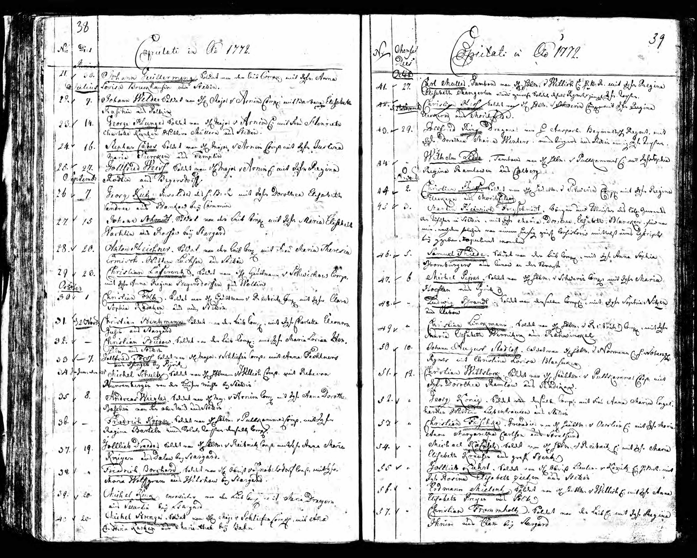

# Marriage of Stephan Cabos and Maria Justine Siercken (1772)

{ loading=lazy }

*"Stephan Cabos Soldat von H Major v Arnim C. mit Frau Justine Maria Siercken aus Templin"*

*He emigrated from France and married Maria Justine Siercken on July 16, 1772 in Stettin. She was born on January 28, 1754 in Templin near Berlin as the daughter of a town musician.*

---

## Document Information

| Field | Value |
|------|------|
| **Document Type** | Church register entry (marriage) |
| **Date** | July 16, 1772 |
| **Location** | Stettin, Prussia (today Szczecin, Poland) |
| **Groom** | Stephan Cabos (soldier in Infantry Regiment No. 8) |
| **Bride** | Maria Justine Siercken |
| **Bride's Date of Birth** | January 28, 1754 |
| **Bride's Origin** | Templin near Berlin |
| **Bride's Father's Occupation** | Town musician |

---

## Transcription

*[Insert transcription of original entry here]*

---

## Description

On **July 16, 1772**, **Etienne Cabos** - now under the Germanized name **Stephan Cabos** - married **Maria Justine Siercken** in Stettin. The bride was only 18 years old and came from Templin near Berlin, where her father worked as a town musician.

### The Groom

At this time, Etienne/Stephan was already a soldier in **Infantry Regiment No. 8 (von Hacke)**, a traditional regiment stationed in Stettin. The exact circumstances of his emigration from France and his entry into the Prussian army remain shrouded in the mists of history.

### The Bride

Maria Justine Siercken came from a musical family. Her father was a town musician in Templin - a respectable profession in the 18th century. Town musicians were responsible for providing music at official occasions.

### Prussia as a Refuge

The **Edict of Potsdam** (1685) had granted French Protestants refuge and special privileges in Brandenburg-Prussia. Approximately 18,000-20,000 Huguenots found a new home here. French became the language of the educated elite, and the Reformed confession connected the Huguenots with the ruling house.

---

## Significance for Family History

This entry documents:

- The beginning of Etienne's "German" life under the name Stephan
- His service as a soldier in Prussia
- His marriage to Maria Justine Siercken
- The family's location in Stettin

---

[← Back to Overview](index.md)
