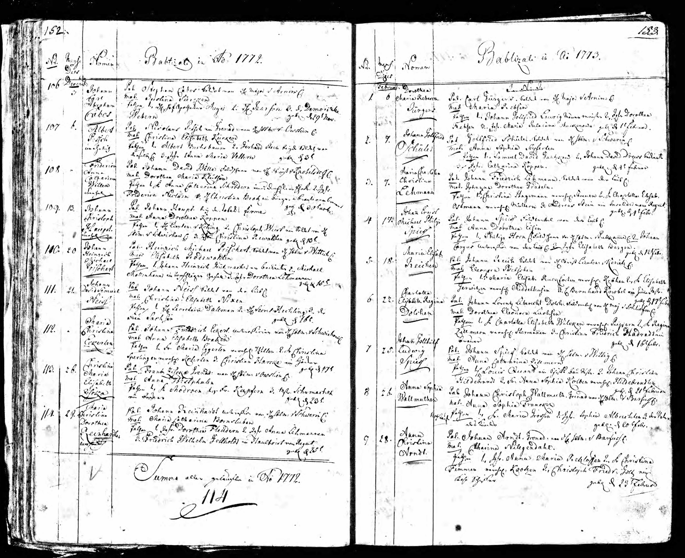
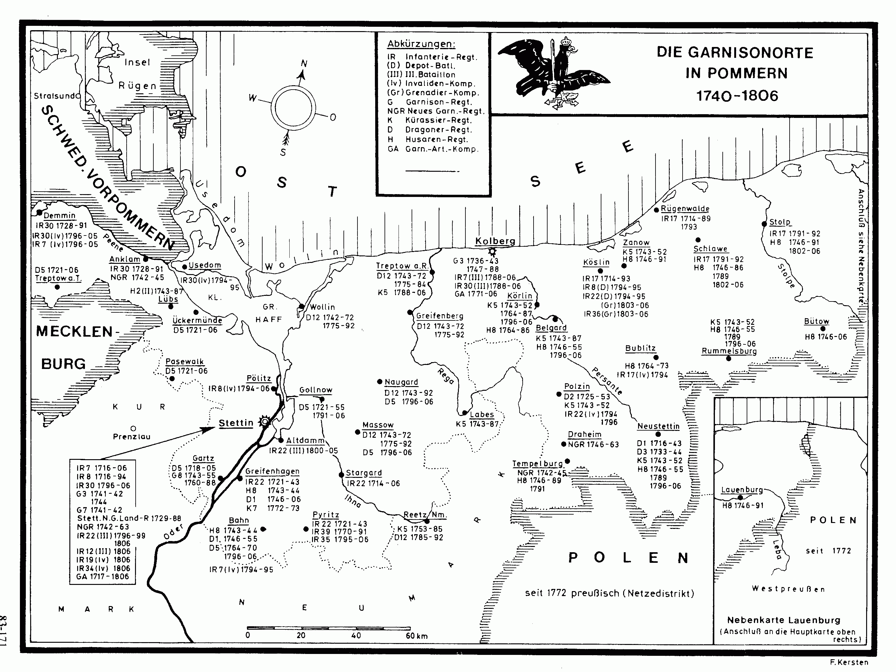
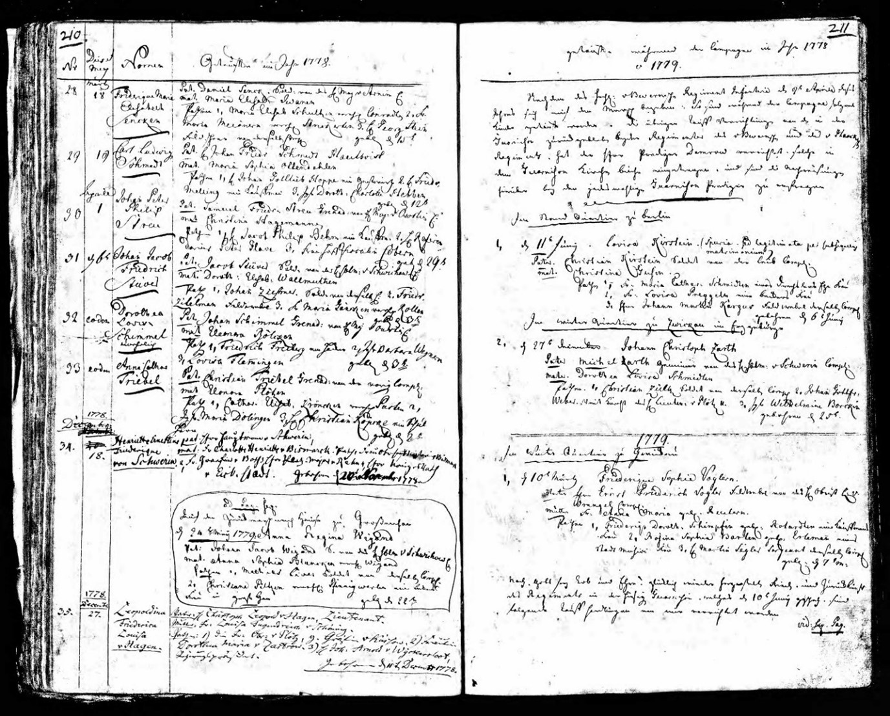
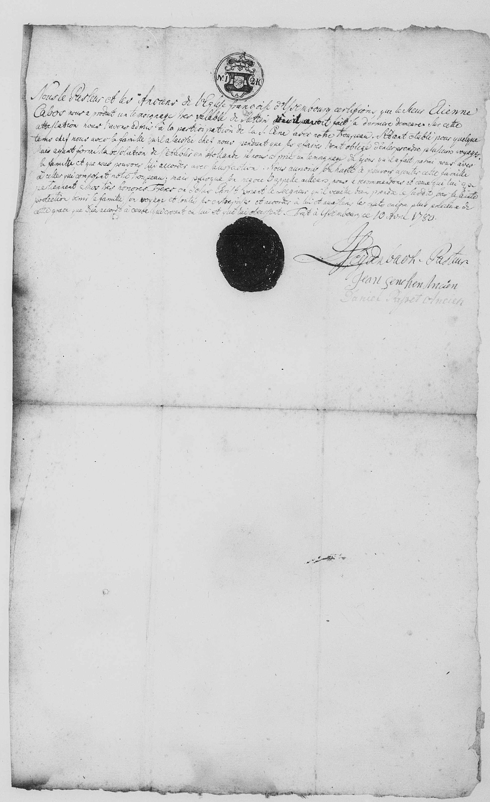
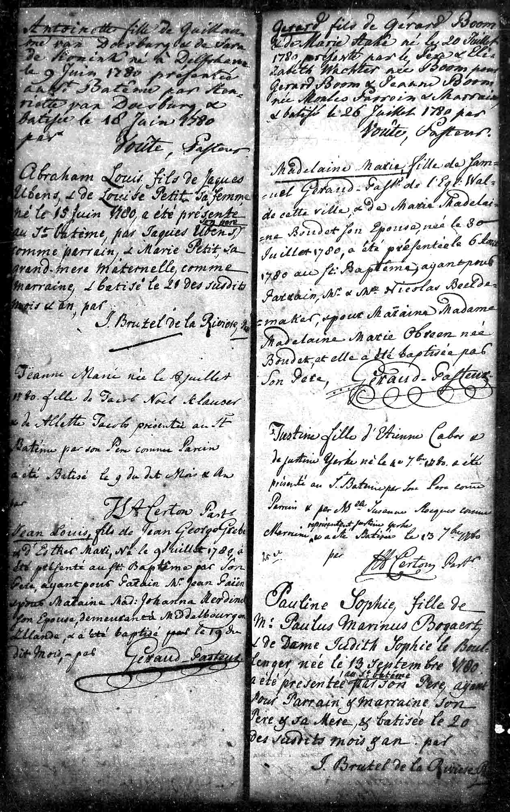
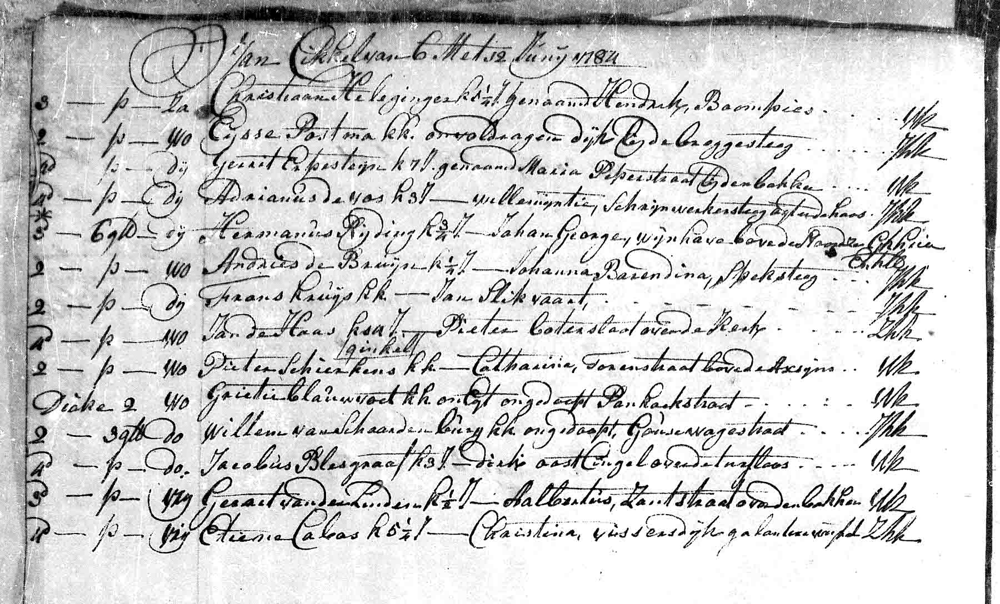
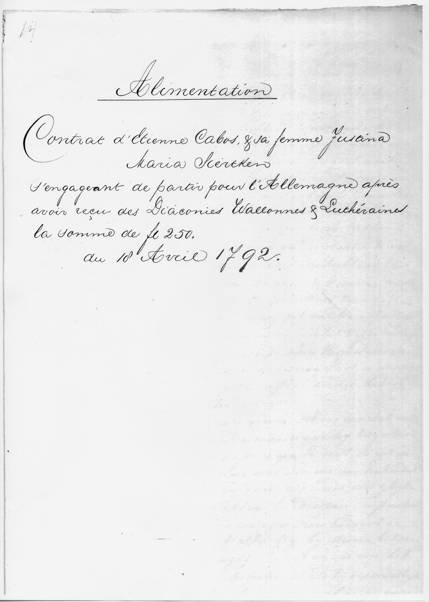
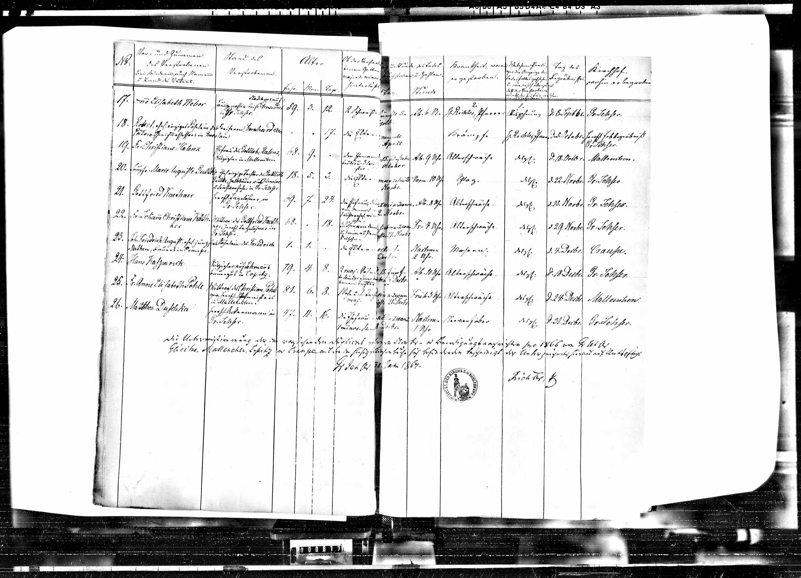
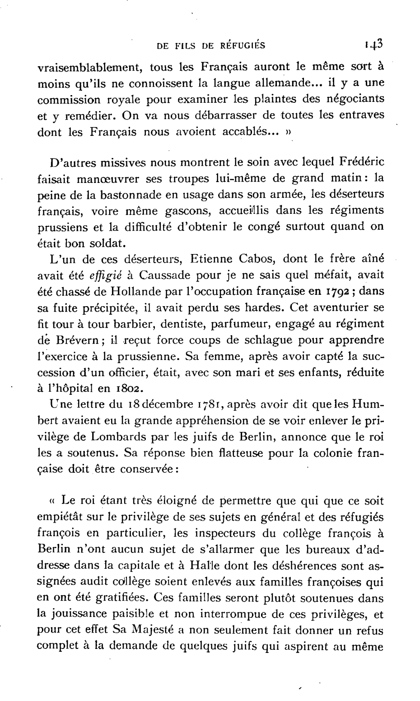

# Historical Documents

This page provides an overview of all historical original documents that chronicle the life of Etienne Cabos and his family.

---

## France (1729-1771)

-   **Map from 1777**

    ---

    { .card-image style="height:120px; object-fit:cover; width:100%;" }

    Carte de France, Montauban sheet - showing the Quercy region

    [→ Details](karte-1777.md)

-   **Marriage Laurens Cabos 1729**

    ---

    { .card-image style="height:120px; object-fit:cover; width:100%;" }

    Marriage record of Etienne's parents

    [→ Details](hochzeit-laurens-1729.md)

-   **Baptism Etienne 1737**

    ---

    { .card-image style="height:120px; object-fit:cover; width:100%;" }

    Baptismal record of newborn Etienne in Caussade

    [→ Details](taufe-etienne-1737.md)

-   **Baptism Pierre 1740**

    ---

    { .card-image style="height:120px; object-fit:cover; width:100%;" }

    Baptismal record of younger brother Pierre

    [→ Details](taufe-pierre-1740.md)

-   **Wedding Jean Cabos 1760**

    ---

    { .card-image style="height:120px; object-fit:cover; width:100%;" }

    Brother Jean marries Jeanne Fournier

    [→ Details](hochzeit-jean-1760.md)

-   **Marriage Anne Cabos 1771**

    ---

    { .card-image style="height:120px; object-fit:cover; width:100%;" }

    Sister Anne marries Pierre Lacombe

    [→ Details](hochzeit-anne-1771.md)

---

## Prussia - Stettin (1772-1780)

-   **Marriage Stettin 1772**

    ---

    { .card-image style="height:120px; object-fit:cover; width:100%;" }

    Marriage record of Stephan Cabos and Maria Justine Siercken

    [→ Details](hochzeit-stettin-1772.md)

-   **Births Stettin 1772-1777**

    ---

    { .card-image style="height:120px; object-fit:cover; width:100%;" }

    Baptismal records of the four children Johann Carl, Friedrich Ludwig, Franz Alexander, and Henriette

    [→ Details](geburten-stettin.md)

-   **Military Register**

    ---

    { .card-image style="height:120px; object-fit:cover; width:100%;" }

    Entries for Infantry Regiment No. 8 (von Hacke)

    [→ Details](militaerregister.md)

-   **War's End 1779**

    ---

    { .card-image style="height:120px; object-fit:cover; width:100%;" }

    Church register entries on the end of the War of the Bavarian Succession (Potato War)

    [→ Details](kriegsende-1779.md)

-   **Passport 1780**

    ---

    { .card-image style="height:120px; object-fit:cover; width:100%;" }

    Issued by the French Reformed Church

    [→ Details](reisepass-1780.md)

---

## Netherlands - Rotterdam (1780-1792)

-   **Citizen Book Rotterdam**

    ---

    Entry in the Poorterboek from May 24, 1780

    [→ Details](buergerbuch-rotterdam.md)

-   **Baptisms Rotterdam**

    ---

    { .card-image style="height:120px; object-fit:cover; width:100%;" }

    Baptismal records of the children Justine, Etienne, and Elisabeth

    [→ Details](taufen-rotterdam.md)

-   **Burials Rotterdam**

    ---

    { .card-image style="height:120px; object-fit:cover; width:100%;" }

    Burial records for Justine and Marie Christine

    [→ Details](begraebnisse-rotterdam.md)

-   **Maintenance Contract 1792**

    ---

    { .card-image style="height:120px; object-fit:cover; width:100%;" }

    Contract with the Consistory of the Lutheran and Walloon Church

    [→ Details](unterhaltsvertrag-1792.md)

---

## Berlin (1793-1810)

-   **Baptism Berlin 1793**

    ---

    { .card-image style="height:120px; object-fit:cover; width:100%;" }

    Baptismal record of Charles Emmanuel in Friedrichstadt Church

    [→ Details](taufe-berlin-1793.md)

-   **Dentist in Halle 1794-1798**

    ---

    Advertisements in Wöchentliche Hallische Anzeigen

    [→ Details](zahnarzt-halle.md)

-   **Wedding Elisabeth 1807**

    ---

    { .card-image style="height:120px; object-fit:cover; width:100%;" }

    Marriage record of Anne Elisabeth and August Pohle

    [→ Details](hochzeit-elisabeth-1807.md)

-   **Death Certificate Etienne 1808**

    ---

    { .card-image style="height:120px; object-fit:cover; width:100%;" }

    Death record of Etienne Cabos in Charlottenburg

    [→ Details](sterbeurkunde-1808.md)

-   **Death Certificate Maria Justine 1810**

    ---

    { .card-image style="height:120px; object-fit:cover; width:100%;" }

    Death record in Luisenkirche Charlottenburg

    [→ Details](sterbeurkunde-justine-1810.md)

-   **Death Elisabeth 1866**

    ---

    { .card-image style="height:120px; object-fit:cover; width:100%;" }

    Death record of Anne Elisabeth Pohle, née Cabos

    [→ Details](hochzeit-elisabeth-1807.md)

---

## Secondary Sources

-   **Bulletin 1907**

    ---

    { .card-image style="height:120px; object-fit:cover; width:100%;" }

    French report on the Huguenot colony in Berlin with mention of Etienne Cabos

    [→ Details](bulletin-1907.md)

