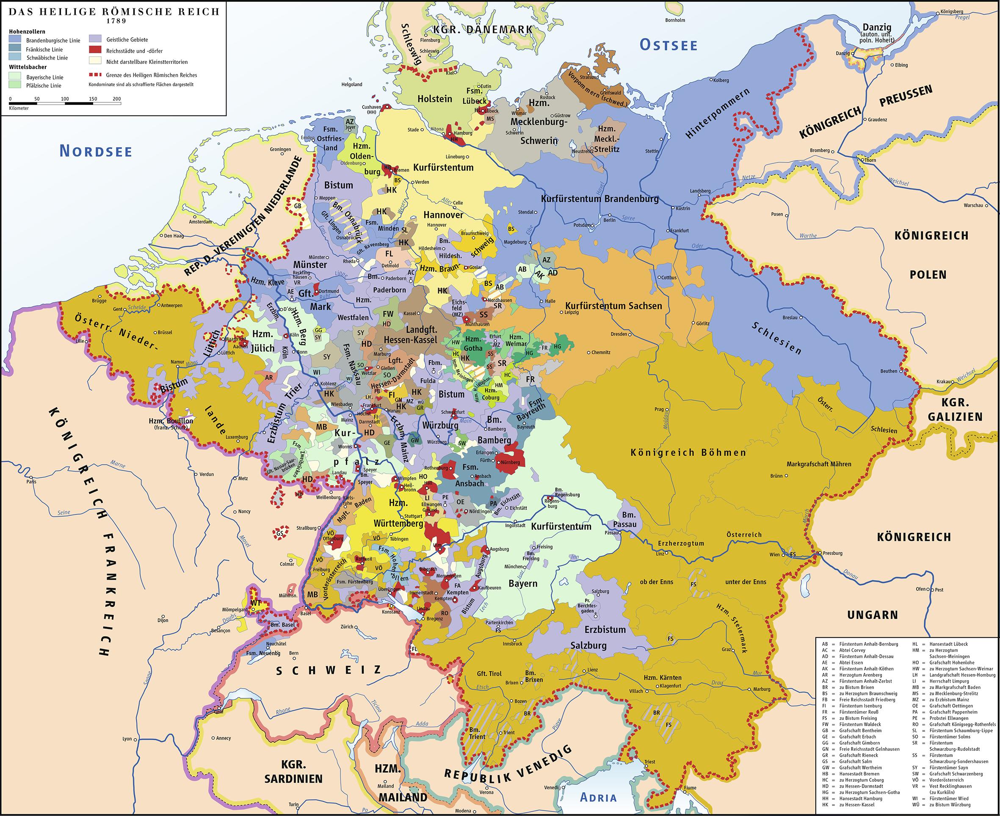
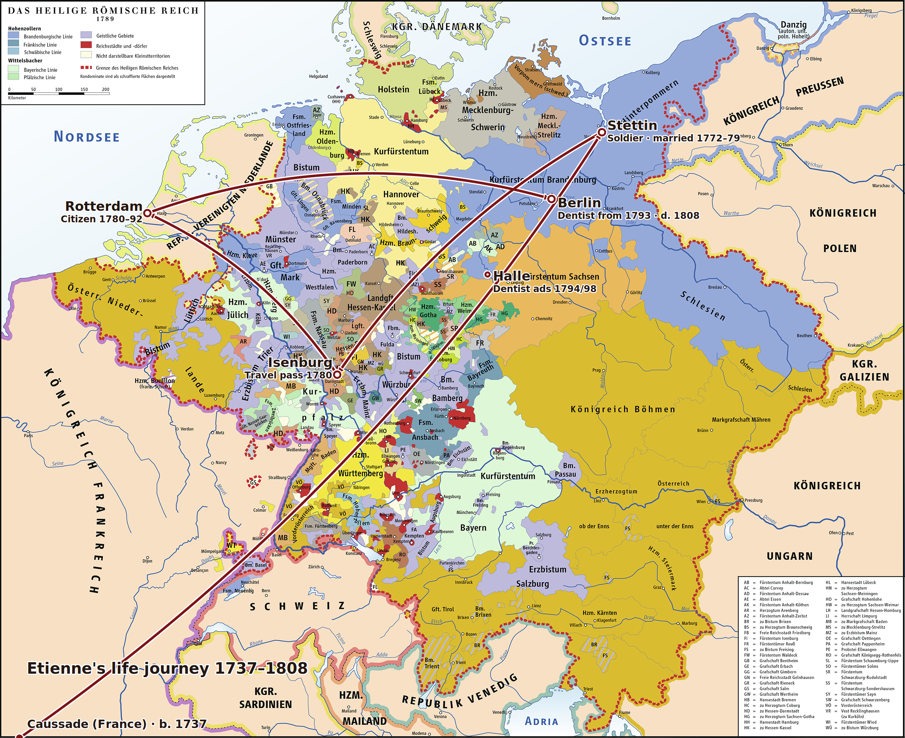

# Historical Maps

## Map from 1789 - Europe at the Time of the Revolution

{ loading=lazy }

*Europe in 1789 - the year of the French Revolution. The map shows the political borders during Etienne Cabos' lifetime.*

### Etienne's life journey on the 1789 map

{ loading=lazy }

*The same contemporary map, with Etienne's life stations added. The points are georeferenced against known cities on the map itself; the route follows the chronological order:*

- **Caussade (France)** – born 1737 (in the far southwest, off the edge of the map)
- **Stettin** – soldier and marriage, 1772–1779
- **Isenburg** – travel pass, 10 April 1780
- **Rotterdam** – citizen, 1780–1792
- **Berlin** – dentist from 1793, died 1808
- **Halle** – dentist advertisements 1794/1798

*Base map: "The Holy Roman Empire 1789". The route was added for this book (`generate_map_1789.py`).*

---

## Map from 1777 - Montauban Sheet

{ loading=lazy }

*(Carte de France levée par ordre du Roy). No. 37 (Montauban). Aldring sculp. et Bourgoin scrip. (1777)*

---

## Document Information

| Field | Value |
|------|------|
| **Title** | Carte de France levée par ordre du Roy |
| **Sheet** | No. 37 (Montauban) |
| **Creator** | Aldring sculp. et Bourgoin scrip. |
| **Year** | 1777 |
| **Source** | [David Rumsey Map Collection](https://www.davidrumsey.com/luna/servlet/s/8584yt) |

---

## Description

This historical map shows the **Quercy** region in southwestern France, where the town of **Caussade** is located - the birthplace of Etienne Cabos. The map was commissioned by the French King and is part of the large-scale mapping of France in the 18th century.

### Relevant Places on the Map

- **Caussade** - Birthplace of Etienne Cabos (1737)
- **Montauban** - Capital of the southwestern Reformed, important Protestant center
- **Quercy region** - The "white Quercy" was known for its limestone hills and had been an area with a strong Protestant presence since the Reformation

### Historical Context

The map was created at a time when the Huguenots in France were still suffering from severe restrictions. Although the Edict of Fontainebleau (1685) had revoked religious freedom, secret Protestant communities persisted in regions such as Quercy.

---

[← Back to Overview](index.md)
