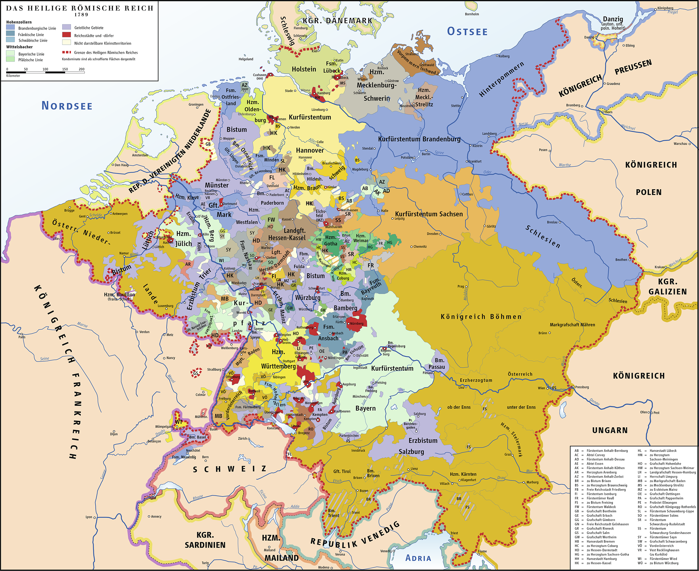

# Historische Karten

## Karte von 1789 - Europa zur Zeit der Revolution

{ loading=lazy }

*Europa im Jahr 1789 - dem Jahr der Französischen Revolution. Die Karte zeigt die politischen Grenzen zur Lebenszeit von Etienne Cabos.*

---

## Karte von 1777 - Blatt Montauban

{ loading=lazy }

*(Carte de France levée par ordre du Roy). No. 37 (Montauban). Aldring sculp. et Bourgoin scrip. (1777)*

---

## Dokumentinformationen

| Feld | Wert |
|------|------|
| **Titel** | Carte de France levée par ordre du Roy |
| **Blatt** | No. 37 (Montauban) |
| **Ersteller** | Aldring sculp. et Bourgoin scrip. |
| **Jahr** | 1777 |
| **Quelle** | [David Rumsey Map Collection](https://www.davidrumsey.com/luna/servlet/s/8584yt) |

---

## Beschreibung

Diese historische Karte zeigt die Region **Quercy** im Südwesten Frankreichs, in der die Stadt **Caussade** liegt - der Geburtsort von Etienne Cabos. Die Karte wurde im Auftrag des französischen Königs erstellt und ist Teil der großangelegten Kartierung Frankreichs im 18. Jahrhundert.

### Relevante Orte auf der Karte

- **Caussade** - Geburtsort von Etienne Cabos (1737)
- **Montauban** - Hauptstadt der südwestlichen Reformierten, wichtiges protestantisches Zentrum
- **Region Quercy** - Das "weiße Quercy" war bekannt für seine Kalkhügel und war seit der Reformation ein Gebiet mit starker protestantischer Präsenz

### Historischer Kontext

Die Karte entstand in einer Zeit, als die Hugenotten in Frankreich noch unter starken Einschränkungen litten. Obwohl das Edikt von Fontainebleau (1685) die Religionsfreiheit aufgehoben hatte, hielten sich in Regionen wie dem Quercy heimliche protestantische Gemeinschaften.

---

[← Zurück zur Übersicht](index.md)
