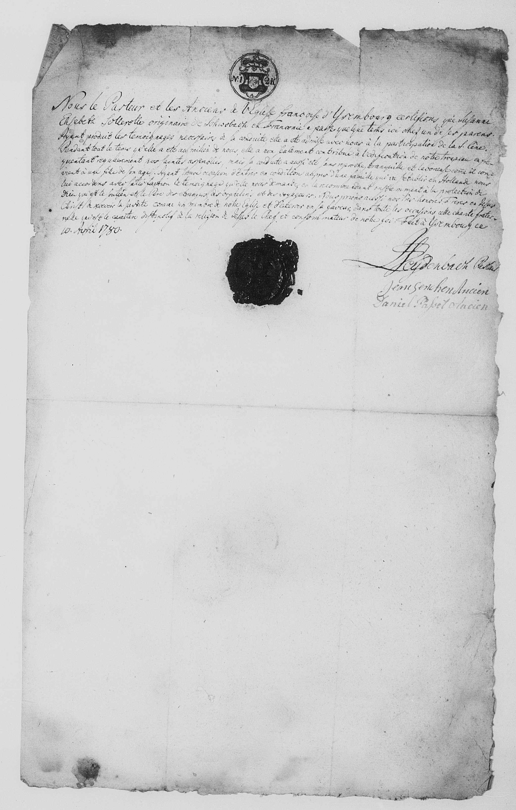

# Travel Passport of the French Reformed Church (1780)

## The Passport for Etienne Cabos

{ loading=lazy }

> *"Nous le Pasteur et les Anciens de l'Eglise francaise d'Isembourg certifions que le sieur Etienne Cabos nous a produit un témoignage très valable de Stettin ou il avait fait sa dernière demeure. Sur cette attestation nous l'avons admis a la participation de la S. Cène avex notre tropeau. S'etant etabli pour quelque temps chez nous avec sa famille il l'a laissé chez nous pendant que les affaires l'ont obligé de aller prendre plusieurs voyages. Mais ayant formé sa résolution de s'établir en Hollande, il nous a prié un témoignage de séjours qu'il a fait parmis nous avec sa famille et que nous pouvons lui accorder avec satisfaction. Nous aurions souhaité de pouvoir ajoute cette famille a celles qui composent notre troupeau mais puisque sa négoce l'appelle aeilleurs nous le recommandons et ceux qui lui appartiennent a notre honorés frères en J.C. priant le Seigneur qu'il veuille bien prendre etc. signé: I.S. Eyderbach, pasteur; Jean Selchen, ancien; Daniel Papet, ancien"*

*We, the Pastor and the Elders of Isenburg certify that Mr. Etienne Cabos has shown us a very valid testimony from Stettin where he had his last residence. Based on this evidence, we admitted him to participate in the Holy Communion with our congregation. After he had stayed with us for a while with his family, he left the family with us while his business obliged him to undertake several journeys. But having made the decision to establish his residence in Holland, he asked us for a certificate of the stay he spent among us with his family, which we can issue to him with satisfaction. We would have wished to be able to add this family to those who make up our congregation, but since his business calls him away, we recommend him and his family to our esteemed brothers in J.C. (Jesus Christ) and pray to the Lord that he may well take...*

**Signatories:**

- I.S. Eyderbach, Pastor
- Jean Selchen, Elder
- Daniel Papet, Elder

---

## The Passport for Susanne Elisabeth Sollerolle (Family Maid)

{ loading=lazy }

> *"Nous le Pasteur et les Anciens de l'Eglise fracoise d'Ysembourg certfions que Susanne Elisabeth Sollerolle originaire de Schwobach en Franconie a passer quelque tems ici avec un de ses parens. Ayant produit les témoignages de la conduite, elle a été admisse avec nous a la participation de la S. Cène. Pendant tout le tems quelle a eté au milieu de nous, elle a non seulement contribué à la édification de notre troupeau en frequentant regulierement nos..."*

*We, the Pastor and the Elders of the French Church of Isenburg, certify that Susanne Elisabeth Sollerolle, native of Schwabach in Franconia, has spent some time here with one of her relatives. Having presented valid testimonies of her conduct, she was admitted with us to participate in the Holy Communion. During all the time she was in our midst, she not only contributed to the edification of our congregation by regularly attending our...*

!!! note "Susanne Elisabeth Sollerolle"
    Susanne Elisabeth Sollerolle came from Schwabach in Franconia and was the **maid of the Cabos family**. She accompanied the family on their journey from Stettin to Rotterdam.

---

## Document Information

| Field | Value |
|------|------|
| **Document Type** | Ecclesiastical Travel Passport/Certificate |
| **Issue Date** | April 10, 1780 |
| **Issuing Institution** | French Reformed Church in Isenburg (Ysembourg) |
| **Recipient** | Etienne Cabos and Family |
| **Destination** | Holland |
| **Previous Residence** | Stettin |

---

## Description

This document is a fascinating testimony to the Huguenot networks in 18th-century Europe. It shows how the French Reformed congregations in various countries served as contact points and intermediaries for their fellow believers.

### The Place of Issue: Isenburg

The French Reformed Church in Isenburg (Ysembourg) was located on the route from Prussia to Holland. It served as a way station for Etienne on his journey from Stettin to Rotterdam.

### The Function of the Document

The document served several functions:

1. **Religious Certificate** - Confirmation of Reformed confession and good conduct
2. **Proof of Identity** - Confirmation of person and origin
3. **Letter of Recommendation** - Recommendation for the receiving congregation in Holland

### The Network of Reformed Congregations

The Huguenot congregations throughout Europe formed a network of mutual support:

- Certificates were passed from congregation to congregation
- Newcomers were welcomed into the congregation
- Assistance with settlement was provided

---

## Significance for Family History

This document documents:

- The family's decision to leave Stettin
- The intention to move to Holland
- Membership in the French Reformed congregation
- The use of the Huguenot network

---

[← Back to Overview](index.md)
