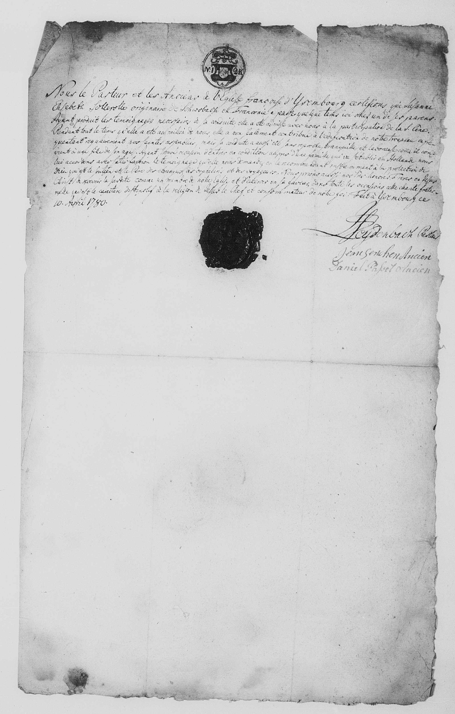

# Reisepass der französisch-reformierten Kirche (1780)

## Der Pass für Etienne Cabos

{ loading=lazy }

> *"Nous le Pasteur et les Anciens de l'Eglise francaise d'Isembourg certifions que le sieur Etienne Cabos nous a produit un témoignage très valable de Stettin ou il avait fait sa dernière demeure. Sur cette attestation nous l'avons admis a la participation de la S. Cène avex notre tropeau. S'etant etabli pour quelque temps chez nous avec sa famille il l'a laissé chez nous pendant que les affaires l'ont obligé de aller prendre plusieurs voyages. Mais ayant formé sa résolution de s'établir en Hollande, il nous a prié un témoignage de séjours qu'il a fait parmis nous avec sa famille et que nous pouvons lui accorder avec satisfaction. Nous aurions souhaité de pouvoir ajoute cette famille a celles qui composent notre troupeau mais puisque sa négoce l'appelle aeilleurs nous le recommandons et ceux qui lui appartiennent a notre honorés frères en J.C. priant le Seigneur qu'il veuille bien prendre etc. signé: I.S. Eyderbach, pasteur; Jean Selchen, ancien; Daniel Papet, ancien"*

*Wir, der Pastor und die Kirchenältesten von Isemburg bestätigen, dass der Herr Etienne Cabos uns ein sehr gültiges Zeugnis aus Stettin gezeigt hat, wo er seinen letzten Verbleib hatte. Auf Basis dieses Nachweises haben wir ihn zugelassen zur Teilnahme am heiligen Abendmahl mit unserer Gemeinde. Nachdem er sich eine Weile bei uns mit seiner Familie aufgehalten hatte, hat er die Familie bei uns gelassen während seine Geschäfte ihn gezwungen haben, einige Reisen zu unternehmen. Aber nachdem er den Entschluss gefasst hatte, seinen Wohnsitz in Holland zu ergreifen, hat er uns darum gebeten, ein Zeugnis über seinen Aufenthalt auszustellen, den er unter uns mit seiner Familie verbracht hat, das wir ihm mit Zufriedenheit ausstellen können. Wir hätten uns gewünscht, diese Familie zu denen hinzufügen zu können, die unsere Gemeinde ausmachen, aber da seine Geschäfte ihn fortrufen, empfehlen wir ihn und die Seinen unseren geschätzten Brüdern in J.C. (Jesus Christus) und bitten den Herrn, dass er ihn gut auf...*

**Unterzeichner:**

- I.S. Eyderbach, Pastor
- Jean Selchen, Kirchenältester
- Daniel Papet, Kirchenältester

---

## Der Pass für Susanne Elisabeth Sollerolle (Magd der Familie)

{ loading=lazy }

> *"Nous le Pasteur et les Anciens de l'Eglise fracoise d'Ysembourg certfions que Susanne Elisabeth Sollerolle originaire de Schwobach en Franconie a passer quelque tems ici avec un de ses parens. Ayant produit les témoignages de la conduite, elle a été admisse avec nous a la participation de la S. Cène. Pendant tout le tems quelle a eté au milieu de nous, elle a non seulement contribué à la édification de notre troupeau en frequentant regulierement nos..."*

*Wir, der Pastor und die Kirchenältesten der französischen Kirche von Isenburg, bestätigen, dass Susanne Elisabeth Sollerolle, gebürtig aus Schwabach in Franken, einige Zeit hier bei einem ihrer Verwandten verbracht hat. Nachdem sie gültige Zeugnisse ihres Lebenswandels vorgelegt hat, wurde sie bei uns zur Teilnahme am heiligen Abendmahl zugelassen. Während der ganzen Zeit, die sie in unserer Mitte war, hat sie nicht nur zur Erbauung unserer Gemeinde beigetragen, indem sie regelmäßig unsere...*

!!! note "Susanne Elisabeth Sollerolle"
    Susanne Elisabeth Sollerolle stammte aus Schwabach in Franken und war die **Magd der Familie Cabos**. Sie begleitete die Familie auf ihrer Reise von Stettin nach Rotterdam.

---

## Dokumentinformationen

| Feld | Wert |
|------|------|
| **Dokumenttyp** | Kirchlicher Reisepass/Zeugnis |
| **Ausstellungsdatum** | 10. April 1780 |
| **Ausstellende Institution** | Französische reformierte Kirche in Isenburg (Ysembourg) |
| **Empfänger** | Etienne Cabos und Familie |
| **Reiseziel** | Holland |
| **Vorheriger Wohnort** | Stettin |

---

## Beschreibung

Dieses Dokument ist ein faszinierendes Zeugnis der hugenottischen Netzwerke im Europa des 18. Jahrhunderts. Es zeigt, wie die französisch-reformierten Gemeinden in verschiedenen Ländern als Anlaufstellen und Vermittler für ihre Glaubensbrüder dienten.

### Der Ausstellungsort: Isenburg

Die französisch-reformierte Kirche in Isenburg (Ysembourg) lag auf dem Weg von Preußen nach Holland. Sie diente als Zwischenstation für Etienne auf seiner Reise von Stettin nach Rotterdam.

### Die Funktion des Dokuments

Das Dokument erfüllte mehrere Funktionen:

1. **Religiöses Zeugnis** - Bestätigung der reformierten Konfession und des guten Lebenswandels
2. **Identitätsnachweis** - Bestätigung der Person und Herkunft
3. **Empfehlungsschreiben** - Empfehlung für die aufnehmende Gemeinde in Holland

### Das Netzwerk der reformierten Gemeinden

Die hugenottischen Gemeinden in ganz Europa bildeten ein Netzwerk gegenseitiger Unterstützung:

- Zeugnisse wurden von Gemeinde zu Gemeinde weitergereicht
- Neuankömmlinge wurden in die Gemeinde aufgenommen
- Unterstützung bei der Ansiedlung wurde gewährt

---

## Bedeutung für die Familiengeschichte

Dieses Dokument belegt:

- Den Entschluss der Familie, Stettin zu verlassen
- Die Absicht, nach Holland zu ziehen
- Die Zugehörigkeit zur französisch-reformierten Gemeinde
- Die Nutzung des hugenottischen Netzwerks

---

[← Zurück zur Übersicht](index.md)
