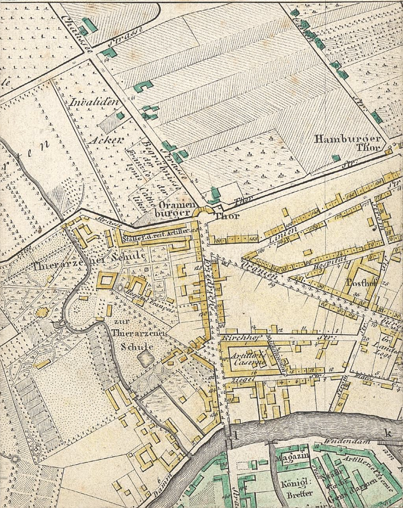

# Sterbeurkunde Etienne Cabos (1808)

{ loading=lazy }

> *"Le 14 Sep 1808 à 1 heure du matin est mort d'apoplexie à l'hopital Etienne Cabos agé de 71 ans natif de Kochshagen fils d'Etienne Cabos et de Marie Rey sa femme. Enterrer le 16 au cimetiere de la porte d'Orange"*

*Am 14. September 1808 um 1 Uhr morgens ist an einem Schlaganfall im Krankenhaus gestorben Etienne Cabos, 71 Jahre alt, gebürtig aus "Kochshagen" [= Caussade], Sohn von Etienne Cabos und seiner Ehefrau Marie Rey. Beerdigt am 16. auf dem Friedhof am Oranienburger Tor.*

!!! note "Ortsname 'Kochshagen'"
    Der Schreiber notierte den Geburtsort als "Kochshagen" - eine phonetische Verballhornung von **Caussade**. Der französische Ortsname war dem deutschsprachigen Kirchenbuchführer offenbar nicht geläufig.

---

## Dokumentinformationen

| Feld | Wert |
|------|------|
| **Dokumenttyp** | Kirchenbucheintrag (Sterbefall) |
| **Todesdatum** | 14. September 1808, 1:00 Uhr morgens |
| **Sterbeort** | Charlottenburger Krankenhaus |
| **Todesursache** | Schlaganfall |
| **Alter** | 71 Jahre |
| **Beerdigungsdatum** | 16. September 1808 |
| **Friedhof** | Cimetière de la porte d'Orange (Friedhof am Oranienburger Tor) |

---

## Beschreibung

Am **14. September 1808**, morgens um ein Uhr, starb **Etienne Cabos** im Alter von 71 Jahren im Charlottenburger Krankenhaus an einem **Schlaganfall**. Zwei Tage später, am 16. September, wurde er auf dem **Friedhof am Oranienburger Tor** beerdigt - dem traditionellen Friedhof der französischen Kolonie in Berlin.

### Die letzten Jahre

Über Etiennes letzte Lebensjahre wissen wir wenig. Ein Jahr vor seinem Tod, am 16. August 1807, hatte seine Tochter Anne Elisabeth in der Luisenkirche in Charlottenburg den Stadtchirurgen August Friedrich Ferdinand Pohle geheiratet. Bei dieser Hochzeit wurde Etienne noch als "Kaufmann zu Rotterdam" bezeichnet - ein Titel, der auf seine Rotterdamer Jahre verwies.

### Der Friedhof am Oranienburger Tor

Der **Cimetière de la porte d'Orange** (Friedhof am Oranienburger Tor) war der Begräbnisplatz der französisch-reformierten Gemeinde in Berlin. Hier fanden die Mitglieder der hugenottischen Gemeinde ihre letzte Ruhe.

{ loading=lazy }

*Karte von Berlin um 1810. Der Friedhof am Oranienburger Tor (Cimetière de la porte d'Orange) lag nördlich der Stadtmauer.*

Der Friedhof existiert noch heute als **Französischer Friedhof** in der Chausseestraße in Berlin.

---

## Das Ende einer Ehe

Bemerkenswert ist, dass Etienne im Krankenhaus starb - nicht zu Hause bei seiner Familie. Der Sterbeeintrag seiner Frau Maria Justine zwei Jahre später gibt einen Hinweis: Sie wird dort als "separirte" bezeichnet - getrennt lebend.

Es scheint, dass die Ehe in den letzten Jahren nicht mehr glücklich war. Die vielen Schicksalsschläge - die Kindesverluste, die finanziellen Nöte, die mehrfachen Umzüge - hatten wohl ihre Spuren hinterlassen.

---

## Der Tod von Maria Justine (1810)

Maria Justine überlebte ihren Mann um zwei Jahre. Am **10. September 1810** starb sie abends um neun Uhr an der Ruhr. Der Kirchenbucheintrag vermerkt:

> *"1 major: Tochter und 3 Söhne davon 2 major: sind, und 1 Sohn von dem man seit 20 Jahren nichts weiß"*

Sie hinterließ also:
- Eine erwachsene Tochter (Elisabeth)
- Drei Söhne, von denen zwei volljährig waren
- Einen Sohn, von dem man seit 20 Jahren nichts gehört hatte

Wer war dieser verschollene Sohn? Möglicherweise einer der älteren Söhne aus der Stettiner Zeit, der sein eigenes Schicksal gesucht hatte und den Kontakt zur Familie verloren hatte.

---

## Bedeutung für die Familiengeschichte

Dieser Eintrag belegt:

- Das Todesdatum und die Todesursache von Etienne Cabos
- Seine Bestattung auf dem hugenottischen Friedhof
- Die mögliche Trennung von seiner Frau in den letzten Jahren
- Das Ende eines bewegten Lebens, das ihn von Südfrankreich über Preußen und die Niederlande nach Berlin geführt hatte

---

[← Zurück zur Übersicht](index.md)
