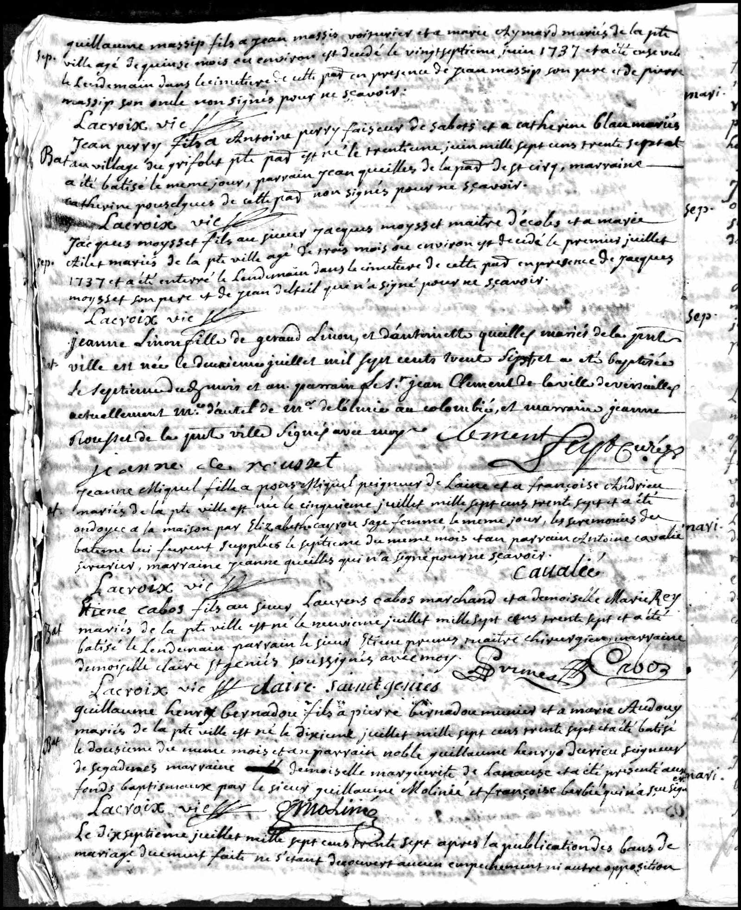

# Baptism of Etienne Cabos (1737)

{ loading=lazy }

> *"Etiene cabos fils au Sieur Laurent cabos marchand et a demoiselle Marie Rey mariés de la pte ville est né le neuvienne juillet mille Sept cens trente sept et a été batisé le Lendemain parrain le sieur Etiene Prunet maitre chirurgien, marraine demoiselle Claire St Geniés soussignnés avec moy Lacroix vie Claire Saint genies Prunet Cabos"*

*Etiene Cabos, son of Mr. Laurens Cabos, merchant, and Miss Marie Rey, married in the said town, was born on the ninth of July 1737 and was baptized the next day. Godfather was Mr. Etiene Prunet, master surgeon, godmother was Miss Claire St Geniés. Signed with me Lacroix Vie, Claire Saint Genies, Prunet, Cabos*

---

## Document Information

| Field | Value |
|------|------|
| **Document Type** | Church Register Entry (Baptism) |
| **Date of Birth** | July 9, 1737 |
| **Date of Baptism** | July 10, 1737 |
| **Location** | Caussade, Tarn-et-Garonne, France |
| **Baptized** | Etienne Cabos |
| **Father** | Laurens Cabos (Merchant) |
| **Mother** | Marie Rey |
| **Godfather** | Etienne Prunet (Master Surgeon) |
| **Godmother** | Claire St. Genies |

---

## Description

On **July 9, 1737**, **Etienne Cabos** was born as the son of Laurens Cabos and Marie Rey in Caussade. The very next day, on July 10, he was baptized - a then-common practice of quick baptism due to high infant mortality rates.

### The Godparents

The choice of godparents shows the family's social standing:

- **Etienne Prunet** - A master surgeon, after whom the baptized child was presumably named
- **Claire St. Genies** - A lady from the educated bourgeoisie

Both names indicate connections to the medical profession and the upper middle class of the region.

### Historical Context

Caussade had been a Protestant center since 1560. Although the town had surrendered to royal troops in 1621, a quiet Protestant resistance persisted here. Baptism in the Catholic Church was mandatory for all subjects - regardless of their actual religious conviction.

---

## Significance for Family History

This entry is the **birth document** of Etienne Cabos and establishes:

- His exact date of birth: July 9, 1737
- His origin from Caussade in the Quercy region
- His family's bourgeois status
- Connections to medical professional circles (godfather was a surgeon)

---

[← Back to Overview](index.md)
