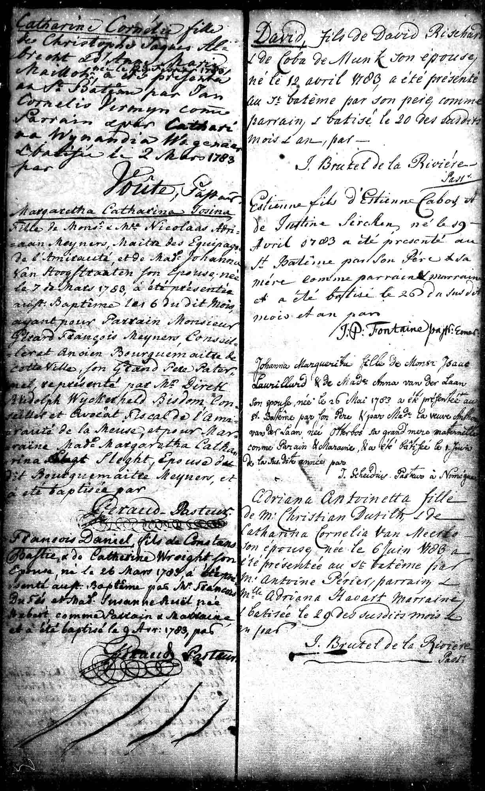
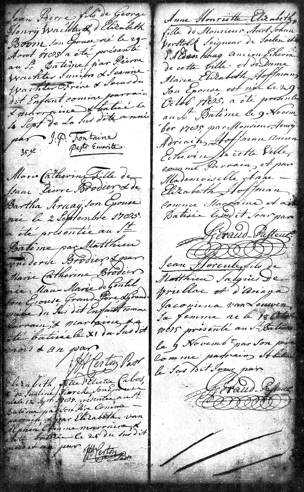

# Baptisms in Rotterdam (1780-1785)

## Baptism of Justine (1780)

{ loading=lazy }

*On September 4, 1780, their daughter Justine was born in Rotterdam. She was baptized on September 13.*

---

### Document Information

| Field | Value |
|------|------|
| **Document Type** | DTB Rotterdam Doop Waals (Walloon Baptismal Register) |
| **Date of Birth** | September 4, 1780 |
| **Date of Baptism** | September 13, 1780 |
| **Baptized Child** | Justine |
| **Parents** | Etienne Cabos and Maria Justine Siercken |

### Description

Just a few months after arriving in Rotterdam, their daughter **Justine** was born on September 4, 1780. She was baptized on September 13 in the Walloon (French Reformed) church.

Tragically, little Justine died on September 12, 1782 - not even two years old.

---

## Baptism of Etienne (1783)

{ loading=lazy }

*The baptism entry of Etienne, April 26, 1783, in the DTB Rotterdam Doop Waals.*

*On April 19, 1783, their son Etienne was born. According to a letter from Pastor Täge of Anklam, he was born during a journey from Le Havre to Rotterdam. He was baptized in Rotterdam on April 26.*

---

### Document Information

| Field | Value |
|------|------|
| **Document Type** | DTB Rotterdam Doop Waals |
| **Date of Birth** | April 19, 1783 |
| **Date of Baptism** | April 26, 1783 |
| **Baptized Child** | Etienne |
| **Parents** | Etienne Cabos and Maria Justine Siercken |
| **Special Note** | Born during a journey from Le Havre to Rotterdam |

### Description

The son **Etienne** was born on April 19, 1783 - according to a letter from Pastor Täge of Anklam, *"during a journey from Le Havre to Rotterdam"*. This detail is fascinating: What brought Etienne Cabos senior to Le Havre? Was it a business trip for his fancy goods store?

The baptism took place on April 26, 1783 in Rotterdam - the child was given his father's name.

---

## Baptism of Elisabeth (1785)

{ loading=lazy }

*On September 12, 1785, their daughter Elisabeth was born; she was baptized on September 25. Baptism entry for Elisabeth, September 25, 1785, in the DTB Rotterdam Doop Waals.*

---

### Document Information

| Field | Value |
|------|------|
| **Document Type** | DTB Rotterdam Doop Waals |
| **Date of Birth** | September 12, 1785 |
| **Date of Baptism** | September 25, 1785 |
| **Baptized Child** | Elisabeth |
| **Parents** | Etienne Cabos and Maria Justine Siercken |

### Description

On September 12, 1785, their daughter **Elisabeth** was born and baptized on September 25. She was the last child born in Rotterdam.

Elisabeth survived as one of the few children and later married (1807) the municipal surgeon August Friedrich Ferdinand Pohle in Charlottenburg.

---

## The Walloon Church in Rotterdam

All children were baptized in the **Walloon (French Reformed) Church**. The Walloon congregations in the Netherlands were traditional havens for French-speaking Protestants and maintained close connections to the Huguenot networks throughout Europe.

---

[← Back to Overview](index.md)
