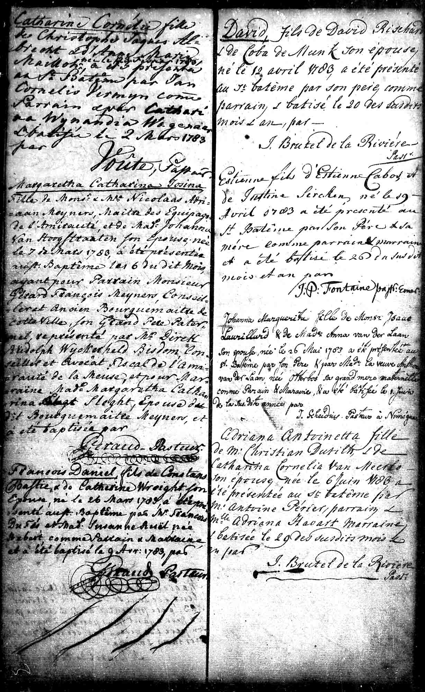
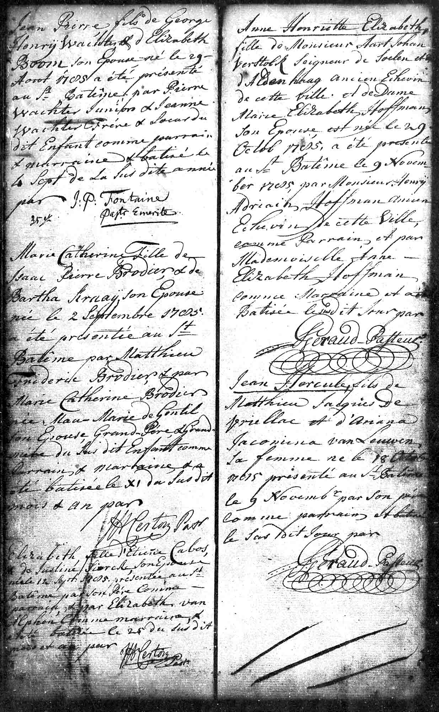

# Taufen in Rotterdam (1780-1785)

## Taufe Justine (1780)

{ loading=lazy }

*Am 4. Sept. 1780 kommt ihre Tochter Justine in Rotterdam zur Welt. Sie wird am 13. Sept. getauft.*

---

### Dokumentinformationen

| Feld | Wert |
|------|------|
| **Dokumenttyp** | DTB Rotterdam Doop Waals (Wallonisches Taufbuch) |
| **Geburtsdatum** | 4. September 1780 |
| **Taufdatum** | 13. September 1780 |
| **Täufling** | Justine |
| **Eltern** | Etienne Cabos und Maria Justine Siercken |

### Beschreibung

Nur wenige Monate nach der Ankunft in Rotterdam wurde am 4. September 1780 die Tochter **Justine** geboren. Sie wurde am 13. September in der wallonischen (französisch-reformierten) Kirche getauft.

Tragischerweise starb die kleine Justine bereits am 12. September 1782 - nicht einmal zwei Jahre alt.

---

## Taufe Etienne (1783)

{ loading=lazy }

*Der Eintrag der Taufe von Etienne 26.4.1783 im DTB Rotterdam Doop Waals.*

*Am 19. Apr. 1783 wird ihr Sohn Etienne geboren. Laut eines Briefs des Pfarrers Täge aus Anklam wurde er geboren auf einer Reise von Le Havre nach Rotterdam. Am 26. Apr. wird er in Rotterdam getauft.*

---

### Dokumentinformationen

| Feld | Wert |
|------|------|
| **Dokumenttyp** | DTB Rotterdam Doop Waals |
| **Geburtsdatum** | 19. April 1783 |
| **Taufdatum** | 26. April 1783 |
| **Täufling** | Etienne |
| **Eltern** | Etienne Cabos und Maria Justine Siercken |
| **Besonderheit** | Geboren auf einer Reise von Le Havre nach Rotterdam |

### Beschreibung

Der Sohn **Etienne** wurde am 19. April 1783 geboren - laut eines Briefes des Pfarrers Täge aus Anklam *"auf einer Reise von Le Havre nach Rotterdam"*. Diese Angabe ist faszinierend: Was führte Etienne Cabos senior nach Le Havre? War es eine Geschäftsreise für sein Galanteriewarengeschäft?

Die Taufe fand am 26. April 1783 in Rotterdam statt - das Kind erhielt den Namen seines Vaters.

---

## Taufe Elisabeth (1785)

{ loading=lazy }

*Am 12. Sept. 1785 wird ihre Tochter Anne Elisabeth geboren, am 25. Sept. wird sie getauft. Eintrag zur Taufe von Elisabeth 25.9.1785 im DTB Rotterdam Doop Waals.*

---

### Dokumentinformationen

| Feld | Wert |
|------|------|
| **Dokumenttyp** | DTB Rotterdam Doop Waals |
| **Geburtsdatum** | 12. September 1785 |
| **Taufdatum** | 25. September 1785 |
| **Täufling** | Anne Elisabeth |
| **Eltern** | Etienne Cabos und Maria Justine Siercken |

### Beschreibung

Am 12. September 1785 wurde die Tochter **Anne Elisabeth** geboren und am 25. September getauft. Sie war das letzte Kind, das in Rotterdam zur Welt kam.

Elisabeth überlebte als eine der wenigen Kinder und heiratete am **16. August 1807** in Charlottenburg den Stadtchirurgen **August Friedrich Ferdinand Pohle**. Sie starb am **21. Dezember 1866** in Groß Jehser (Brandenburg) und wurde am 24. Dezember 1866 beerdigt.

[→ Hochzeit Elisabeth 1807](hochzeit-elisabeth-1807.md)

---

## Die wallonische Kirche in Rotterdam

Alle Kinder wurden in der **wallonischen (französisch-reformierten) Kirche** getauft. Die wallonischen Gemeinden in den Niederlanden waren traditionelle Anlaufpunkte für französischsprachige Protestanten und pflegten enge Verbindungen zu den hugenottischen Netzwerken in ganz Europa.

---

[← Zurück zur Übersicht](index.md)
