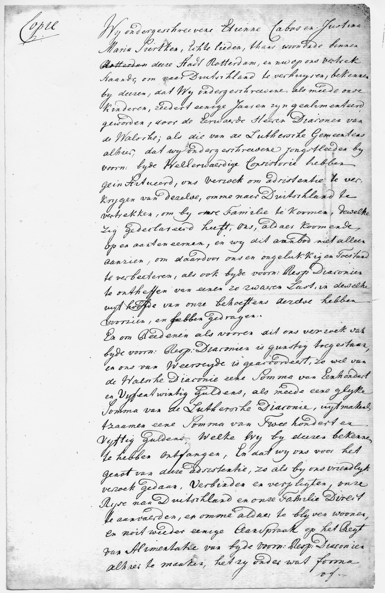

# Maintenance Contract with the Consistory of Rotterdam (1792)

## The Original Pages

### Page 1
{ loading=lazy }

### Page 2
{ loading=lazy }

### Page 3
{ loading=lazy }

---

## Document Information

| Field | Value |
|------|------|
| **Document Type** | Contract/Agreement |
| **Date** | April 18, 1792 |
| **Issuing Institution** | Consistory of the Lutheran and Walloon Church of Rotterdam |
| **Signatories** | Etienne Cabos and Justine Maria Siercken |
| **Agreed Sum** | 250 Guilders (125 from each church) |

---

## Transcription (Translation from Dutch)

**Provision / Maintenance**

*Contract of Étienne Cabos and his wife Justina Maria Siercken, who are about to depart for Germany, after receiving 250 guilders from the Walloon and Lutheran Diaconate on April 18, 1792.*

---

We, the undersigned Étienne Cabos and Justine Maria Siercken, noble people, currently residing in the city of Rotterdam, are at this time ready to depart for Germany. We hereby confirm that we and our children have been receiving maintenance for several years, both from the honorable Deacons of the Walloons, as well as from the local Lutheran congregation.

Recently we have been informed by the honorable Consistory (ecclesiastical authority) that we have permission to relocate to Germany to live with our family, who have invited us. We are taking up this offer, not only to improve our unfortunate situation, but also to relieve the two Diaconates of a heavy burden they bear in meeting our needs.

Our request has been approved by both Diaconates and both are ready to help and support us, the Walloon Diaconate with a sum of 125 guilders and the same sum of 125 guilders also from the Lutheran Diaconate, which together amounts to 250 guilders, which we confirm having received and thank for this kind support, so that we can immediately undertake the journey to Germany to remain living there.

Once arrived there, we commit ourselves never again to claim maintenance from either Diaconate, under any circumstances whatsoever. Furthermore, we wish to express our gratitude for the many years of maintenance for us and our children and commit ourselves to repay the sum of 250 guilders as soon as it is possible to us to the Walloon Diaconate and the Lutheran congregation.

**Rotterdam April 18, 1792**

Signed:

- E. Cabos
- M.J. Cabos, née Siercken

*Today in the Consistory of the local Lutheran congregation.*

---

## Description

This document reveals a less glorious chapter in the life of the Cabos family: financial hardship and dependence on ecclesiastical support.

### The Economic Decline

The Cabos family had begun hopefully anew in Rotterdam in 1780 - with a haberdashery shop on Vissersdijk. But something went wrong:

- The business appears not to have been successful
- The family had been dependent on support "for several years"
- Both the Walloon and Lutheran congregations supported the family

### The Agreement

The contract regulated the following:

| Aspect | Details |
|--------|---------|
| **Travel Money** | 250 Guilders (125 from each church) |
| **Condition** | Relocation to Germany |
| **Obligation** | No renewed claim for support |
| **Repayment** | "as soon as possible" |

### The Significance of 250 Guilders

250 guilders was a considerable sum of money in the late 18th century. To put this in perspective:

**In relation to workers' wages:**

- An **unskilled laborer** earned approximately **300 guilders per year**[^1]
- A **craftsman** (mason, carpenter) earned approximately **250-600 guilders per year**[^2]
- A **master carpenter** could earn approximately **1 guilder per day** (ca. 300 guilders/year with 300 working days)[^3]
- Professional **painters** earned up to **3 guilders per day**[^3]

**This means concretely:**

The 250 guilders corresponded to:
- **10 months of work** for an unskilled laborer
- **6-12 months of work** for an average craftsman
- **Nearly a year's salary** for simple laborers

**Purchasing power:**

Poor families spent up to **50% of their income on bread**.[^4] The 250 guilders had to cover not only the travel costs, but also enable a fresh start in Germany - accommodation, provisions, and possibly the establishment of a new livelihood.

For a family with six surviving children (Johann Carl, Friedrich Ludwig, Franz Alexander, Henriette, Etienne jr., and Elisabeth), this was indeed substantial support, but by no means a fortune. It was just enough to finance the journey and bridge a few weeks or months.

**For comparison:** The painter Vermeer had accumulated a bread debt of 617 guilders in the 17th century - which corresponded to several years of bread supply for a family.[^3] This illustrates how quickly even larger sums could be exhausted.

[^1]: [What was a guilder worth? | Lens on Leeuwenhoek](https://lensonleeuwenhoek.net/content/what-was-guilder-worth) - Data on wages of unskilled laborers in Delft
[^2]: [Historical Value of the Guilder: Measuring Vermeer's Prices](https://www.essentialvermeer.com/references/vermeer-economy.html) - Annual salaries of craftsmen
[^3]: [Historical Value of the Guilder: Measuring Vermeer's Prices](https://www.essentialvermeer.com/references/vermeer-economy.html) - Daily wages and price comparisons
[^4]: [Food in Seventeenth-Century Netherlands](https://www.essentialvermeer.com/dutch-painters/netherlands/food-in-the-netherlands.html) - Expenditures for basic foodstuffs

### The Invitation to Germany

The family was invited to Germany by relatives. Who these relatives were is not documented - possibly contacts from the Stettin period or other Huguenot families in Berlin.

---

## Historical Context: The Political Situation in Holland 1792

### Europe on the Eve of War

1792 was a turbulent year in Europe. The French Revolution was in full swing, and the European powers were preparing for conflict. The date of the contract - **April 18, 1792** - is remarkable: **Only two days later**, on April 20, 1792, France declared war on Austria.

### Timeline

| Date | Event |
|-------|----------|
| **1787** | Prussian army suppresses the Dutch "Patriot" movement and restores Orange rule |
| **April 1789** | Beginning of the French Revolution |
| **April 18, 1792** | Etienne's maintenance contract with the church in Rotterdam |
| **April 20, 1792** | France declares war on Austria |
| **February 1, 1793** | France declares war on Holland and England |
| **Winter 1794/95** | French invasion across the frozen rivers |
| **January 19, 1795** | Batavian Republic is proclaimed |

### The "Patriots" and the Orangists

In the Netherlands, two political camps were hostile to each other:

- The **"Patriots"** - a reform-oriented movement that sympathized with the ideals of the French Revolution
- The **Orangists** - supporters of Stadholder William V

In 1787, the Prussian army had violently suppressed the Patriot movement and restored Orange rule. Many Patriots were waiting for an opportunity for revenge - and saw the French revolutionary army as their liberators.[^5]

### Possible Reasons for Departure

For Etienne Cabos, a native Frenchman with a Prussian military background, the situation was particularly delicate:

1. **War danger was foreseeable** - In April 1792, it was clear that a war between France and Holland was imminent. As a native Frenchman, Etienne's position in Holland would have become difficult.

2. **Political tensions** - The Patriots (pro-French) and Orangists were hostile to each other. As a Huguenot, Etienne was in a complex position: The Huguenots had fled from Catholic France, but revolutionary France was anti-clerical and was now also persecuting Protestant clergy.

3. **Economic hardship** - The contract shows that the family was already dependent on ecclesiastical welfare.

4. **Prussian connections** - Etienne had served for years in the Prussian army. With the impending war between France and the Netherlands allied with Prussia, his loyalty was potentially questionable.

5. **Family in Germany** - The contract explicitly mentions an invitation from family in Germany - possibly contacts from the Stettin period or other Huguenot families in Berlin.

The timing is striking: The contract was signed only **two days before** the French declaration of war on Austria. The signs pointed to storm, and for a family with French roots and a Prussian past, Germany was the safest haven.

[^5]: [Batavian Revolution - Wikipedia](https://en.wikipedia.org/wiki/Batavian_revolution) and [Batavian Republic - Wikipedia](https://en.wikipedia.org/wiki/Batavian_Republic)

---

## Significance for Family History

This document documents:

- The financial hardship of the family in Rotterdam
- The years-long dependence on ecclesiastical support
- The decision to emigrate to Germany
- The existence of family connections in Germany

It is an honest testimony to the difficulties faced by many emigrants - despite initial hopes for economic success.

---

[← Back to Overview](index.md)
