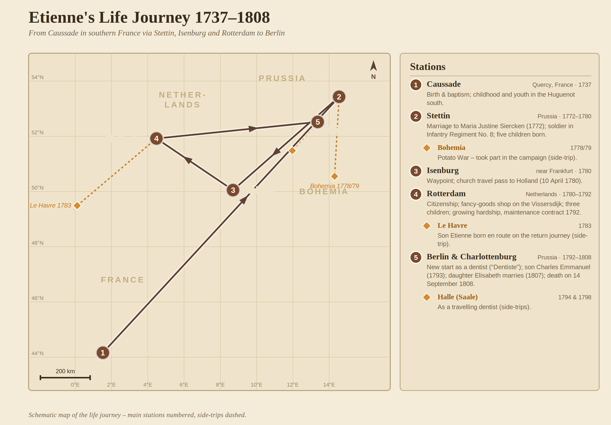

# Etienne Cabos (1737-1808)

## A Life Between France, Prussia and the Netherlands

*Etienne Cabos's life journey with its main stations and the key events of each - from Caussade in southern France via Stettin, Isenburg and Rotterdam to Berlin (1737-1808).*

---

## A World in Upheaval

18th century France was a land of contrasts. While Paris shone in the splendor of the Sun King and his successors, the Protestants - the Huguenots - still suffered from the aftermath of the devastating Edict of Fontainebleau of 1685, which abolished religious freedom and forced hundreds of thousands to flee. Between 160,000 and 200,000 French Protestants fled to Protestant countries of Europe, about 44,000 of them to Germany and around 70,000 to the Netherlands.

Into this turbulent time, on **July 9, 1737**, in the small town of **Caussade**, located in southern France in the Quercy region, a boy was born whose life would lead him through half of Europe: **Etienne Cabos**.

-   [{ width="200" }](dokumente/karte-1777.md)

    **Map from 1777**

    Carte de France - Montauban sheet

    [→ To the map](dokumente/karte-1777.md)

---

## Childhood in the Protestant South

Caussade, a picturesque town in white Quercy, had been a Protestant center since 1560 - once in the orbit of Montauban, the capital of the southwestern Reformed. Although the town had surrendered to the troops of Louis XIII in 1621, a quiet Protestant resistance persisted here into the 18th century.

Etienne's father, **Laurens Cabos**, was a merchant and had married **Marie Rey** on July 14, 1729. The wedding was performed in the Catholic church - as the law required - but the ceremony before the Jesuit father Maisonneuve hints at the complicated religious situation of the family. The presence of high-ranking witnesses, including Raymond Rochin, the king's deputy, and Joseph Laens, a surgeon, shows that the Cabos family belonged to the respectable bourgeoisie.

The day after his birth, on July 10, 1737, little Etienne was baptized. His godfather was Etienne Prunet, a master surgeon, his godmother Claire St. Genies - both names that point to the educated bourgeoisie of the region.

Etienne had at least two brothers and one sister: **Jean Cabos**, who married **Jeanne Fournier** in Caussade on February 3, 1760, and died in Caussade on November 4, 1796, **Pierre Cabos**, who was baptized on November 1, 1740 - three years after Etienne -, and **Anne Cabos** (born ca. 1742), who married **Pierre Lacombe** on October 2, 1771 in Saint-Jean de Réalville near Caussade. Jean's wedding was performed by Protestant pastor Lafond "in the Désert" (underground) - an act of religious resistance at a time when Protestantism was forbidden. Anne's marriage entry of 1771 also reveals an important detail: the father Laurens is recorded there as *"feu"* (deceased) - **he therefore died between 1760 and 1771**.

-   [{ width="200" }](dokumente/hochzeit-laurens-1729.md)

    **Wedding 1729**

    Marriage entry of Laurens Cabos and Marie Rey

    [→ To the document](dokumente/hochzeit-laurens-1729.md)

-   [{ width="200" }](dokumente/taufe-etienne-1737.md)

    **Baptism 1737**

    Baptismal entry of Etienne Cabos

    [→ To the document](dokumente/taufe-etienne-1737.md)

-   [{ width="200" }](dokumente/taufe-pierre-1740.md)

    **Baptism Pierre 1740**

    Baptismal entry of Pierre Cabos (younger brother)

    [→ To the document](dokumente/taufe-pierre-1740.md)

-   [{ width="200" }](dokumente/hochzeit-jean-1760.md)

    **Wedding Jean 1760**

    Marriage contract of Jean Cabos and Jeanne Fournier

    [→ To the document](dokumente/hochzeit-jean-1760.md)

-   [{ width="200" }](dokumente/hochzeit-anne-1771.md)

    **Wedding Anne 1771**

    Marriage entry of Anne Cabos and Pierre Lacombe

    [→ To the document](dokumente/hochzeit-anne-1771.md)

---

## The Path to Prussia

The exact circumstances that led Etienne from his southern French homeland to northern Germany lie in the darkness of history. A [French report from 1907](dokumente/bulletin-1907.md) mentions, however, that his **older brother was "effigié" in Caussade** - **executed in effigy**, for an unknown offense. Execution in effigy (the sentence was carried out in absentia on an image) applied to convicts who had **fled**: the brother was therefore not killed, but had evaded justice by flight. It was neither Jean (†1796 in Caussade) nor Pierre (born 1740, thus younger than Etienne). If the claim is true, there must have been **another, older brother**. In September 1761, the Protestant pastor Rochette was arrested in Caussade - the subsequent [Rochette Affair](dokumente/bulletin-1907.md#historischer-kontext-die-affare-rochette-1761-1762) shook the Protestant community. Whether a family tragedy drove Etienne to flee France remains speculation, but it would explain why he left his homeland forever.

The temporal proximity to the father's death is also striking: Laurens Cabos died between 1760 and 1771 - at the [wedding of his sister Anne in October 1771](dokumente/hochzeit-anne-1771.md) he is already recorded as deceased. Only nine months later, Etienne married in Stettin. Perhaps the death of the father - and an associated division of the inheritance - gave the final impetus to leave home.

What is certain is that he appears in Stettin in the early 1770s - not as a merchant like his father, but as a soldier in the Prussian army. The same report describes him as a "deserter" and mentions that he "received numerous blows to learn the Prussian art of drilling" - a reference to the notorious harshness of Prussian military discipline.

Prussia under Frederick the Great was a refuge for French Protestants. The Edict of Potsdam of 1685 had granted the persecuted Huguenots admission and special privileges. About 18,000 to 20,000 Huguenots found a new home in Brandenburg-Prussia and brought over 40 new professions with them, founded the first manufactories and gained access to high positions in the military, science and administration. French became the language of the educated elites, and the Reformed confession connected the Huguenots with the Brandenburg ruling house.

On **July 16, 1772**, Etienne - now under the Germanized name **Stephan Cabos** - married **Maria Justine Siercken** in Stettin. She came from Templin near Berlin, where her father worked as a town musician. The bride was just 18 years old, born on January 28, 1754.

Etienne served as a soldier in **Infantry Regiment No. 8 (von Hacke)**, in the company of Major Alexander Wilhelm von Arnim. This traditional regiment, founded in 1679, was stationed in Stettin and would soon march into one of the last cabinet wars in European history.

-   [{ width="200" }](dokumente/hochzeit-stettin-1772.md)

    **Wedding Stettin 1772**

    Marriage entry of Stephan Cabos and Maria Justine Siercken

    [→ To the document](dokumente/hochzeit-stettin-1772.md)

-   [{ width="200" }](dokumente/militaerregister.md)

    **Military Register**

    Entries for Infantry Regiment No. 8

    [→ To the document](dokumente/militaerregister.md)

-   [{ width="200" }](dokumente/geburten-stettin.md)

    **Births Stettin 1772-1777**

    Baptismal entries of the four children Johann Carl, Friedrich Ludwig, Franz Alexander and Henriette

    [→ To the documents](dokumente/geburten-stettin.md)

-   [{ width="200" }](dokumente/kriegsende-1779.md)

    **Church Register War's End 1779**

    Entries on the end of the War of the Bavarian Succession (Potato War)

    [→ To the document](dokumente/kriegsende-1779.md)

---

## The Potato War

The years in Stettin were fruitful for the young family. On November 29, 1772, the first son **Johann Carl Abraham** was born, on April 27, 1774, **Friedrich Ludwig Abraham Isaac** followed, on January 29, 1776, **Franz Alexander George Carl**, and on December 29, 1777, the daughter **Henriette Charlotte Sophie**. The godparents of the children - including Major von Wrangel, Major von Arnim and aristocrats such as the wife of Lieutenant von Braunschweig - show that Etienne, despite his simple soldier status, maintained connections in higher circles.

In the summer of 1778, Europe was once again shaken by warmongers. After the extinction of the Bavarian Wittelsbach line, Emperor Joseph II laid claim to Lower Bavaria and the Upper Palatinate. Frederick the Great, determined to prevent a strengthening of Austria, mobilized his troops.

On **July 5, 1778**, 80,000 Prussian and Saxon soldiers marched into Bohemia - **presumably including Etienne Cabos**. Although no direct military proof of his participation in the campaign has been preserved, everything points to it: His regiment, Infantry Regiment No. 8, was among the units transferred to Bohemia. As an active soldier in this regiment, it would have been highly unusual if he had not participated in the campaign.

But what began as a campaign developed into a peculiar non-war: both sides experienced severe logistical problems. The soldiers had to live mainly on requisitioned potatoes, which is why this conflict mockingly entered history as the **"Potato War"** - in Austria it was ridiculed as "Zwetschgenrummel" (Plum Rumble).

The church registers of the garrison church in Stettin note laconically: *"Getaufte während der Campagne im Jahre 1778 u 1779"* - an indication that the families of the soldiers remained in the garrison during the campaign. On **May 13, 1779**, the Peace of Teschen ended the strange war, and the regiments returned to their garrisons.

The [church register on the war's end 1779](dokumente/kriegsende-1779.md) documents the post-war period with entries "zum ende des Krieges zu Sept. 1779" - the administrative aftermath and the return of the soldiers to their families continued into September.

---

## Departure for Rotterdam

After the war, Etienne's life changed fundamentally. In 1779 or 1780, another daughter, **Marie Christine**, was born. But something drove the family away from Stettin - perhaps the desire for economic advancement, perhaps family connections.

On **April 10, 1780**, the French Reformed Church in Isenburg (Ysembourg) issued a pass for Etienne Cabos, which enabled him to travel to Holland. The document is a fascinating testimony:

> *"Wir, der Pastor und die Kirchenältesten von Isemburg bestätigen, dass der Herr Etienne Cabos uns ein sehr gültiges Zeugnis aus Stettin gezeigt hat, wo er seinen letzten Verbleib hatte. Auf Basis dieses Nachweises haben wir ihn zugelassen zur Teilnahme am heiligen Abendmahl mit unserer Gemeinde. [...] Aber nachdem er den Entschluss gefasst hatte, seinen Wohnsitz in Holland zu ergreifen, hat er uns darum gebeten, ein Zeugnis über seinen Aufenthalt auszustellen..."*

On **May 24, 1780**, Etienne was registered as a citizen (Poorter) in Rotterdam: *"Etienne Cabos geb. te Caussade is poorter geedt"* - "Etienne Cabos, born in Caussade, has taken the citizen's oath." The family settled in **Vissersdijk** and operated a **fancy goods shop** there.

-   [{ width="200" }](dokumente/reisepass-1780.md)

    **Travel Pass 1780**

    Issued by the French Reformed Church in Isenburg

    [→ To the document](dokumente/reisepass-1780.md)

-   :material-book-open-variant:{ .lg .middle } **Citizen Book Rotterdam**

    ---

    Entry in the Poorterboek dated May 24, 1780

    [→ To the document](dokumente/buergerbuch-rotterdam.md)

---

## Years in Rotterdam - Joy and Sorrow

Rotterdam in the 1780s was a bustling trading city, characterized by canals and lively shipping traffic. The Cabos family continued to grow: on September 4, 1780, daughter **Justine** was born, on April 19, 1783, son **Etienne** - according to a letter from Pastor Täge from Anklam, he was born *"auf einer Reise von Le Havre nach Rotterdam"* - and on September 12, 1785, **Elisabeth**.

But happiness did not last. On September 12, 1782, little Justine was buried. And in June 1784, the family suffered another heavy blow: Marie Christine, only 5 1/4 years old, died. The entry in the burial book notes soberly: *"overledene was 5 1/4 jaar; Visserdijk Galanteriwinkel"* - a child of 5 1/4 years, residing at Vissersdijk in the fancy goods shop.

The family's economic situation apparently deteriorated increasingly. On **April 18, 1792**, Etienne concluded a remarkable contract with the consistory of the Lutheran and Walloon Church in Rotterdam:

> *"Wir, die unterschreibenden Etienne Cabos und Justine Maria Siercken [...] bestätigen hiermit, dass wir und unsere Kinder seit einigen Jahren Unterhalt bezogen, sowohl durch die ehrenwerten Herren Diakone von den Wallonen, als auch von der hiesigen lutherischen Gemeinde. Vor kurzem sind wir [...] informiert worden, dass wir die Genehmigung haben nach Deutschland zu übersiedeln um bei unserer Familie, welche uns eingeladen hat, zu wohnen."*

The two churches each granted the family 125 guilders - together 250 guilders - to finance the journey to Germany. This corresponded to about **10 months of work for an unskilled laborer** or almost **one year's salary for a simple craftsman** - a substantial sum for a large family, but by no means a fortune. In return, Etienne and his wife pledged to *"nie wieder Anspruch auf Unterhalt von beiden Diakonien [...] zu erheben"* and *"die Summe von 250 Gulden sobald es uns möglich ist"* to repay.

### Europe on the Eve of War

The date of the contract - **April 18, 1792** - is remarkable: **only two days later**, on April 20, 1792, France declared war on Austria. In February 1793, the declaration of war on Holland and England followed, and in the winter of 1794/95, French troops marched across the frozen rivers into the Netherlands.

In Holland, two political camps were hostile to each other: The **"Patriots"**, who sympathized with the ideals of the French Revolution, and the Orangists, supporters of Stadholder William V. As early as 1787, the Prussian army had violently suppressed the Patriot movement. Now many waited for the French revolutionary army as liberators.

For Etienne Cabos - a native Frenchman with a Prussian military background - the situation was particularly delicate. As a Huguenot, he was in a complex position: The Huguenots had fled from Catholic France, but revolutionary France was now also persecuting Protestant clergy. With the impending war between France and the Netherlands allied with Prussia, his loyalty was potentially questionable. The signs pointed to storm, and for a family with French roots and a Prussian past, Germany was the safest haven.

-   [{ width="200" }](dokumente/taufen-rotterdam.md)

    **Baptisms Rotterdam**

    Baptismal entries of the children Justine, Etienne and Elisabeth

    [→ To the documents](dokumente/taufen-rotterdam.md)

-   [{ width="200" }](dokumente/begraebnisse-rotterdam.md)

    **Burials Rotterdam**

    Burial entries for Justine and Marie Christine

    [→ To the documents](dokumente/begraebnisse-rotterdam.md)

-   [{ width="200" }](dokumente/unterhaltsvertrag-1792.md)

    **Support Contract 1792**

    Contract with the Rotterdam consistory

    [→ To the document](dokumente/unterhaltsvertrag-1792.md)

---

## New Beginning in Berlin

The Cabos family traveled to Berlin in 1792 - to a city that had housed a significant French community for over a hundred years. About 6,000 Huguenots had settled in Berlin between 1685 and 1700 and at times made up one-fifth of the population. The French Reformed community with its Friedrichstadtkirche - the "French Cathedral" on Gendarmenmarkt - was the center of this community.

On **January 24, 1793**, the last son of the family was born in Berlin: **Charles Emmanuel**. The church register entry of the French Reformed Friedrichstadtkirche notes that the father was described as *"Dentiste, natif de Caussade en Querci"* - as a dentist, native of Caussade in Quercy. The godparents of the child were high-ranking: Charles Emanuel Baron de Hoffstaedt, Privy Councillor, and Agnes Louise Amelie Palmie, née Rauch.

Etienne was a man of many professions. The [French report from 1907](dokumente/bulletin-1907.md) describes him as an "adventurer" who was successively **hairdresser, dentist and perfumer**. That he actually practiced as a dentist is documented by advertisements in the **Wöchentliche Hallische Anzeigen** from **1794 and 1798**. From Berlin he traveled to Halle to treat patients there. He offered the full spectrum of contemporary dentistry: tooth extraction, prostheses, fillings, teeth cleaning and self-produced mouthwash. In his advertisements, he praised dental prostheses *"welche so fest an dem Gaumen halten, als die besten natürlichen Zähne"*, and in 1798 even promised to insert teeth *"wie sie die Natur giebt"*. As a traveling dentist, Cabos was among the few who visited Halle multiple times.

-   [{ width="200" }](dokumente/taufe-berlin-1793.md)

    **Baptism Berlin 1793**

    Baptismal entry of Charles Emmanuel at the Friedrichstadtkirche

    [→ To the document](dokumente/taufe-berlin-1793.md)

-   :material-tooth:{ .lg .middle } **Dentist in Halle 1794-1798**

    ---

    Advertisements document Cabos' activity as a traveling dentist

    [→ To the document](dokumente/zahnarzt-halle.md)

-   [{ width="200" }](dokumente/bulletin-1907.md)

    **Bulletin 1907**

    French report on the Huguenot colony - mentions Etienne Cabos by name

    [→ To the document](dokumente/bulletin-1907.md)

---

## The Final Years

We know little about Etienne's last years of life. On **August 16, 1807**, his daughter **Anne Elisabeth** married the town surgeon **August Friedrich Ferdinand Pohle** at the Luisenkirche in Charlottenburg. The church register entry describes Etienne as "Merchant in Rotterdam" - a title that probably referred to his Rotterdam years. Elisabeth reached a great age and died on December 21, 1866 in Groß Jehser (Brandenburg).

On **September 14, 1808**, at one o'clock in the morning, Etienne Cabos died at the age of 71 in the Charlottenburg hospital from a stroke. The church register entry of the French Reformed Friedrichstadtkirche records his death and his burial on September 16 at the *"cimetière de la porte d'Orange"* - the cemetery at the Oranienburger Tor, the cemetery of the French colony.

His wife Maria Justine survived him by two years. On September 10, 1810, she died at nine o'clock in the evening from dysentery. The church register entry of the **Luisenkirche in Charlottenburg** describes her as "separirte" - living separately - an indication that the marriage had broken down in its final years. She left behind *"1 major: Tochter und 3 Söhne davon 2 major: sind, und 1 Sohn von dem man seit 20 Jahren nichts weiß"* - one adult daughter and three sons, two of whom were of age, and one son who had not been heard from in 20 years.

-   [{ width="200" }](dokumente/hochzeit-elisabeth-1807.md)

    **Wedding Elisabeth 1807**

    Marriage entry of Anne Elisabeth and August Pohle

    [→ To the document](dokumente/hochzeit-elisabeth-1807.md)

-   [{ width="200" }](dokumente/sterbeurkunde-1808.md)

    **Death Certificate Etienne 1808**

    Death entry of Etienne Cabos in Berlin

    [→ To the document](dokumente/sterbeurkunde-1808.md)

-   [{ width="200" }](dokumente/sterbeurkunde-justine-1810.md)

    **Death Certificate Maria Justine 1810**

    Death entry at the Luisenkirche Charlottenburg

    [→ To the document](dokumente/sterbeurkunde-justine-1810.md)

-   [{ width="200" }](dokumente/hochzeit-elisabeth-1807.md)

    **Death Elisabeth 1866**

    Death entry of Anne Elisabeth Pohle, née Cabos

    [→ To the document](dokumente/hochzeit-elisabeth-1807.md)

---

## Epilogue: A Life in the Stream of History

Etienne Cabos' life reflects the great movements of his time: the aftermath of Huguenot persecution, the attraction of Prussia for French Protestants, the turmoil of the War of the Bavarian Succession, the economic networks between Rotterdam and Germany. He was the son of a merchant, became a soldier in a foreign country, tried his hand as a trader in the Netherlands and finally practiced as a traveling dentist in Prussia.

His story is also a story of losses: two children who died young; a son who was missing; a marriage that broke down; financial hardships that forced him to accept alms from church communities. But it is also a story of perseverance and adaptability - the story of a man who found his way in a world full of boundaries and obstacles.

His son Friedrich Ludwig later went to Hamburg and then to Königsberg, his youngest son Charles Emmanuel remained in Berlin. The Cabos family, once rooted in sunny Quercy, had put down new roots in northern Germany - a small part of the great Huguenot diaspora that changed Europe forever.

---

## The Next Generation: Frédéric Louis

Frédéric Louis came to Hamburg around 1794 - presumably he had accompanied the family on the journey from Rotterdam in 1792 and stayed behind along the way. On March 28, 1806, he became a citizen of Hamburg, and on May 4 of the same year, he married **Anna Monica Jacobsen** at the Hamburg Michel (St. Michaelis). He now called himself **Friedrich Ludwig Abraham Isaak**.

The marriage register of St. Michaelis provides remarkable details: Friedrich Ludwig is listed as *"citizen, born in Stettin"*, his father as *"Stephanus"*, his mother as *"Justine née Siercken"*. His trade is given as **"Mahler"** (painter), his residence as *Neustraße, Neustadt oben No. 288*, and his stay in Hamburg is stated as **12 years** - confirming his arrival around 1794. The bride Anna Monica, born in Hamburg, daughter of Jacob Christian Jacobsen and Anna Margaretha née Stoltzenberg, was the **widow of Johann Friedrich Nettelbroth** (widowed for 1 3/4 years). The wedding was performed by *"Doktor u. Senior Rambach"*. Later, Friedrich Ludwig went to Königsberg.

---

-   :material-book-open-page-variant:{ .lg .middle } **Bibliography**

    ---

    All primary sources and secondary literature

    [→ To the sources](quellen.md)

-   :material-folder-multiple:{ .lg .middle } **Historical Documents**

    ---

    Overview of all original documents

    [→ To the overview](dokumente/index.md)

