# Etienne Cabos (1737-1808)

## Ein Leben zwischen Frankreich, Preußen und den Niederlanden

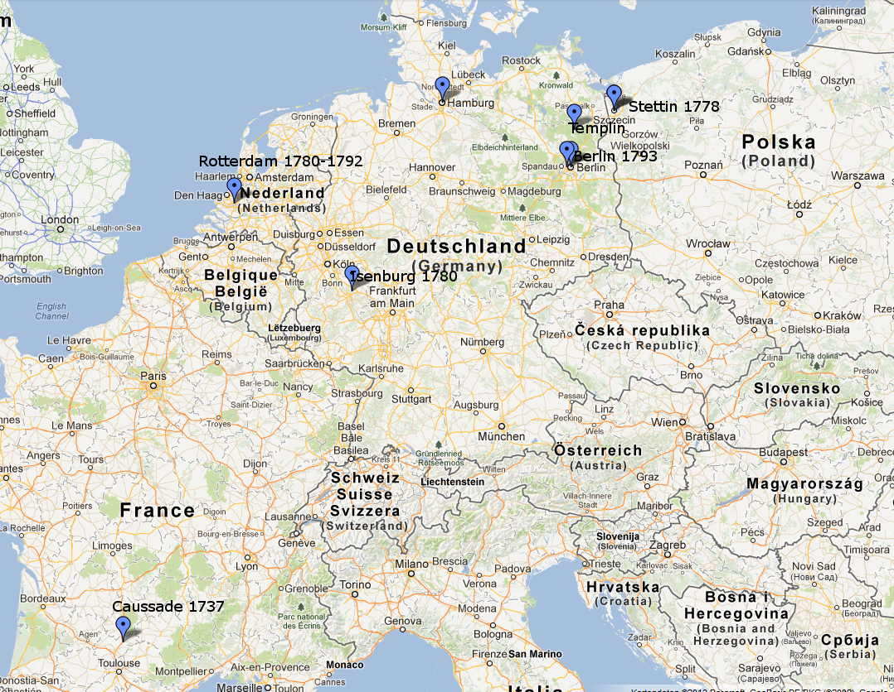

*Die Lebensstationen von Etienne Cabos: Von Caussade in Südfrankreich über Stettin und Rotterdam bis nach Berlin.*

---

## Eine Welt im Umbruch

Das Frankreich des 18. Jahrhunderts war ein Land der Gegensätze. Während Paris im Glanz des Sonnenkönigs und seiner Nachfolger erstrahlte, litten die Protestanten - die Hugenotten - noch immer unter den Nachwirkungen des verheerenden Edikts von Fontainebleau von 1685, das die Religionsfreiheit aufhob und Hunderttausende zur Flucht zwang. Zwischen 160.000 und 200.000 französische Protestanten flohen in protestantische Länder Europas, etwa 44.000 davon nach Deutschland und rund 70.000 in die Niederlande.

In diese turbulente Zeit hinein wurde am **9. Juli 1737** in der kleinen Stadt **Caussade**, im Süden Frankreichs gelegen in der Region Quercy, ein Junge geboren, dessen Leben ihn durch halb Europa führen sollte: **Etienne Cabos**.

-   [{ width="200" }](dokumente/karte-1777.md)

    **Karte von 1777**

    Carte de France - Blatt Montauban

    [→ Zur Karte](dokumente/karte-1777.md)

---

## Kindheit im protestantischen Süden

Caussade, eine malerische Stadt im weißen Quercy, war seit 1560 ein protestantisches Zentrum gewesen - einst in der Umlaufbahn von Montauban, der Hauptstadt der südwestlichen Reformierten. Obwohl die Stadt sich 1621 den Truppen Ludwigs XIII. ergeben hatte, hielt sich hier ein stiller protestantischer Widerstand bis ins 18. Jahrhundert.

Etiennes Vater, **Laurens Cabos**, war Kaufmann und hatte am 14. Juli 1729 **Marie Rey** geheiratet. Die Hochzeit wurde in der katholischen Kirche vollzogen - wie es das Gesetz verlangte -, doch die Zeremonie vor dem Jesuitenpater Maisonneuve deutet auf die komplizierte religiöse Situation der Familie hin. Die Anwesenheit hochrangiger Zeugen, darunter Raymond Rochin, Stellvertreter des Königs, und Joseph Laens, ein Chirurg, zeigt, dass die Familie Cabos zum angesehenen Bürgertum gehörte.

Am Tag nach seiner Geburt, dem 10. Juli 1737, wurde der kleine Etienne getauft. Sein Pate war Etienne Prunet, ein Meisterchirurg, seine Patin Claire St. Genies - beides Namen, die auf das gebildete Bürgertum der Region hindeuten.

Etienne hatte mindestens zwei Brüder: **Jean Cabos**, der am 3. Februar 1760 in Caussade **Jeanne Fournier** heiratete und am 4. November 1796 in Caussade starb, sowie **Pierre Cabos**, der am 1. November 1740 getauft wurde - drei Jahre nach Etienne. Die Trauung Jeans wurde vom protestantischen Pastor Lafond "im Désert" (im Untergrund) vollzogen - ein Akt des religiösen Widerstands in einer Zeit, als der Protestantismus verboten war.

-   [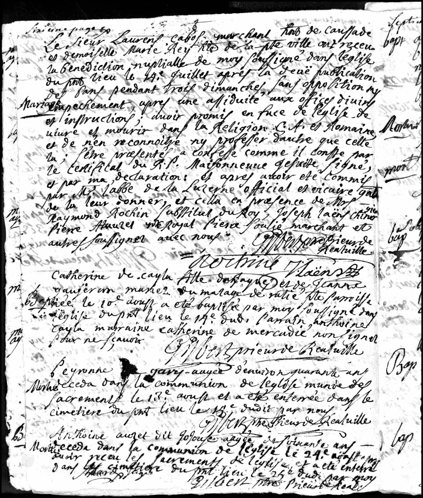{ width="200" }](dokumente/hochzeit-laurens-1729.md)

    **Hochzeit 1729**

    Heiratseintrag Laurens Cabos und Marie Rey

    [→ Zum Dokument](dokumente/hochzeit-laurens-1729.md)

-   [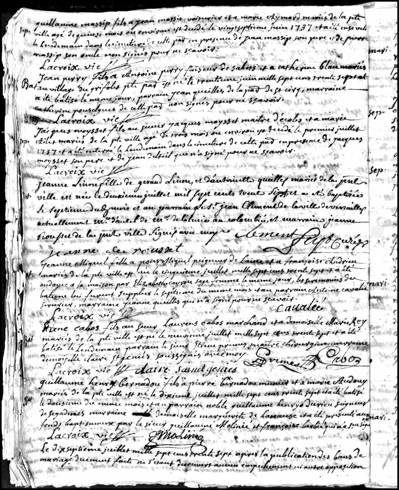{ width="200" }](dokumente/taufe-etienne-1737.md)

    **Taufe 1737**

    Taufeintrag Etienne Cabos

    [→ Zum Dokument](dokumente/taufe-etienne-1737.md)

-   [{ width="200" }](dokumente/taufe-pierre-1740.md)

    **Taufe Pierre 1740**

    Taufeintrag Pierre Cabos (jüngerer Bruder)

    [→ Zum Dokument](dokumente/taufe-pierre-1740.md)

-   [{ width="200" }](dokumente/hochzeit-jean-1760.md)

    **Hochzeit Jean 1760**

    Ehevertrag Jean Cabos und Jeanne Fournier

    [→ Zum Dokument](dokumente/hochzeit-jean-1760.md)

---

## Der Weg nach Preußen

Die genauen Umstände, die Etienne aus seiner südfranzösischen Heimat nach Norddeutschland führten, liegen im Dunkel der Geschichte. Ein [französischer Bericht aus dem Jahr 1907](dokumente/bulletin-1907.md) erwähnt jedoch, dass sein **älterer Bruder in Caussade hingerichtet** worden sei - wegen eines unbekannten Vergehens. Es war weder Jean (†1796 in Caussade) noch Pierre (1740 geboren, also jünger als Etienne). Wenn die Behauptung stimmt, muss es einen **vierten, älteren Bruder** gegeben haben. Im September 1761 wurde in Caussade der protestantische Pastor Rochette verhaftet - die darauf folgende [Affäre Rochette](dokumente/bulletin-1907.md#historischer-kontext-die-affare-rochette-1761-1762) erschütterte die protestantische Gemeinde. Ob ein familiäres Drama Etienne zur Flucht aus Frankreich trieb, bleibt Spekulation, doch es würde erklären, warum er seine Heimat für immer verließ.

Fest steht, dass er in den frühen 1770er Jahren in Stettin auftaucht - nicht als Kaufmann wie sein Vater, sondern als Soldat im preußischen Heer. Der gleiche Bericht bezeichnet ihn als "Deserteur" und erwähnt, dass er "zahlreiche Schläge erhielt, um die preußische Exerzierkunst zu erlernen" - ein Hinweis auf die berüchtigte Härte der preußischen Militärdisziplin.

Preußen unter Friedrich dem Großen war ein Zufluchtsort für französische Protestanten. Das Edikt von Potsdam von 1685 hatte den verfolgten Hugenotten Aufnahme und besondere Privilegien gewährt. Etwa 18.000 bis 20.000 Hugenotten fanden in Brandenburg-Preußen eine neue Heimat und brachten über 40 neue Berufszweige mit, gründeten die ersten Manufakturen und fanden Zugang zu gehobenen Positionen in Militär, Wissenschaft und Verwaltung. Französisch wurde zur Sprache der gebildeten Eliten, und die reformierte Konfession verband die Hugenotten mit dem brandenburgischen Herrscherhaus.

Am **16. Juli 1772** heiratete Etienne - nun unter dem eingedeutschten Namen **Stephan Cabos** - in Stettin die **Maria Justine Siercken**. Sie stammte aus Templin bei Berlin, wo ihr Vater als Stadtmusiker tätig war. Die Braut war gerade 18 Jahre alt, geboren am 28. Januar 1754.

Etienne diente als Soldat im **Infanterieregiment Nr. 8 (von Hacke)**, in der Kompanie des Majors Alexander Wilhelm von Arnim. Dieses traditionsreiche Regiment, gegründet 1679, hatte seinen Standort in Stettin und sollte bald in einen der letzten Kabinettskriege der europäischen Geschichte ziehen.

-   [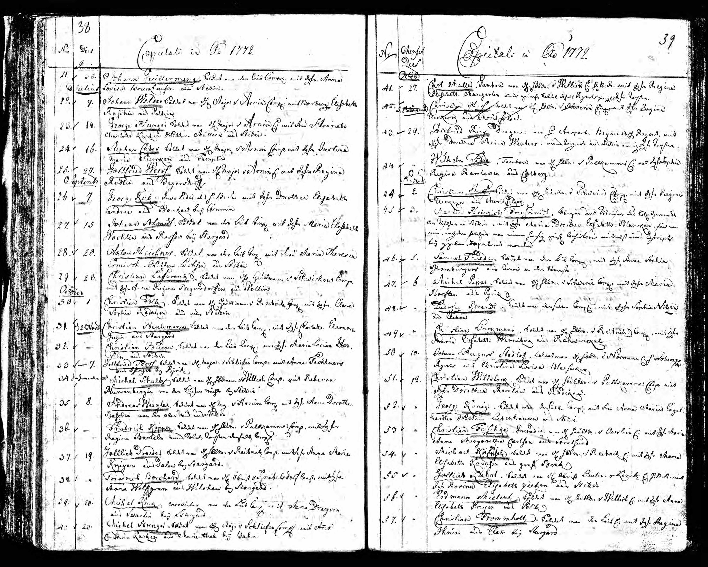{ width="200" }](dokumente/hochzeit-stettin-1772.md)

    **Hochzeit Stettin 1772**

    Heiratseintrag Stephan Cabos und Maria Justine Siercken

    [→ Zum Dokument](dokumente/hochzeit-stettin-1772.md)

-   [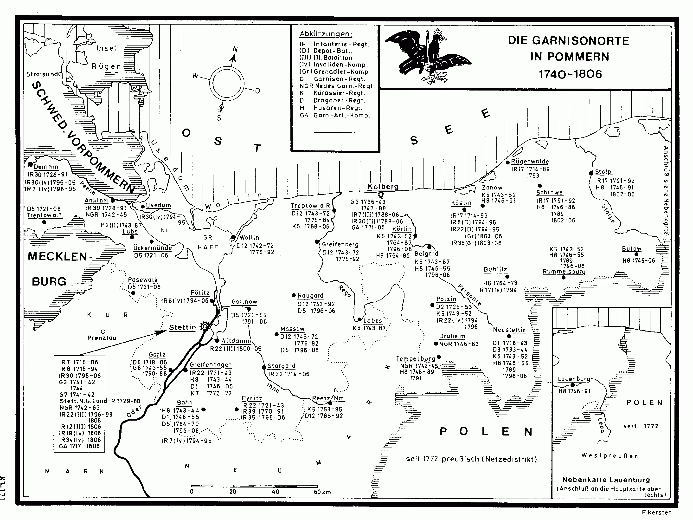{ width="200" }](dokumente/militaerregister.md)

    **Militärregister**

    Einträge zum Infanterieregiment Nr. 8

    [→ Zum Dokument](dokumente/militaerregister.md)

-   [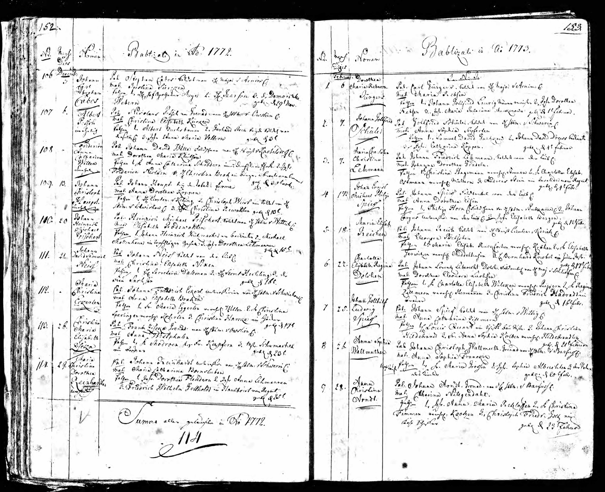{ width="200" }](dokumente/geburten-stettin.md)

    **Geburten Stettin 1772-1777**

    Taufeinträge der vier Kinder Johann Carl, Friedrich Ludwig, Franz Alexander und Henriette

    [→ Zu den Dokumenten](dokumente/geburten-stettin.md)

-   [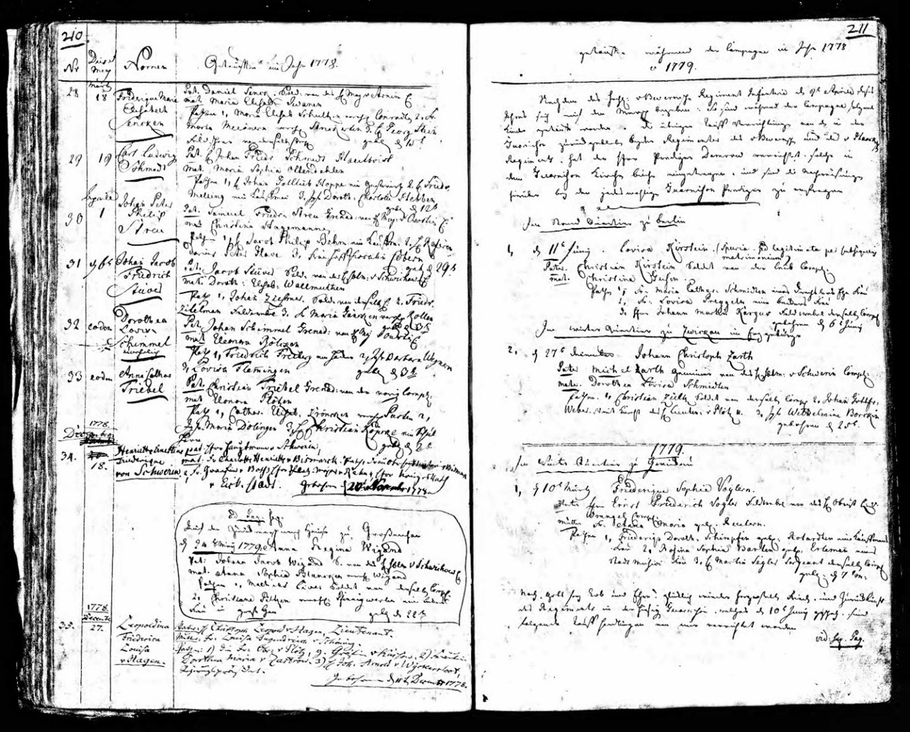{ width="200" }](dokumente/kriegsende-1779.md)

    **Kirchenbuch Kriegsende 1779**

    Einträge zum Ende des Bayerischen Erbfolgekrieges (Kartoffelkrieg)

    [→ Zum Dokument](dokumente/kriegsende-1779.md)

---

## Der Kartoffelkrieg

Die Jahre in Stettin waren fruchtbar für die junge Familie. Am 29. November 1772 wurde der erste Sohn **Johann Carl Abraham** geboren, am 27. April 1774 folgte **Friedrich Ludwig Abraham Isaac**, am 29. Januar 1776 **Franz Alexander George Carl**, und am 29. Dezember 1777 die Tochter **Henriette Charlotte Sophie**. Die Paten der Kinder - darunter Major von Wrangel, Major von Arnim und Adlige wie die Frau Lieutenant von Braunschweig - zeigen, dass Etienne trotz seines einfachen Soldatenstandes Verbindungen in höhere Kreise pflegte.

Im Sommer 1778 wurde Europa erneut von Kriegstreibern erschüttert. Nach dem Aussterben der bayerischen Wittelsbacher-Linie erhob Kaiser Joseph II. Anspruch auf Niederbayern und die Oberpfalz. Friedrich der Große, entschlossen, eine Stärkung Österreichs zu verhindern, mobilisierte seine Truppen.

Am **5. Juli 1778** marschierten 80.000 preußische und sächsische Soldaten in Böhmen ein - **vermutlich unter ihnen auch Etienne Cabos**. Obwohl kein direkter militärischer Nachweis seiner Teilnahme am Feldzug erhalten ist, spricht alles dafür: Sein Regiment, das Infanterieregiment Nr. 8, gehörte zu den Einheiten, die nach Böhmen verlegt wurden. Als aktiver Soldat in diesem Regiment wäre es höchst ungewöhnlich gewesen, wenn er nicht am Feldzug teilgenommen hätte.

Doch was als Feldzug begann, entwickelte sich zu einem eigenartigen Nicht-Krieg: Auf beiden Seiten kam es zu schweren logistischen Problemen. Die Soldaten mussten sich hauptsächlich von beschlagnahmten Kartoffeln ernähren, weshalb dieser Konflikt spöttisch als **"Kartoffelkrieg"** in die Geschichte einging - in Österreich wurde er als "Zwetschgenrummel" verspottet.

Die Kirchenbücher der Garnisonskirche in Stettin vermerken lakonisch: *"Getaufte während der Campagne im Jahre 1778 u 1779"* - ein Hinweis darauf, dass die Familien der Soldaten während des Feldzugs in der Garnison zurückblieben. Am **13. Mai 1779** beendete der Frieden von Teschen den seltsamen Krieg, und die Regimenter kehrten in ihre Garnisonen zurück.

Das [Kirchenbuch zum Kriegsende 1779](dokumente/kriegsende-1779.md) dokumentiert die Nachkriegszeit mit Einträgen "zum ende des Krieges zu Sept. 1779" - die administrativen Nacharbeiten und die Rückkehr der Soldaten zu ihren Familien zogen sich bis in den September hinein.

---

## Aufbruch nach Rotterdam

Nach dem Krieg veränderte sich Etiennes Leben grundlegend. 1779 oder 1780 wurde eine weitere Tochter, **Marie Christine**, geboren. Doch irgendetwas trieb die Familie fort aus Stettin - vielleicht der Wunsch nach wirtschaftlichem Aufstieg, vielleicht familiäre Verbindungen.

Am **10. April 1780** stellte die französische reformierte Kirche in Isenburg (Ysembourg) einen Pass für Etienne Cabos aus, der ihm die Reise nach Holland ermöglichte. Das Dokument ist ein faszinierendes Zeugnis:

> *"Wir, der Pastor und die Kirchenältesten von Isemburg bestätigen, dass der Herr Etienne Cabos uns ein sehr gültiges Zeugnis aus Stettin gezeigt hat, wo er seinen letzten Verbleib hatte. Auf Basis dieses Nachweises haben wir ihn zugelassen zur Teilnahme am heiligen Abendmahl mit unserer Gemeinde. [...] Aber nachdem er den Entschluss gefasst hatte, seinen Wohnsitz in Holland zu ergreifen, hat er uns darum gebeten, ein Zeugnis über seinen Aufenthalt auszustellen..."*

Am **24. Mai 1780** wurde Etienne in Rotterdam als Bürger (Poorter) eingetragen: *"Etienne Cabos geb. te Caussade is poorter geedt"* - "Etienne Cabos, geboren in Caussade, hat den Bürgereid geleistet." Die Familie ließ sich im **Vissersdijk** nieder und betrieb dort ein **Galanteriewarengeschäft**.

-   [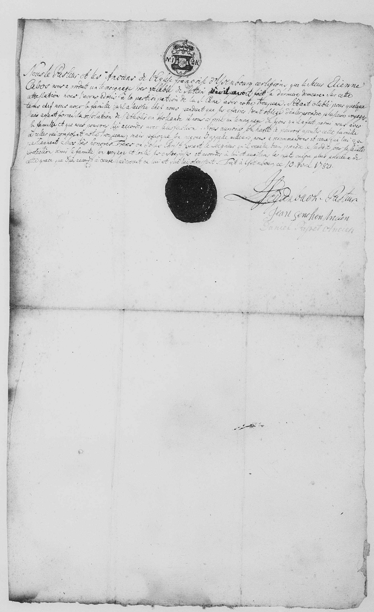{ width="200" }](dokumente/reisepass-1780.md)

    **Reisepass 1780**

    Ausgestellt von der französisch-reformierten Kirche in Isenburg

    [→ Zum Dokument](dokumente/reisepass-1780.md)

-   :material-book-open-variant:{ .lg .middle } **Bürgerbuch Rotterdam**

    ---

    Eintrag im Poorterboek vom 24. Mai 1780

    [→ Zum Dokument](dokumente/buergerbuch-rotterdam.md)

---

## Jahre in Rotterdam - Freud und Leid

Rotterdam in den 1780er Jahren war eine pulsierende Handelsstadt, geprägt von den Kanälen und dem regen Schiffsverkehr. Die Familie Cabos wuchs weiter: Am 4. September 1780 kam Tochter **Justine** zur Welt, am 19. April 1783 der Sohn **Etienne** - laut eines Briefes des Pfarrers Täge aus Anklam wurde er *"auf einer Reise von Le Havre nach Rotterdam"* geboren -, und am 12. September 1785 **Elisabeth**.

Doch das Glück war nicht von Dauer. Am 12. September 1782 wurde die kleine Justine beerdigt. Und im Juni 1784 traf die Familie ein weiterer schwerer Schlag: Marie Christine, erst 5 1/4 Jahre alt, starb. Der Eintrag im Begräbnisbuch vermerkt nüchtern: *"overledene was 5 1/4 jaar; Visserdijk Galanteriwinkel"* - ein Kind von 5 1/4 Jahren, wohnhaft am Vissersdijk im Galanteriewarengeschäft.

Die wirtschaftliche Lage der Familie verschlechterte sich offenbar zunehmend. Am **18. April 1792** schloss Etienne einen bemerkenswerten Vertrag mit dem Konsistorium der lutherischen und wallonischen Kirche in Rotterdam:

> *"Wir, die unterschreibenden Etienne Cabos und Justine Maria Siercken [...] bestätigen hiermit, dass wir und unsere Kinder seit einigen Jahren Unterhalt bezogen, sowohl durch die ehrenwerten Herren Diakone von den Wallonen, als auch von der hiesigen lutherischen Gemeinde. Vor kurzem sind wir [...] informiert worden, dass wir die Genehmigung haben nach Deutschland zu übersiedeln um bei unserer Familie, welche uns eingeladen hat, zu wohnen."*

Die beiden Kirchen gewährten der Familie jeweils 125 Gulden - zusammen 250 Gulden -, um die Reise nach Deutschland zu finanzieren. Dies entsprach etwa **10 Monaten Arbeit eines ungelernten Arbeiters** oder fast einem **Jahresgehalt eines einfachen Handwerkers** - eine substanzielle Summe für eine sechsköpfige Familie, aber keineswegs ein Vermögen. Im Gegenzug verpflichteten sich Etienne und seine Frau, *"nie wieder Anspruch auf Unterhalt von beiden Diakonien [...] zu erheben"* und *"die Summe von 250 Gulden sobald es uns möglich ist"* zurückzuzahlen.

### Europa am Vorabend des Krieges

Das Datum des Vertrags - der **18. April 1792** - ist bemerkenswert: Nur **zwei Tage später**, am 20. April 1792, erklärte Frankreich Österreich den Krieg. Im Februar 1793 folgte die Kriegserklärung an Holland und England, und im Winter 1794/95 marschierten französische Truppen über die zugefrorenen Flüsse in die Niederlande ein.

In Holland standen sich zwei politische Lager feindlich gegenüber: Die **"Patriotten"**, die mit den Idealen der Französischen Revolution sympathisierten, und die **Orangisten**, Anhänger des Statthalters Wilhelm V. Bereits 1787 hatte die preußische Armee die Patriotten-Bewegung gewaltsam niedergeschlagen. Nun warteten viele auf die französische Revolutionsarmee als Befreier.

Für Etienne Cabos - einen gebürtigen Franzosen mit preußischer Militärvergangenheit - war die Lage besonders heikel. Als Hugenotte war er in einer komplexen Position: Die Hugenotten waren vor dem katholischen Frankreich geflohen, aber das revolutionäre Frankreich verfolgte nun auch protestantische Geistliche. Mit dem drohenden Krieg zwischen Frankreich und den mit Preußen verbündeten Niederlanden war seine Loyalität möglicherweise fragwürdig. Die Zeichen standen auf Sturm, und für eine Familie mit französischen Wurzeln und preußischer Vergangenheit war Deutschland der sicherste Hafen.

-   [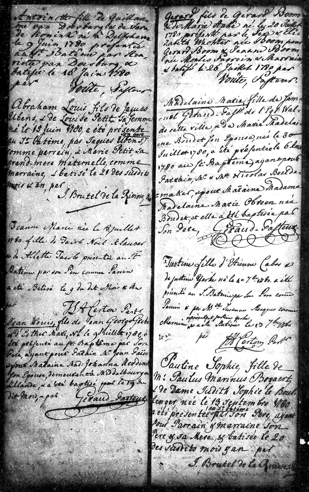{ width="200" }](dokumente/taufen-rotterdam.md)

    **Taufen Rotterdam**

    Taufeinträge der Kinder Justine, Etienne und Elisabeth

    [→ Zu den Dokumenten](dokumente/taufen-rotterdam.md)

-   [{ width="200" }](dokumente/begraebnisse-rotterdam.md)

    **Begräbnisse Rotterdam**

    Begräbniseinträge für Justine und Marie Christine

    [→ Zu den Dokumenten](dokumente/begraebnisse-rotterdam.md)

-   [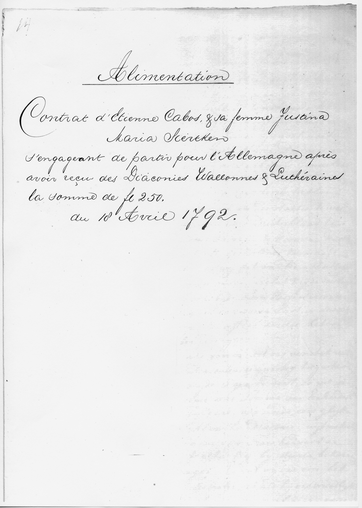{ width="200" }](dokumente/unterhaltsvertrag-1792.md)

    **Unterhaltsvertrag 1792**

    Vertrag mit dem Konsistorium Rotterdam

    [→ Zum Dokument](dokumente/unterhaltsvertrag-1792.md)

---

## Neuanfang in Berlin

Die Familie Cabos reiste 1792 nach Berlin - in eine Stadt, die seit über hundert Jahren eine bedeutende französische Gemeinde beherbergte. Etwa 6.000 Hugenotten hatten sich zwischen 1685 und 1700 in Berlin niedergelassen und machten zeitweilig ein Fünftel der Bevölkerung aus. Die französisch-reformierte Gemeinde mit ihrer Friedrichstadtkirche - dem "Französischen Dom" am Gendarmenmarkt - war das Zentrum dieser Gemeinschaft.

Am **24. Januar 1793** wurde in Berlin der letzte Sohn der Familie geboren: **Charles Emmanuel**. Der Kirchenbucheintrag der französisch-reformierten Friedrichstadtkirche vermerkt, dass der Vater als *"Dentiste, natif de Caussade en Querci"* - als Zahnarzt, gebürtig aus Caussade in Quercy - bezeichnet wurde. Die Paten des Kindes waren hochrangig: Charles Emanuel Baron de Hoffstaedt, Geheimer Rat, und Agnes Louise Amelie Palmie, geborene Rauch.

Etienne war ein Mann vieler Berufe. Der [französische Bericht von 1907](dokumente/bulletin-1907.md) beschreibt ihn als "Abenteurer", der nacheinander **Friseur, Zahnarzt und Parfümeur** gewesen sei. Dass er tatsächlich als Zahnarzt praktizierte, belegen Anzeigen in den **Wöchentlichen Hallischen Anzeigen** von **1794 und 1798**. Von Berlin aus reiste er nach Halle, um dort Patienten zu behandeln. Er bot das volle Spektrum zeitgenössischer Zahnheilkunde an: Zahnextraktion, Prothesen, Füllungen, Zahnreinigung und selbst hergestelltes Mundwasser. In seinen Anzeigen pries er Zahnprothesen an, *"welche so fest an dem Gaumen halten, als die besten natürlichen Zähne"*, und versprach 1798 sogar Zähne einzusetzen, *"wie sie die Natur giebt"*. Als reisender Zahnarzt gehörte Cabos zu den wenigen, die Halle mehrfach besuchten.

-   [{ width="200" }](dokumente/taufe-berlin-1793.md)

    **Taufe Berlin 1793**

    Taufeintrag Charles Emmanuel in der Friedrichstadtkirche

    [→ Zum Dokument](dokumente/taufe-berlin-1793.md)

-   :material-tooth:{ .lg .middle } **Zahnarzt in Halle 1794-1798**

    ---

    Anzeigen belegen Cabos' Tätigkeit als reisender Zahnarzt

    [→ Zum Dokument](dokumente/zahnarzt-halle.md)

-   [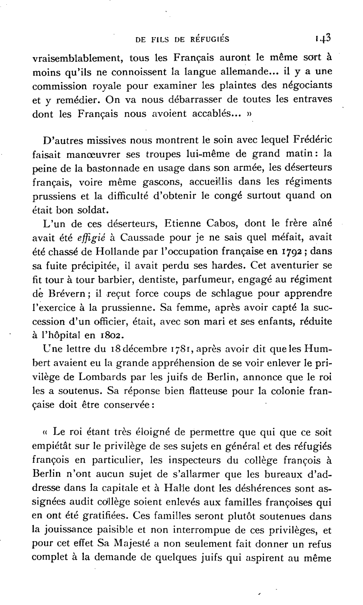{ width="200" }](dokumente/bulletin-1907.md)

    **Bulletin 1907**

    Französischer Bericht über die Hugenottenkolonie - erwähnt Etienne Cabos namentlich

    [→ Zum Dokument](dokumente/bulletin-1907.md)

---

## Die letzten Jahre

Über Etiennes letzte Lebensjahre wissen wir wenig. Am **16. August 1807** heiratete seine Tochter **Anne Elisabeth** in der Luisenkirche in Charlottenburg den Stadtchirurgen **August Friedrich Ferdinand Pohle**. Der Kirchenbucheintrag bezeichnet Etienne als "Kaufmann zu Rotterdam" - ein Titel, der wohl auf seine Rotterdamer Jahre verwies. Elisabeth erreichte ein hohes Alter und starb am 21. Dezember 1866 in Groß Jehser (Brandenburg).

Am **14. September 1808**, morgens um ein Uhr, starb Etienne Cabos im Alter von 71 Jahren im Charlottenburger Krankenhaus an einem Schlaganfall. Der Kirchenbucheintrag der französisch-reformierten Friedrichstadtkirche vermerkt seinen Tod und seine Beerdigung am 16. September auf dem *"cimetière de la porte d'Orange"* - dem Friedhof am Oranienburger Tor, dem Friedhof der französischen Kolonie.

Seine Frau Maria Justine überlebte ihn um zwei Jahre. Am 10. September 1810 starb sie abends um neun Uhr an der Ruhr. Der Kirchenbucheintrag der **Luisenkirche in Charlottenburg** bezeichnet sie als "separirte" - getrennt lebend -, ein Hinweis darauf, dass die Ehe in den letzten Jahren zerbrochen war. Sie hinterließ *"1 major: Tochter und 3 Söhne davon 2 major: sind, und 1 Sohn von dem man seit 20 Jahren nichts weiß"* - ein erwachsenes Kind und drei Söhne, von denen zwei volljährig waren, und einen Sohn, von dem man seit 20 Jahren nichts gehört hatte.

-   [{ width="200" }](dokumente/hochzeit-elisabeth-1807.md)

    **Hochzeit Elisabeth 1807**

    Heiratseintrag Anne Elisabeth und August Pohle

    [→ Zum Dokument](dokumente/hochzeit-elisabeth-1807.md)

-   [{ width="200" }](dokumente/sterbeurkunde-1808.md)

    **Sterbeurkunde Etienne 1808**

    Sterbeeintrag Etienne Cabos in Berlin

    [→ Zum Dokument](dokumente/sterbeurkunde-1808.md)

-   [{ width="200" }](dokumente/sterbeurkunde-justine-1810.md)

    **Sterbeurkunde Maria Justine 1810**

    Sterbeeintrag in der Luisenkirche Charlottenburg

    [→ Zum Dokument](dokumente/sterbeurkunde-justine-1810.md)

-   [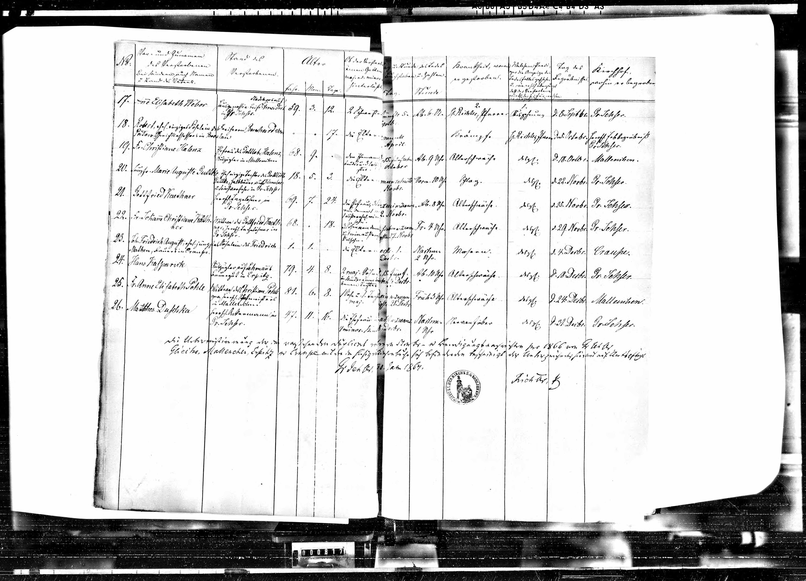{ width="200" }](dokumente/hochzeit-elisabeth-1807.md)

    **Tod Elisabeth 1866**

    Sterbeeintrag Anne Elisabeth Pohle, geb. Cabos

    [→ Zum Dokument](dokumente/hochzeit-elisabeth-1807.md)

---

## Epilog: Ein Leben im Strom der Geschichte

Etienne Cabos' Leben spiegelt die großen Bewegungen seiner Zeit wider: die Nachwirkungen der Hugenottenverfolgung, die Anziehungskraft Preußens für französische Protestanten, die Wirren des Bayerischen Erbfolgekrieges, die wirtschaftlichen Netzwerke zwischen Rotterdam und Deutschland. Er war Sohn eines Kaufmanns, wurde Soldat in einem fremden Land, versuchte sich als Händler in den Niederlanden und praktizierte schließlich als reisender Zahnarzt in Preußen.

Seine Geschichte ist auch eine Geschichte von Verlusten: zwei Kinder, die jung starben; ein Sohn, der verschollen war; eine Ehe, die zerbrach; finanzielle Nöte, die ihn zwangen, Almosen von Kirchengemeinden anzunehmen. Doch sie ist auch eine Geschichte von Beharrlichkeit und Anpassungsfähigkeit - die Geschichte eines Mannes, der in einer Welt voller Grenzen und Hindernisse seinen Weg fand.

Sein Sohn Friedrich Ludwig ging später nach Hamburg und dann nach Königsberg, sein jüngster Sohn Charles Emmanuel blieb in Berlin. Die Familie Cabos, einst im sonnigen Quercy verwurzelt, hatte neue Wurzeln in Norddeutschland geschlagen - ein kleiner Teil der großen hugenottischen Diaspora, die Europa für immer veränderte.

---

## Die nächste Generation: Frédéric Louis

Frédéric Louis kam ca. 1794 nach Hamburg und wurde am 28. März 1806 Bürger. Am 4. Mai des gleichen Jahres heiratete er dort **Anna Monica Jacobsen** im Hamburger Michel. Er nannte sich jetzt **Friedrich Ludwig Abraham Isaak**. Später ging er nach Königsberg.

---

-   :material-book-open-page-variant:{ .lg .middle } **Quellenverzeichnis**

    ---

    Alle Primärquellen und Sekundärliteratur

    [→ Zu den Quellen](quellen.md)

-   :material-folder-multiple:{ .lg .middle } **Historische Dokumente**

    ---

    Übersicht aller Originaldokumente

    [→ Zur Übersicht](dokumente/index.md)

