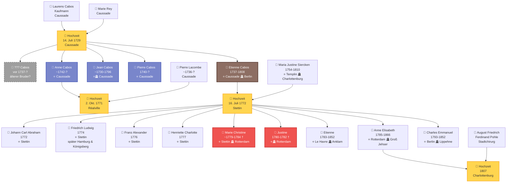
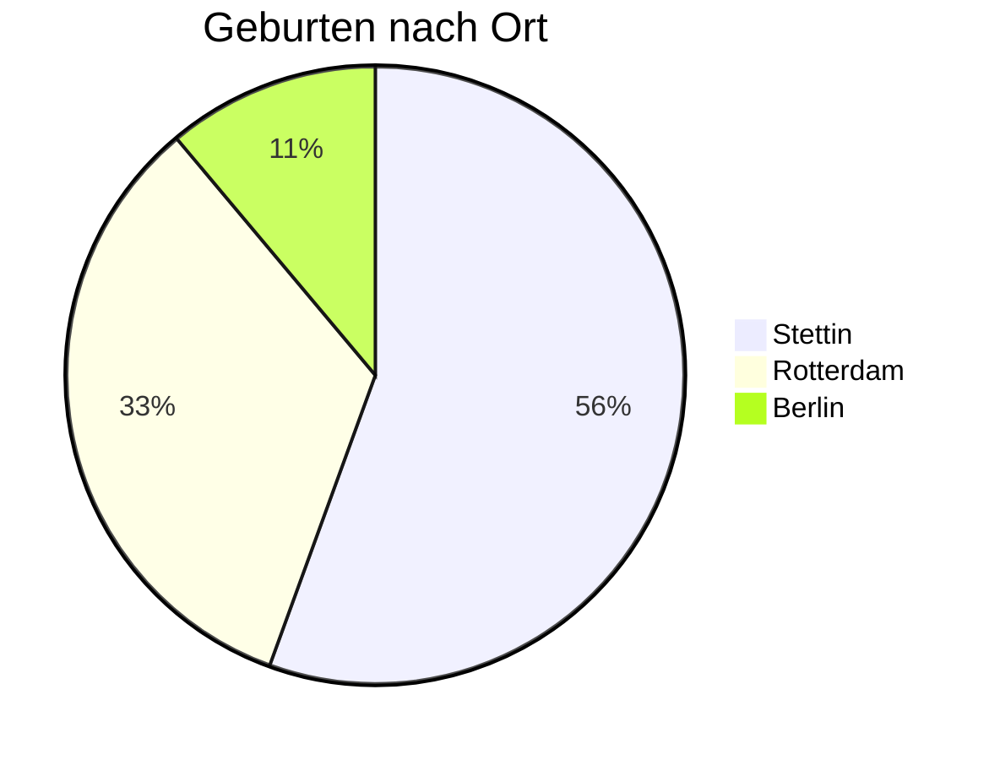

# Stammbaum der Familie Cabos

Diese Seite zeigt die genealogischen Verbindungen der Familie Cabos über drei Generationen hinweg, von der Hochzeit von Laurens Cabos und Marie Rey 1729 bis zur Geburt des letzten Kindes Charles Emmanuel 1793.

---

## Generationsüberblick

**Legende:**
- ⭐ = Geburtsort
- 🪦 = Sterbeort
- 💒 = Hochzeit (eigener Knoten)
- † = früh verstorben
- Braun = Etienne Cabos (Hauptperson)
- Blau = Geschwister von Etienne
- Grau gestrichelt = Unbestätigt/vermutet
- Rot = Im Kindesalter verstorben
- Gelb = Hochzeitsknoten

---

## Familienmitglieder im Detail

### Generation I: Die Eltern von Etienne

#### 👨 Laurens Cabos
- **Beruf:** Kaufmann
- **Wohnort:** Caussade, Frankreich (Quercy)
- **Hochzeit:** 14. Juli 1729 mit Marie Rey
- **Tod:** zwischen Februar 1760 und Oktober 1771 (im [Heiratseintrag der Tochter Anne 1771](dokumente/hochzeit-anne-1771.md) als "feu"/verstorben bezeichnet)
- **Religion:** Protestantisch (Hugenotte), katholisch getraut
- **Sozialstand:** Angesehenes Bürgertum

[→ Hochzeitsdokument 1729](dokumente/hochzeit-laurens-1729.md)

#### 👩 Marie Rey
- **Herkunft:** Caussade, Frankreich
- **Hochzeit:** 14. Juli 1729
- **Religion:** Protestantisch (Hugenottin)

---

### Generation II: Die Kinder von Laurens und Marie

#### 👤 ??? Cabos (vor 1737 - ?)
- **Geburt:** vor 1737 (vermutlich)
- **Status:** Unbestätigt
- **Hinweis:** Das [Bulletin 1907](dokumente/bulletin-1907.md) berichtet, Etiennes "älterer Bruder" sei in Caussade **in effigie hingerichtet** worden - also in Abwesenheit verurteilt, weil er **geflohen** war. Weder Jean noch Pierre können dieser Bruder sein. Wenn die Behauptung stimmt, muss es einen weiteren, älteren Bruder gegeben haben, der die Flucht vermutlich überlebte.

!!! warning "Forschungsbedarf"
    Die Existenz dieses Bruders ist nicht durch Primärquellen belegt.

#### 👤 Etienne Cabos (1737-1808)
- **Geburt:** 9. Juli 1737 in Caussade, Frankreich
- **Taufe:** 10. Juli 1737
- **Tod:** 14. September 1808 in Charlottenburg (Schlaganfall, 71 Jahre)
- **Hochzeit:** 16. Juli 1772 in Stettin mit Maria Justine Siercken
- **Beruf:** Soldat im Infanterieregiment Nr. 8 (von Hacke), Kompanie des Majors von Arnim; später Galanteriewarenhändler, dann Zahnarzt
- **Lebensstationen:**
    - 1737 bis ca. 1771: Caussade (Kindheit und Jugend; der genaue Zeitpunkt der Auswanderung ist unbekannt)
    - vor 1772 bis 1780: Stettin (Militärdienst, Ehe)
    - 1780-1792: Rotterdam (Händler)
    - 1792-1808: Berlin/Halle (Zahnarzt)

**Bedeutende Ereignisse:**
- 1778-1779: Teilnahme am Bayerischen Erbfolgekrieg ("Kartoffelkrieg")
- 1780: Bürgerrecht in Rotterdam
- 1792: Wirtschaftlicher Bankrott, Umsiedlung nach Preußen
- 1793: Neubeginn als Zahnarzt in Berlin

[→ Taufurkunde 1737](dokumente/taufe-etienne-1737.md) | [→ Sterbeurkunde 1808](dokumente/sterbeurkunde-1808.md)

#### 👦 Jean Cabos (~1730-1796)
- **Geburt:** ca. 1730 (geschätzt)
- **Tod:** 4. November 1796 in Caussade
- **Hochzeit:** 3./8. Februar 1760 mit Jeanne Fournier
- **Religion:** Protestantisch (Trauung "au Désert" durch Pastor Lafond)
- **Besonderheit:** Blieb in Caussade, starb dort friedlich während der Französischen Revolution

!!! success "Nicht der verurteilte Bruder"
    Die Sterbeurkunde von 1796 beweist, dass Jean unbehelligt in Caussade blieb und dort starb - er war nicht der geflohene, in effigie verurteilte Bruder aus dem Bulletin 1907.

[→ Hochzeitsdokument 1760](dokumente/hochzeit-jean-1760.md)

#### 👦 Pierre Cabos (1740-?)
- **Geburt:** 1. November 1740 in Caussade
- **Taufe:** 1. November 1740
- **Eltern:** Laurens Cabos und Marie Rey
- **Besonderheit:** Jüngerer Bruder von Etienne (3 Jahre jünger)

!!! info "Nicht der ältere Bruder"
    Pierre wurde 1740 geboren, also 3 Jahre nach Etienne - er kann nicht der "ältere, in effigie verurteilte Bruder" aus dem Bulletin 1907 sein.

[→ Taufdokument 1740](dokumente/taufe-pierre-1740.md)

#### 👧 Anne Cabos (~1742-?)
- **Geburt:** ca. 1742 (errechnet aus der Altersangabe "etwa 29 Jahre" im Heiratseintrag)
- **Hochzeit:** 2. Oktober 1771 in Saint-Jean de Réalville (bei Caussade) mit **Pierre Lacombe**
- **Ehemann:** Pierre Lacombe (ca. 1736), Sohn von Antoine Lacombe aus Caussade
- **Besonderheit:** Für die Ehe war eine bischöfliche **Dispens wegen Blutsverwandtschaft im dritten Grad** nötig - die Familien Cabos und Lacombe waren also verwandt

!!! info "Schlüsseldokument für den Vater"
    Annes Heiratseintrag bezeichnet Laurens Cabos als **"feu" (verstorben)** - der einzige bekannte Beleg, der den Tod des Vaters eingrenzt (zwischen 1760 und 1771).

[→ Heiratsdokument 1771](dokumente/hochzeit-anne-1771.md)

---

### Etienne und Maria Justine

#### 👩 Maria Justine Siercken (1754-1810)
- **Geburt:** 28. Januar 1754 in Templin, Preußen
- **Tod:** 10. September 1810 in Charlottenburg (Ruhr, 56 Jahre)
- **Vater:** Stadtmusiker in Templin
- **Hochzeit:** 16. Juli 1772 (mit 18 Jahren)
- **Kinder:** 9 Kinder (1772-1793)
- **Lebensstationen:** Templin → Stettin → Rotterdam → Berlin/Charlottenburg
- **Besonderheit:** Im Sterbeeintrag als "separirte" (getrennt lebend) bezeichnet

[→ Hochzeitsurkunde 1772](dokumente/hochzeit-stettin-1772.md) | [→ Sterbeurkunde 1810](dokumente/sterbeurkunde-justine-1810.md)

---

### Generation III: Die Kinder

#### In Stettin geboren (1772-1779)

##### 👦 Johann Carl Abraham (1772)
- **Geburt:** 29. November 1772
- **Taufe:** 3. Dezember 1772
- **Besonderheit:** Erstes Kind, nur 4 Monate nach der Hochzeit

!!! note "Namensabweichung in den Kirchenbüchern"
    Im Taufeintrag wird die Mutter als "Christine Siegrigen" bezeichnet. Dies ist höchstwahrscheinlich eine Verschreibung von **"Justine Siercken"** (Maria Justine Siercken). Solche phonetischen Verschreibungen waren in handschriftlichen Kirchenbüchern üblich, besonders bei ungewöhnlichen Namen. Der zeitliche Kontext (4 Monate nach der Hochzeit von Etienne und Maria Justine) und die Tatsache, dass alle späteren Kinder eindeutig als Kinder von Maria Justine Siercken dokumentiert sind, bestätigen die Identität.

[→ Zum Dokument](dokumente/geburten-stettin.md#johann-carl-abraham-1772)

##### 👦 Friedrich Ludwig Abraham Isaac (1774)
- **Geburt:** 27. April 1774
- **Weiterer Lebensweg:**
    - ca. 1794: Ankunft in Hamburg (laut Traubuch 1806: "Aufenthalt hieselbst 12 Jahr")
    - 28. März 1806: Bürger in Hamburg
    - 4. Mai 1806: Hochzeit mit Anna Monica Jacobsen, verwitwete Nettelbroth (Hamburger Michel, St. Michaelis)
    - Später Umzug nach Königsberg
- **Beruf:** Maler ("Mahler" laut Traubuch St. Michaelis)
- **Paten:** Major von Wrangel, Major von Arnim, Fräulein von Zarkow

[→ Zum Dokument](dokumente/geburten-stettin.md#friedrich-ludwig-abraham-isaac-1774)

##### 👦 Franz Alexander George Carl (1776)
- **Geburt:** 29. Januar 1776

[→ Zum Dokument](dokumente/geburten-stettin.md#franz-alexander-george-carl-1776)

##### 👧 Henriette Charlotte Sophie (1777)
- **Geburt:** 29. Dezember 1777
- **Besonderheit:** Erste Tochter
- **Paten:** Frau Lieutenant von Braunschweig (geb. von Wedel), Frau Hauptmann von Schwerin

!!! warning "Schicksal unbekannt - vermutlich vor 1807 gestorben"
    Nach ihrer Taufe verliert sich Henriettes Spur. Zwei spätere Dokumente sprechen dafür, dass sie früh starb: Der [Heiratseintrag ihrer Schwester Elisabeth 1807](dokumente/hochzeit-elisabeth-1807.md) bezeichnet diese als **"einzige eheliche Tochter"** des Kaufmanns Cabos, und der [Sterbeeintrag der Mutter 1810](dokumente/sterbeurkunde-justine-1810.md) nennt nur **eine** hinterbliebene Tochter. Wo und wann Henriette starb - in Stettin, Rotterdam oder unterwegs - ist nicht dokumentiert.

[→ Zum Dokument](dokumente/geburten-stettin.md#henriette-charlotte-sophie-1777)

##### 👧 Marie Christine (~1779-1784) †
- **Geburt:** ca. 1779 in Stettin
- **Tod:** Juni 1784 in Rotterdam
- **Alter bei Tod:** 5 1/4 Jahre
- **Wohnort beim Tod:** Vissersdijk (Galanteriewarengeschäft)

[→ Zum Dokument](dokumente/begraebnisse-rotterdam.md#begrabnis-marie-christine-1784)

---

#### In Rotterdam geboren (1780-1785)

##### 👧 Justine (1780-1782) †
- **Geburt:** 4. September 1780
- **Taufe:** 13. September 1780 (wallonische Kirche)
- **Tod:** 12. September 1782
- **Alter bei Tod:** knapp 2 Jahre

[→ Taufe](dokumente/taufen-rotterdam.md#taufe-justine-1780) | [→ Begräbnis](dokumente/begraebnisse-rotterdam.md#begrabnis-justine-1782)

##### 👦 Etienne (1783-1852)
- **Geburt:** 19. April 1783 auf einer Reise von Le Havre nach Rotterdam
- **Taufe:** 26. April 1783 in Rotterdam
- **Tod:** 17. Mai 1852 in Anklam
- **Besonderheit:** Namensgeber des Vaters, außergewöhnlicher Geburtsort

[→ Zum Dokument](dokumente/taufen-rotterdam.md#taufe-etienne-1783)

##### 👧 Anne Elisabeth (1785-1866)
- **Geburt:** 12. September 1785
- **Taufe:** 25. September 1785 (wallonische Kirche)
- **Hochzeit:** 16. August 1807 in Charlottenburg
- **Ehemann:** August Friedrich Ferdinand Pohle (Stadtchirurg)
- **Tod:** 21. Dezember 1866 in Groß Jehser, Brandenburg
- **Begräbnis:** 24. Dezember 1866
- **Besonderheit:** Letztes in Rotterdam geborenes Kind, einziges Kind mit vollständiger Dokumentation

[→ Taufe Rotterdam](dokumente/taufen-rotterdam.md#taufe-elisabeth-1785) | [→ Hochzeit & Tod](dokumente/hochzeit-elisabeth-1807.md)

---

#### In Berlin geboren (1793)

##### 👦 Charles Emmanuel (1793-1852)
- **Geburt:** 24. Januar 1793 in Berlin
- **Taufe:** 1. Februar 1793 (Französisch-reformierte Friedrichstadtkirche)
- **Tod:** 23. Januar 1852 in Lippehne
- **Paten:**
    - Charles Emanuel Baron de Hoffstaedt (Geheimer Rat)
    - Agnes Louise Amelie Palmie (geb. Rauch)
- **Besonderheit:** Jüngstes Kind, hochrangige Paten, Vater als "Dentiste" vermerkt

[→ Zum Dokument](dokumente/taufe-berlin-1793.md)

---

## Geografische Verteilung der Geburten

| Ort | Zeitraum | Anzahl Kinder | Überlebten die Kindheit |
|-----|----------|---------------|-------------|
| **Stettin** | 1772-1779 | 5 | 4 (Marie Christine † 1784) |
| **Rotterdam** | 1780-1785 | 3 | 2 (Justine † 1782) |
| **Berlin** | 1793 | 1 | 1 |
| **Gesamt** | | **9** | **7** |

*Anmerkung: Etienne jr. (1783) wurde streng genommen nicht in Rotterdam geboren, sondern auf einer Reise von Le Havre nach Rotterdam; getauft wurde er in Rotterdam. Von den 7 Kindern, die die Kindheit überlebten, sind 1810 nur noch 5 nachweisbar (siehe [Bilanz von 1810](#die-bilanz-von-1810-was-wurde-aus-den-kindern)).*

---

## Kindersterblichkeit

Von den neun Kindern der Familie Cabos starben mindestens zwei im Kindesalter:

| Name | Geburtsort | Sterbeort | Alter |
|------|------------|-----------|-------|
| **Justine** | Rotterdam | Rotterdam | ca. 2 Jahre |
| **Marie Christine** | Stettin | Rotterdam | 5 1/4 Jahre |

Die Kindersterblichkeitsrate in der Familie Cabos (22% nachweislich) entsprach etwa dem Durchschnitt der damaligen Zeit, in der etwa ein Drittel aller Kinder vor dem fünften Lebensjahr starb.

---

## Die Bilanz von 1810: Was wurde aus den Kindern?

Der [Sterbeeintrag von Maria Justine (1810)](dokumente/sterbeurkunde-justine-1810.md) erlaubt eine Bestandsaufnahme. Er nennt als Hinterbliebene: *"1 major: Tochter und 3 Söhne davon 2 major: sind, und 1 Sohn von dem man seit 20 Jahren nichts weiß"* - also **eine volljährige Tochter, drei Söhne (davon zwei volljährig) und einen verschollenen Sohn**.

Gleicht man diese Angaben mit den neun dokumentierten Kindern ab, ergibt sich folgendes Bild:

| Kind | Geboren | Status 1810 |
|------|---------|-------------|
| Johann Carl Abraham | 1772 | ❓ Verschollen **oder** vor 1810 gestorben |
| Friedrich Ludwig | 1774 | ✅ Lebt (Bürger in Hamburg, volljährig) |
| Franz Alexander | 1776 | ❓ Verschollen **oder** vor 1810 gestorben |
| Henriette Charlotte | 1777 | ✝️ Vermutlich vor 1807 gestorben (1807 ist Elisabeth "einzige eheliche Tochter") |
| Marie Christine | ~1779 | ✝️ 1784 in Rotterdam gestorben |
| Justine | 1780 | ✝️ 1782 in Rotterdam gestorben |
| Etienne jr. | 1783 | ✅ Lebt (†1852 in Anklam, volljährig) |
| Anne Elisabeth | 1785 | ✅ Lebt (verheiratete Pohle - die "1 major: Tochter") |
| Charles Emmanuel | 1793 | ✅ Lebt (†1852 in Lippehne; 1810 erst 17, der minderjährige Sohn) |

**Die Rechnung geht auf:** Die drei 1810 genannten Söhne sind Friedrich Ludwig, Etienne jr. (beide volljährig) und Charles Emmanuel (minderjährig). Der **verschollene Sohn** - seit ca. 1790, also noch aus der Rotterdamer Zeit - muss **Johann Carl Abraham oder Franz Alexander** gewesen sein. Der jeweils andere der beiden ist demnach vor 1810 gestorben, ohne dass bisher ein Dokument darüber gefunden wurde. Johann Carl wäre 1790 etwa 18 Jahre alt gewesen - alt genug, um zur See zu fahren, Soldat zu werden oder auf andere Weise den Kontakt zur Familie zu verlieren.

!!! warning "Forschungsbedarf"
    Das Schicksal von **Johann Carl Abraham**, **Franz Alexander** und **Henriette Charlotte** ist ungeklärt. Sterbe- oder Begräbniseinträge könnten in Rotterdam (bis 1792), Berlin/Charlottenburg (ab 1792) oder - im Fall des Verschollenen - ganz woanders liegen.

---

## Die wallonische Verbindung

Alle in Rotterdam geborenen Kinder wurden in der **wallonischen (französisch-reformierten) Kirche** getauft. Diese Kirchen waren traditionelle Anlaufstellen für französischsprachige Protestanten und Hugenotten in den Niederlanden.

Auch in Berlin wurde Charles Emmanuel in der **französisch-reformierten Friedrichstadtkirche** getauft - ein Zeichen der fortbestehenden hugenottischen Identität der Familie, auch nach drei Generationen.

---

## Soziale Mobilität durch Patenschaft

Die Taufpaten der Kinder zeigen die bemerkenswerte soziale Stellung der Familie:

**In Stettin (Militärzeit):**
- Major von Wrangel
- Major von Arnim (Kompaniechef)
- Frau Lieutenant von Braunschweig
- Frau Hauptmann von Schwerin

**In Berlin (als Zahnarzt):**
- Charles Emanuel Baron de Hoffstaedt (Geheimer Rat)
- Agnes Louise Amelie Palmie (geb. Rauch)

Trotz einfacher Herkunft als Soldat und Händler gelang es Etienne Cabos, Verbindungen zu Adel und höheren Gesellschaftskreisen aufzubauen.

---

## Nachkommen-Übersicht (PDF)

Eine vollständige grafische Darstellung der Nachkommen von Etienne Cabos steht als PDF-Dokument zur Verfügung:

**[📄 Nachkommen von Etienne Cabos (1737-1808)](dokumente/etienne1737_compact.pdf)** *(PDF)*

Dieses Dokument zeigt die vollständige Nachkommenschaft von Etienne Cabos und Maria Justine Siercken über mehrere Generationen hinweg in kompakter Form.

---

## Weiterführende Informationen

- [→ Zur Zeitleiste](zeitleiste.md)
- [→ Zu den Dokumenten](dokumente/index.md)
- [→ Zu den Quellen](quellen.md)
- [→ Zurück zur Startseite](index.md)
