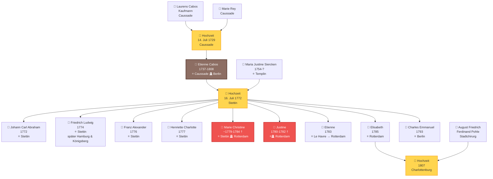
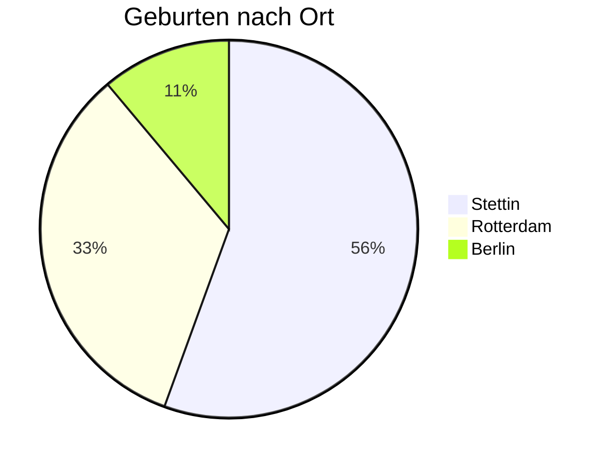

# Family Tree of the Cabos Family

This page shows the genealogical connections of the Cabos family across three generations, from the marriage of Laurens Cabos and Marie Rey in 1729 to the birth of the last child Charles Emmanuel in 1793.

---

## Generational Overview

**Legend:**
- ⭐ = Place of birth
- 🪦 = Place of death
- 💒 = Marriage (separate node)
- † = died young
- Brown = Etienne Cabos (main person)
- Red = Died in childhood
- Yellow = Marriage nodes

---

## Family Members in Detail

### Generation I: The Parents of Etienne

#### 👨 Laurens Cabos
- **Occupation:** Merchant
- **Residence:** Caussade, France (Quercy)
- **Marriage:** July 14, 1729 with Marie Rey
- **Religion:** Protestant (Huguenot), married in Catholic ceremony
- **Social Status:** Respected bourgeoisie

[→ Marriage document 1729](dokumente/hochzeit-laurens-1729.md)

#### 👩 Marie Rey
- **Origin:** Caussade, France
- **Marriage:** July 14, 1729
- **Religion:** Protestant (Huguenot)

---

### Generation II: Etienne Cabos

#### 👤 Etienne Cabos (1737-1808)
- **Birth:** July 9, 1737 in Caussade, France
- **Baptism:** July 10, 1737
- **Death:** May 29, 1808 in Berlin, Prussia (stroke, 71 years)
- **Marriage:** July 16, 1772 in Stettin with Maria Justine Siercken
- **Occupation:** Soldier (Grenadier Battalion von Arnim), later fancy goods merchant, then dentist
- **Life Stations:**
    - 1737-1757: Caussade (childhood)
    - 1757-1780: Stettin (military service, marriage)
    - 1780-1792: Rotterdam (merchant)
    - 1792-1808: Berlin/Halle (dentist)

**Significant Events:**
- 1778-1779: Participation in the War of the Bavarian Succession ("Potato War")
- 1780: Citizenship in Rotterdam
- 1792: Financial bankruptcy, relocation to Prussia
- 1793: New beginning as dentist in Berlin

[→ Baptism certificate 1737](dokumente/taufe-etienne-1737.md) | [→ Death certificate 1808](dokumente/sterbeurkunde-1808.md)

#### 👩 Maria Justine Siercken (1754-?)
- **Birth:** January 28, 1754 in Templin, Prussia
- **Father:** Town musician in Templin
- **Marriage:** July 16, 1772 (at 18 years old)
- **Children:** 9 children (1772-1793)
- **Life Stations:** Templin → Stettin → Rotterdam → Berlin

[→ Marriage certificate 1772](dokumente/hochzeit-stettin-1772.md)

---

### Generation III: The Children

#### Born in Stettin (1772-1779)

##### 👦 Johann Carl Abraham (1772)
- **Birth:** November 29, 1772
- **Baptism:** December 3, 1772
- **Special Note:** First child, only 4 months after the wedding

[→ To document](dokumente/geburten-stettin.md#johann-carl-abraham-1772)

##### 👦 Friedrich Ludwig Abraham Isaac (1774)
- **Birth:** April 27, 1774
- **Later Life:**
    - March 28, 1806: Citizen in Hamburg
    - May 4, 1806: Marriage with Anna Monica Jacobsen (Hamburger Michel)
    - Later moved to Königsberg
- **Godparents:** Major von Wrangel, Major von Arnim, Fräulein von Zarkow

[→ To document](dokumente/geburten-stettin.md#friedrich-ludwig-abraham-isaac-1774)

##### 👦 Franz Alexander George Carl (1776)
- **Birth:** January 29, 1776

[→ To document](dokumente/geburten-stettin.md#franz-alexander-george-carl-1776)

##### 👧 Henriette Charlotte Sophie (1777)
- **Birth:** December 29, 1777
- **Special Note:** First daughter
- **Godparents:** Frau Lieutenant von Braunschweig (née von Wedel), Frau Hauptmann von Schwerin

[→ To document](dokumente/geburten-stettin.md#henriette-charlotte-sophie-1777)

##### 👧 Marie Christine (~1779-1784) †
- **Birth:** ca. 1779 in Stettin
- **Death:** June 1784 in Rotterdam
- **Age at Death:** 5 1/4 years
- **Residence at Death:** Vissersdijk (fancy goods store)

[→ To document](dokumente/begraebnisse-rotterdam.md#begrabnis-marie-christine-1784)

---

#### Born in Rotterdam (1780-1785)

##### 👧 Justine (1780-1782) †
- **Birth:** September 4, 1780
- **Baptism:** September 13, 1780 (Walloon church)
- **Death:** September 12, 1782
- **Age at Death:** just under 2 years

[→ Baptism](dokumente/taufen-rotterdam.md#taufe-justine-1780) | [→ Burial](dokumente/begraebnisse-rotterdam.md#begrabnis-justine-1782)

##### 👦 Etienne (1783)
- **Birth:** April 19, 1783 on a journey from Le Havre to Rotterdam
- **Baptism:** April 26, 1783 in Rotterdam
- **Special Note:** Named after the father, extraordinary place of birth

[→ To document](dokumente/taufen-rotterdam.md#taufe-etienne-1783)

##### 👧 Elisabeth (1785)
- **Birth:** September 12, 1785
- **Baptism:** September 25, 1785 (Walloon church)
- **Marriage:** 1807 in Charlottenburg
- **Husband:** August Friedrich Ferdinand Pohle (town surgeon)
- **Special Note:** Last child born in Rotterdam

[→ To document](dokumente/taufen-rotterdam.md#taufe-elisabeth-1785)

---

#### Born in Berlin (1793)

##### 👦 Charles Emmanuel (1793)
- **Birth:** January 24, 1793 in Berlin
- **Baptism:** February 1, 1793 (French Reformed Friedrichstadt Church)
- **Godparents:**
    - Charles Emanuel Baron de Hoffstaedt (Privy Councillor)
    - Agnes Louise Amelie Palmie (née Rauch)
- **Special Note:** Youngest child, high-ranking godparents, father noted as "Dentiste"

[→ To document](dokumente/taufe-berlin-1793.md)

---

## Geographic Distribution of Births

| Location | Period | Number of Children | Survivors |
|-----|----------|---------------|-------------|
| **Stettin** | 1772-1779 | 5 | 4 (Marie Christine † 1784) |
| **Rotterdam** | 1780-1785 | 3 | 1 (Justine † 1782) |
| **Berlin** | 1793 | 1 | 1 |
| **Total** | | **9** | **at least 6** |

---

## Child Mortality

Of the nine children of the Cabos family, at least two died in childhood:

| Name | Place of Birth | Place of Death | Age |
|------|------------|-----------|-------|
| **Justine** | Rotterdam | Rotterdam | ca. 2 years |
| **Marie Christine** | Stettin | Rotterdam | 5 1/4 years |

The child mortality rate in the Cabos family (22% documented) corresponded approximately to the average of the time, when about one-third of all children died before their fifth birthday.

---

## The Walloon Connection

All children born in Rotterdam were baptized in the **Walloon (French Reformed) Church**. These churches were traditional gathering places for French-speaking Protestants and Huguenots in the Netherlands.

In Berlin, Charles Emmanuel was also baptized in the **French Reformed Friedrichstadt Church** - a sign of the family's continuing Huguenot identity, even after three generations.

---

## Social Mobility Through Godparentage

The godparents of the children demonstrate the family's remarkable social standing:

**In Stettin (military period):**
- Major von Wrangel
- Major von Arnim (company commander)
- Frau Lieutenant von Braunschweig
- Frau Hauptmann von Schwerin

**In Berlin (as dentist):**
- Charles Emanuel Baron de Hoffstaedt (Privy Councillor)
- Agnes Louise Amelie Palmie (née Rauch)

Despite humble origins as a soldier and merchant, Etienne Cabos succeeded in building connections to nobility and higher social circles.

---

## Further Information

- [→ To the timeline](zeitleiste.md)
- [→ To the documents](dokumente/index.md)
- [→ To the sources](quellen.md)
- [→ Back to homepage](index.md)
