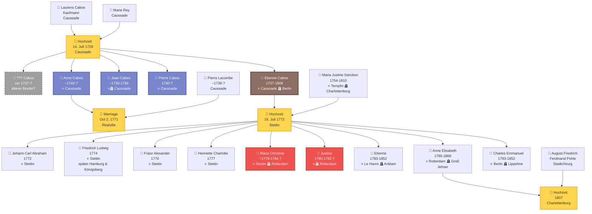
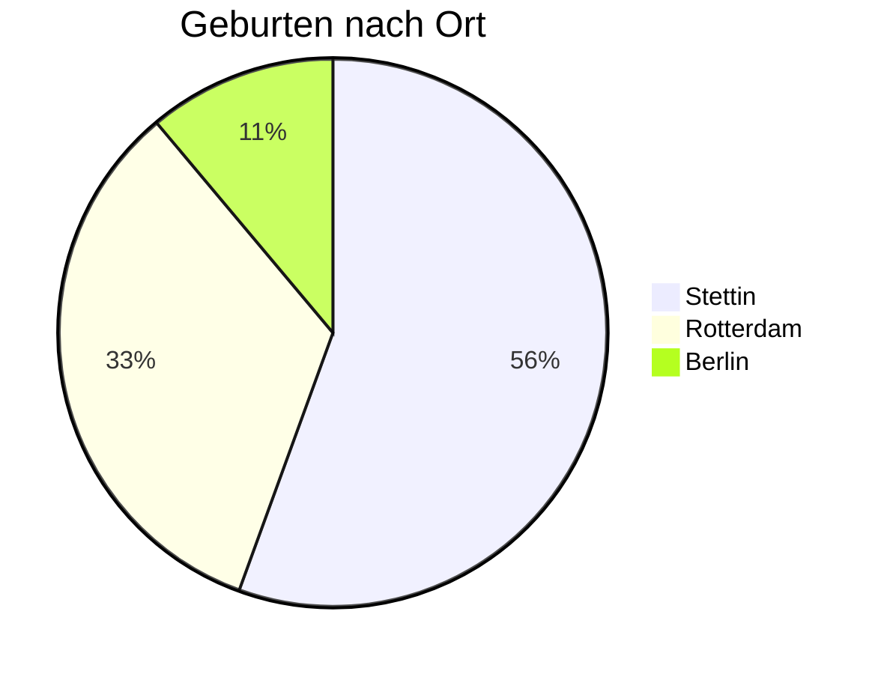

# Family Tree of the Cabos Family

This page shows the genealogical connections of the Cabos family across three generations, from the marriage of Laurens Cabos and Marie Rey in 1729 to the birth of the last child Charles Emmanuel in 1793.

---

## Generational Overview

**Legend:**
- ⭐ = Place of birth
- 🪦 = Place of death
- 💒 = Marriage (separate node)
- † = died young
- Brown = Etienne Cabos (main person)
- Blue = Siblings of Etienne
- Gray dashed = Unconfirmed/presumed
- Red = Died in childhood
- Yellow = Marriage nodes

---

## Family Members in Detail

### Generation I: The Parents of Etienne

#### 👨 Laurens Cabos
- **Occupation:** Merchant
- **Residence:** Caussade, France (Quercy)
- **Marriage:** July 14, 1729 with Marie Rey
- **Death:** between February 1760 and October 1771 (described as "feu"/deceased in the [marriage entry of his daughter Anne, 1771](dokumente/hochzeit-anne-1771.md))
- **Religion:** Protestant (Huguenot), married in Catholic ceremony
- **Social Status:** Respected bourgeoisie

[→ Marriage document 1729](dokumente/hochzeit-laurens-1729.md)

#### 👩 Marie Rey
- **Origin:** Caussade, France
- **Marriage:** July 14, 1729
- **Religion:** Protestant (Huguenot)

---

### Generation II: The Children of Laurens and Marie

#### 👤 ??? Cabos (before 1737 - ?)
- **Birth:** before 1737 (presumably)
- **Status:** Unconfirmed
- **Note:** The [Bulletin 1907](dokumente/bulletin-1907.md) reports that Etienne's "older brother" was **executed in effigy** in Caussade - i.e. condemned in absentia because he had **fled**. Neither Jean nor Pierre can be this brother. If the claim is true, there must have been another, older brother, who probably survived his flight.

!!! warning "Research Needed"
    The existence of this brother is not documented by primary sources.

#### 👤 Etienne Cabos (1737-1808)
- **Birth:** July 9, 1737 in Caussade, France
- **Baptism:** July 10, 1737
- **Death:** September 14, 1808 in Charlottenburg (stroke, 71 years)
- **Marriage:** July 16, 1772 in Stettin with Maria Justine Siercken
- **Occupation:** Soldier in Infantry Regiment No. 8 (von Hacke), company of Major von Arnim; later fancy goods merchant, then dentist
- **Life Stations:**
    - 1737 to ca. 1771: Caussade (childhood and youth; the exact date of emigration is unknown)
    - before 1772 to 1780: Stettin (military service, marriage)
    - 1780-1792: Rotterdam (merchant)
    - 1792-1808: Berlin/Halle (dentist)

**Significant Events:**
- 1778-1779: Participation in the War of the Bavarian Succession ("Potato War")
- 1780: Citizenship in Rotterdam
- 1792: Financial bankruptcy, relocation to Prussia
- 1793: New beginning as dentist in Berlin

[→ Baptism certificate 1737](dokumente/taufe-etienne-1737.md) | [→ Death certificate 1808](dokumente/sterbeurkunde-1808.md)

#### 👦 Jean Cabos (~1730-1796)
- **Birth:** ca. 1730 (estimated)
- **Death:** November 4, 1796 in Caussade
- **Marriage:** February 3/8, 1760 with Jeanne Fournier
- **Religion:** Protestant (wedding "au Désert" by Pastor Lafond)
- **Special Note:** Remained in Caussade, died there peacefully during the French Revolution

!!! success "Not the Executed Brother"
    The death certificate from 1796 proves that Jean remained unmolested in Caussade and died there - he was not the fugitive brother condemned in effigy mentioned in the Bulletin 1907.

[→ Marriage document 1760](dokumente/hochzeit-jean-1760.md)

#### 👦 Pierre Cabos (1740-?)
- **Birth:** November 1, 1740 in Caussade
- **Baptism:** November 1, 1740
- **Parents:** Laurens Cabos and Marie Rey
- **Special Note:** Younger brother of Etienne (3 years younger)

!!! info "Not the Older Brother"
    Pierre was born in 1740, so 3 years after Etienne - he cannot be the "older brother condemned in effigy" from the Bulletin 1907.

[→ Baptism document 1740](dokumente/taufe-pierre-1740.md)

#### 👧 Anne Cabos (~1742-?)
- **Birth:** ca. 1742 (calculated from the age given as "about 29 years" in the marriage entry)
- **Marriage:** October 2, 1771 in Saint-Jean de Réalville (near Caussade) with **Pierre Lacombe**
- **Husband:** Pierre Lacombe (ca. 1736), son of Antoine Lacombe of Caussade
- **Special Note:** The marriage required an episcopal **dispensation for consanguinity in the third degree** - the Cabos and Lacombe families were therefore related

!!! info "Key document for the father"
    Anne's marriage entry describes Laurens Cabos as **"feu" (deceased)** - the only known evidence bracketing the father's death (between 1760 and 1771).

[→ Marriage document 1771](dokumente/hochzeit-anne-1771.md)

---

### Etienne and Maria Justine

#### 👩 Maria Justine Siercken (1754-1810)
- **Birth:** January 28, 1754 in Templin, Prussia
- **Death:** September 10, 1810 in Charlottenburg (dysentery, 56 years)
- **Father:** Town musician in Templin
- **Marriage:** July 16, 1772 (at 18 years old)
- **Children:** 9 children (1772-1793)
- **Life Stations:** Templin → Stettin → Rotterdam → Berlin/Charlottenburg
- **Special Note:** In death entry described as "separirte" (living separately)

[→ Marriage certificate 1772](dokumente/hochzeit-stettin-1772.md) | [→ Death certificate 1810](dokumente/sterbeurkunde-justine-1810.md)

---

### Generation III: The Children

#### Born in Stettin (1772-1779)

##### 👦 Johann Carl Abraham (1772)
- **Birth:** November 29, 1772
- **Baptism:** December 3, 1772
- **Special Note:** First child, only 4 months after the wedding

!!! note "Name Discrepancy in Church Records"
    In the baptism entry, the mother is referred to as "Christine Siegrigen". This is most likely a misspelling of **"Justine Siercken"** (Maria Justine Siercken). Such phonetic misspellings were common in handwritten church records, especially with unusual names. The temporal context (4 months after the marriage of Etienne and Maria Justine) and the fact that all later children are clearly documented as children of Maria Justine Siercken confirm the identity.

[→ To document](dokumente/geburten-stettin.md#johann-carl-abraham-1772)

##### 👦 Friedrich Ludwig Abraham Isaac (1774)
- **Birth:** April 27, 1774
- **Later Life:**
    - ca. 1794: Arrival in Hamburg (according to the 1806 marriage register: "residence here 12 years")
    - March 28, 1806: Citizen in Hamburg
    - May 4, 1806: Marriage with Anna Monica Jacobsen, widow Nettelbroth (Hamburger Michel, St. Michaelis)
    - Later moved to Königsberg
- **Occupation:** Painter ("Mahler" according to the marriage register of St. Michaelis)
- **Godparents:** Major von Wrangel, Major von Arnim, Fräulein von Zarkow

[→ To document](dokumente/geburten-stettin.md#friedrich-ludwig-abraham-isaac-1774)

##### 👦 Franz Alexander George Carl (1776)
- **Birth:** January 29, 1776

[→ To document](dokumente/geburten-stettin.md#franz-alexander-george-carl-1776)

##### 👧 Henriette Charlotte Sophie (1777)
- **Birth:** December 29, 1777
- **Special Note:** First daughter
- **Godparents:** Frau Lieutenant von Braunschweig (née von Wedel), Frau Hauptmann von Schwerin

!!! warning "Fate unknown - probably died before 1807"
    After her baptism, Henriette's trail disappears. Two later documents suggest that she died early: the [marriage entry of her sister Elisabeth in 1807](dokumente/hochzeit-elisabeth-1807.md) describes Elisabeth as the **"only legitimate daughter"** of the merchant Cabos, and the [death entry of the mother in 1810](dokumente/sterbeurkunde-justine-1810.md) mentions only **one** surviving daughter. Where and when Henriette died - in Stettin, Rotterdam or on the road - is not documented.

[→ To document](dokumente/geburten-stettin.md#henriette-charlotte-sophie-1777)

##### 👧 Marie Christine (~1779-1784) †
- **Birth:** ca. 1779 in Stettin
- **Death:** June 1784 in Rotterdam
- **Age at Death:** 5 1/4 years
- **Residence at Death:** Vissersdijk (fancy goods store)

[→ To document](dokumente/begraebnisse-rotterdam.md#begrabnis-marie-christine-1784)

---

#### Born in Rotterdam (1780-1785)

##### 👧 Justine (1780-1782) †
- **Birth:** September 4, 1780
- **Baptism:** September 13, 1780 (Walloon church)
- **Death:** September 12, 1782
- **Age at Death:** just under 2 years

[→ Baptism](dokumente/taufen-rotterdam.md#taufe-justine-1780) | [→ Burial](dokumente/begraebnisse-rotterdam.md#begrabnis-justine-1782)

##### 👦 Etienne (1783-1852)
- **Birth:** April 19, 1783 on a journey from Le Havre to Rotterdam
- **Baptism:** April 26, 1783 in Rotterdam
- **Death:** May 17, 1852 in Anklam
- **Special Note:** Named after the father, extraordinary place of birth

[→ To document](dokumente/taufen-rotterdam.md#taufe-etienne-1783)

##### 👧 Anne Elisabeth (1785-1866)
- **Birth:** September 12, 1785
- **Baptism:** September 25, 1785 (Walloon church)
- **Marriage:** August 16, 1807 in Charlottenburg
- **Husband:** August Friedrich Ferdinand Pohle (town surgeon)
- **Death:** December 21, 1866 in Groß Jehser, Brandenburg
- **Burial:** December 24, 1866
- **Special Note:** Last child born in Rotterdam, only child with complete documentation

[→ Baptism Rotterdam](dokumente/taufen-rotterdam.md#taufe-elisabeth-1785) | [→ Marriage & Death](dokumente/hochzeit-elisabeth-1807.md)

---

#### Born in Berlin (1793)

##### 👦 Charles Emmanuel (1793-1852)
- **Birth:** January 24, 1793 in Berlin
- **Baptism:** February 1, 1793 (French Reformed Friedrichstadt Church)
- **Death:** January 23, 1852 in Lippehne
- **Godparents:**
    - Charles Emanuel Baron de Hoffstaedt (Privy Councillor)
    - Agnes Louise Amelie Palmie (née Rauch)
- **Special Note:** Youngest child, high-ranking godparents, father noted as "Dentiste"

[→ To document](dokumente/taufe-berlin-1793.md)

---

## Geographic Distribution of Births

| Location | Period | Number of Children | Survived childhood |
|-----|----------|---------------|-------------|
| **Stettin** | 1772-1779 | 5 | 4 (Marie Christine † 1784) |
| **Rotterdam** | 1780-1785 | 3 | 2 (Justine † 1782) |
| **Berlin** | 1793 | 1 | 1 |
| **Total** | | **9** | **7** |

*Note: Strictly speaking, Etienne jr. (1783) was not born in Rotterdam but on a journey from Le Havre to Rotterdam; he was baptized in Rotterdam. Of the 7 children who survived childhood, only 5 can still be traced in 1810 (see [The Reckoning of 1810](#the-reckoning-of-1810-what-became-of-the-children)).*

---

## Child Mortality

Of the nine children of the Cabos family, at least two died in childhood:

| Name | Place of Birth | Place of Death | Age |
|------|------------|-----------|-------|
| **Justine** | Rotterdam | Rotterdam | ca. 2 years |
| **Marie Christine** | Stettin | Rotterdam | 5 1/4 years |

The child mortality rate in the Cabos family (22% documented) corresponded approximately to the average of the time, when about one-third of all children died before their fifth birthday.

---

## The Reckoning of 1810: What Became of the Children?

The [death entry of Maria Justine (1810)](dokumente/sterbeurkunde-justine-1810.md) allows a stocktaking. It lists as survivors: *"1 major: Tochter und 3 Söhne davon 2 major: sind, und 1 Sohn von dem man seit 20 Jahren nichts weiß"* - that is, **one adult daughter, three sons (two of them of age) and one missing son**.

Comparing this with the nine documented children yields the following picture:

| Child | Born | Status in 1810 |
|------|---------|-------------|
| Johann Carl Abraham | 1772 | ❓ Missing **or** died before 1810 |
| Friedrich Ludwig | 1774 | ✅ Alive (citizen of Hamburg, of age) |
| Franz Alexander | 1776 | ❓ Missing **or** died before 1810 |
| Henriette Charlotte | 1777 | ✝️ Probably died before 1807 (in 1807 Elisabeth is the "only legitimate daughter") |
| Marie Christine | ~1779 | ✝️ Died 1784 in Rotterdam |
| Justine | 1780 | ✝️ Died 1782 in Rotterdam |
| Etienne jr. | 1783 | ✅ Alive (†1852 in Anklam, of age) |
| Anne Elisabeth | 1785 | ✅ Alive (married Pohle - the "1 major: Tochter") |
| Charles Emmanuel | 1793 | ✅ Alive (†1852 in Lippehne; only 17 in 1810, the minor son) |

**The numbers add up:** The three sons mentioned in 1810 are Friedrich Ludwig, Etienne jr. (both of age) and Charles Emmanuel (a minor). The **missing son** - gone since ca. 1790, i.e. still during the Rotterdam years - must have been **Johann Carl Abraham or Franz Alexander**. The other of the two therefore died before 1810 without any document having been found so far. Johann Carl would have been about 18 in 1790 - old enough to go to sea, become a soldier or lose contact with the family in some other way.

!!! warning "Research needed"
    The fates of **Johann Carl Abraham**, **Franz Alexander** and **Henriette Charlotte** remain unresolved. Death or burial entries could be found in Rotterdam (until 1792), Berlin/Charlottenburg (from 1792) or - in the case of the missing son - somewhere else entirely.

---

## The Walloon Connection

All children born in Rotterdam were baptized in the **Walloon (French Reformed) Church**. These churches were traditional gathering places for French-speaking Protestants and Huguenots in the Netherlands.

In Berlin, Charles Emmanuel was also baptized in the **French Reformed Friedrichstadt Church** - a sign of the family's continuing Huguenot identity, even after three generations.

---

## Social Mobility Through Godparentage

The godparents of the children demonstrate the family's remarkable social standing:

**In Stettin (military period):**
- Major von Wrangel
- Major von Arnim (company commander)
- Frau Lieutenant von Braunschweig
- Frau Hauptmann von Schwerin

**In Berlin (as dentist):**
- Charles Emanuel Baron de Hoffstaedt (Privy Councillor)
- Agnes Louise Amelie Palmie (née Rauch)

Despite humble origins as a soldier and merchant, Etienne Cabos succeeded in building connections to nobility and higher social circles.

---

## Descendants Overview (PDF)

A complete graphical representation of the descendants of Etienne Cabos is available as a PDF document:

**[📄 Descendants of Etienne Cabos (1737-1808)](dokumente/etienne1737_compact.pdf)** *(PDF)*

This document shows the complete descendancy of Etienne Cabos and Maria Justine Siercken across multiple generations in compact form.

---

## Further Information

- [→ To the timeline](zeitleiste.md)
- [→ To the documents](dokumente/index.md)
- [→ To the sources](quellen.md)
- [→ Back to homepage](index.md)
