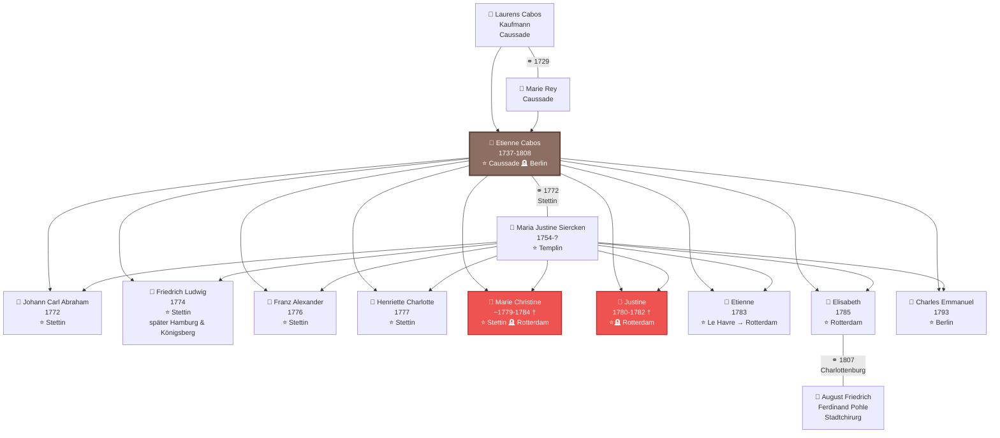
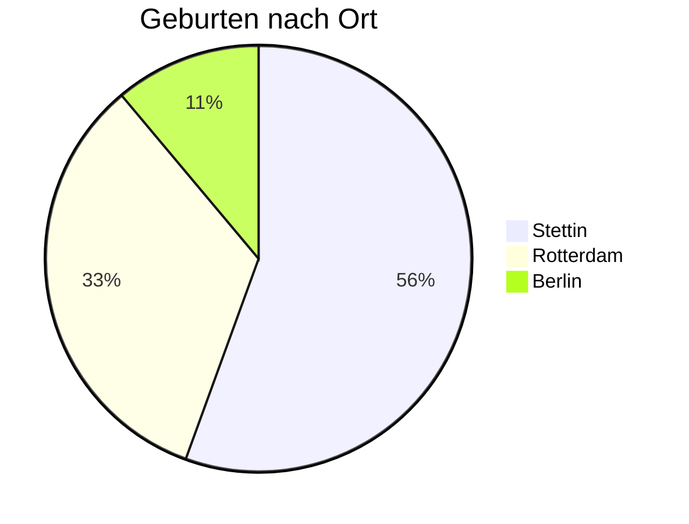

# Stammbaum der Familie Cabos

Diese Seite zeigt die genealogischen Verbindungen der Familie Cabos über drei Generationen hinweg, von der Hochzeit von Laurens Cabos und Marie Rey 1729 bis zur Geburt des letzten Kindes Charles Emmanuel 1793.

---

## Generationsüberblick

**Legende:**
- ⭐ = Geburtsort
- 🪦 = Sterbeort
- ⚭ = Hochzeit
- † = früh verstorben
- Braun = Etienne Cabos (Hauptperson)
- Rot = Im Kindesalter verstorben

---

## Familienmitglieder im Detail

### Generation I: Die Eltern von Etienne

#### 👨 Laurens Cabos
- **Beruf:** Kaufmann
- **Wohnort:** Caussade, Frankreich (Quercy)
- **Hochzeit:** 14. Juli 1729 mit Marie Rey
- **Religion:** Protestantisch (Hugenotte), katholisch getraut
- **Sozialstand:** Angesehenes Bürgertum

[→ Hochzeitsdokument 1729](dokumente/hochzeit-laurens-1729.md)

#### 👩 Marie Rey
- **Herkunft:** Caussade, Frankreich
- **Hochzeit:** 14. Juli 1729
- **Religion:** Protestantisch (Hugenottin)

---

### Generation II: Etienne Cabos

#### 👤 Etienne Cabos (1737-1808)
- **Geburt:** 9. Juli 1737 in Caussade, Frankreich
- **Taufe:** 10. Juli 1737
- **Tod:** 29. Mai 1808 in Berlin, Preußen (Schlaganfall, 71 Jahre)
- **Hochzeit:** 16. Juli 1772 in Stettin mit Maria Justine Siercken
- **Beruf:** Soldat (Grenadier-Bataillon von Arnim), später Galanteriwarenhändler, dann Zahnarzt
- **Lebensstationen:**
    - 1737-1757: Caussade (Kindheit)
    - 1757-1780: Stettin (Militärdienst, Ehe)
    - 1780-1792: Rotterdam (Händler)
    - 1792-1808: Berlin/Halle (Zahnarzt)

**Bedeutende Ereignisse:**
- 1778-1779: Teilnahme am Bayerischen Erbfolgekrieg ("Kartoffelkrieg")
- 1780: Bürgerrecht in Rotterdam
- 1792: Wirtschaftlicher Bankrott, Umsiedlung nach Preußen
- 1793: Neubeginn als Zahnarzt in Berlin

[→ Taufurkunde 1737](dokumente/taufe-etienne-1737.md) | [→ Sterbeurkunde 1808](dokumente/sterbeurkunde-1808.md)

#### 👩 Maria Justine Siercken (1754-?)
- **Geburt:** 28. Januar 1754 in Templin, Preußen
- **Vater:** Stadtmusiker in Templin
- **Hochzeit:** 16. Juli 1772 (mit 18 Jahren)
- **Kinder:** 9 Kinder (1772-1793)
- **Lebensstationen:** Templin → Stettin → Rotterdam → Berlin

[→ Hochzeitsurkunde 1772](dokumente/hochzeit-stettin-1772.md)

---

### Generation III: Die Kinder

#### In Stettin geboren (1772-1779)

##### 👦 Johann Carl Abraham (1772)
- **Geburt:** 29. November 1772
- **Taufe:** 3. Dezember 1772
- **Besonderheit:** Erstes Kind, nur 4 Monate nach der Hochzeit

[→ Zum Dokument](dokumente/geburten-stettin.md#johann-carl-abraham-1772)

##### 👦 Friedrich Ludwig Abraham Isaac (1774)
- **Geburt:** 27. April 1774
- **Weiterer Lebensweg:**
    - 28. März 1806: Bürger in Hamburg
    - 4. Mai 1806: Hochzeit mit Anna Monica Jacobsen (Hamburger Michel)
    - Später Umzug nach Königsberg
- **Paten:** Major von Wrangel, Major von Arnim, Fräulein von Zarkow

[→ Zum Dokument](dokumente/geburten-stettin.md#friedrich-ludwig-abraham-isaac-1774)

##### 👦 Franz Alexander George Carl (1776)
- **Geburt:** 29. Januar 1776

[→ Zum Dokument](dokumente/geburten-stettin.md#franz-alexander-george-carl-1776)

##### 👧 Henriette Charlotte Sophie (1777)
- **Geburt:** 29. Dezember 1777
- **Besonderheit:** Erste Tochter
- **Paten:** Frau Lieutenant von Braunschweig (geb. von Wedel), Frau Hauptmann von Schwerin

[→ Zum Dokument](dokumente/geburten-stettin.md#henriette-charlotte-sophie-1777)

##### 👧 Marie Christine (~1779-1784) †
- **Geburt:** ca. 1779 in Stettin
- **Tod:** Juni 1784 in Rotterdam
- **Alter bei Tod:** 5 1/4 Jahre
- **Wohnort beim Tod:** Vissersdijk (Galanteriewarengeschäft)

[→ Zum Dokument](dokumente/begraebnisse-rotterdam.md#begrabnis-marie-christine-1784)

---

#### In Rotterdam geboren (1780-1785)

##### 👧 Justine (1780-1782) †
- **Geburt:** 4. September 1780
- **Taufe:** 13. September 1780 (wallonische Kirche)
- **Tod:** 12. September 1782
- **Alter bei Tod:** knapp 2 Jahre

[→ Taufe](dokumente/taufen-rotterdam.md#taufe-justine-1780) | [→ Begräbnis](dokumente/begraebnisse-rotterdam.md#begrabnis-justine-1782)

##### 👦 Etienne (1783)
- **Geburt:** 19. April 1783 auf einer Reise von Le Havre nach Rotterdam
- **Taufe:** 26. April 1783 in Rotterdam
- **Besonderheit:** Namensgeber des Vaters, außergewöhnlicher Geburtsort

[→ Zum Dokument](dokumente/taufen-rotterdam.md#taufe-etienne-1783)

##### 👧 Elisabeth (1785)
- **Geburt:** 12. September 1785
- **Taufe:** 25. September 1785 (wallonische Kirche)
- **Hochzeit:** 1807 in Charlottenburg
- **Ehemann:** August Friedrich Ferdinand Pohle (Stadtchirurg)
- **Besonderheit:** Letztes in Rotterdam geborenes Kind

[→ Zum Dokument](dokumente/taufen-rotterdam.md#taufe-elisabeth-1785)

---

#### In Berlin geboren (1793)

##### 👦 Charles Emmanuel (1793)
- **Geburt:** 24. Januar 1793 in Berlin
- **Taufe:** 1. Februar 1793 (Französisch-reformierte Friedrichstadtkirche)
- **Paten:**
    - Charles Emanuel Baron de Hoffstaedt (Geheimer Rat)
    - Agnes Louise Amelie Palmie (geb. Rauch)
- **Besonderheit:** Jüngstes Kind, hochrangige Paten, Vater als "Dentiste" vermerkt

[→ Zum Dokument](dokumente/taufe-berlin-1793.md)

---

## Geografische Verteilung der Geburten

| Ort | Zeitraum | Anzahl Kinder | Überlebende |
|-----|----------|---------------|-------------|
| **Stettin** | 1772-1779 | 5 | 4 (Marie Christine † 1784) |
| **Rotterdam** | 1780-1785 | 3 | 1 (Justine † 1782) |
| **Berlin** | 1793 | 1 | 1 |
| **Gesamt** | | **9** | **mindestens 6** |

---

## Kindersterblichkeit

Von den neun Kindern der Familie Cabos starben mindestens zwei im Kindesalter:

| Name | Geburtsort | Sterbeort | Alter |
|------|------------|-----------|-------|
| **Justine** | Rotterdam | Rotterdam | ca. 2 Jahre |
| **Marie Christine** | Stettin | Rotterdam | 5 1/4 Jahre |

Die Kindersterblichkeitsrate in der Familie Cabos (22% nachweislich) entsprach etwa dem Durchschnitt der damaligen Zeit, in der etwa ein Drittel aller Kinder vor dem fünften Lebensjahr starb.

---

## Die wallonische Verbindung

Alle in Rotterdam geborenen Kinder wurden in der **wallonischen (französisch-reformierten) Kirche** getauft. Diese Kirchen waren traditionelle Anlaufstellen für französischsprachige Protestanten und Hugenotten in den Niederlanden.

Auch in Berlin wurde Charles Emmanuel in der **französisch-reformierten Friedrichstadtkirche** getauft - ein Zeichen der fortbestehenden hugenottischen Identität der Familie, auch nach drei Generationen.

---

## Soziale Mobilität durch Patenschaft

Die Taufpaten der Kinder zeigen die bemerkenswerte soziale Stellung der Familie:

**In Stettin (Militärzeit):**
- Major von Wrangel
- Major von Arnim (Kompaniechef)
- Frau Lieutenant von Braunschweig
- Frau Hauptmann von Schwerin

**In Berlin (als Zahnarzt):**
- Charles Emanuel Baron de Hoffstaedt (Geheimer Rat)
- Agnes Louise Amelie Palmie (geb. Rauch)

Trotz einfacher Herkunft als Soldat und Händler gelang es Etienne Cabos, Verbindungen zu Adel und höheren Gesellschaftskreisen aufzubauen.

---

## Weiterführende Informationen

- [→ Zur Zeitleiste](zeitleiste.md)
- [→ Zu den Dokumenten](dokumente/index.md)
- [→ Zu den Quellen](quellen.md)
- [→ Zurück zur Startseite](index.md)
