# Stammbaum der Familie Cabos

Diese Seite zeigt die genealogischen Verbindungen der Familie Cabos über drei Generationen hinweg, von der Hochzeit von Laurens Cabos und Marie Rey 1729 bis zur Geburt des letzten Kindes Charles Emmanuel 1793.

---

## Generationsüberblick

```mermaid
graph TD
    A["👨 Laurens Cabos<br/>Kaufmann<br/>Caussade"] --> H1["💒 Hochzeit<br/>14. Juli 1729<br/>Caussade"]
    B["👩 Marie Rey<br/>Caussade"] --> H1

    H1 --> S0["👤 ??? Cabos<br/>vor 1737-?<br/>älterer Bruder?"]
    H1 --> C["👤 Etienne Cabos<br/>1737-1808<br/>⭐ Caussade 🪦 Berlin"]
    H1 --> S1["👦 Jean Cabos<br/>~1730-1796<br/>⭐🪦 Caussade"]
    H1 --> S2["👦 Pierre Cabos<br/>1740-?<br/>⭐ Caussade"]

    C --> H2["💒 Hochzeit<br/>16. Juli 1772<br/>Stettin"]
    D["👩 Maria Justine Siercken<br/>1754-1810<br/>⭐ Templin 🪦 Charlottenburg"] --> H2

    H2 --> E1["👦 Johann Carl Abraham<br/>1772<br/>⭐ Stettin"]
    H2 --> E2["👦 Friedrich Ludwig<br/>1774<br/>⭐ Stettin<br/>später Hamburg & Königsberg"]
    H2 --> E3["👦 Franz Alexander<br/>1776<br/>⭐ Stettin"]
    H2 --> E4["👧 Henriette Charlotte<br/>1777<br/>⭐ Stettin"]
    H2 --> E5["👧 Marie Christine<br/>~1779-1784 †<br/>⭐ Stettin 🪦 Rotterdam"]
    H2 --> E6["👧 Justine<br/>1780-1782 †<br/>⭐🪦 Rotterdam"]
    H2 --> E7["👦 Etienne<br/>1783-1852<br/>⭐ Le Havre 🪦 Anklam"]
    H2 --> E8["👧 Anne Elisabeth<br/>1785-1866<br/>⭐ Rotterdam 🪦 Groß Jehser"]
    H2 --> E9["👦 Charles Emmanuel<br/>1793-1852<br/>⭐ Berlin 🪦 Lippehne"]

    E8 --> H3["💒 Hochzeit<br/>1807<br/>Charlottenburg"]
    F["👨 August Friedrich<br/>Ferdinand Pohle<br/>Stadtchirurg"] --> H3

    style C fill:#8d6e63,stroke:#5d4037,stroke-width:3px,color:#fff
    style S0 fill:#9e9e9e,stroke:#616161,stroke-width:2px,stroke-dasharray:5,color:#fff
    style S1 fill:#7986cb,stroke:#3f51b5,stroke-width:2px,color:#fff
    style S2 fill:#7986cb,stroke:#3f51b5,stroke-width:2px,color:#fff
    style E5 fill:#ef5350,stroke:#c62828,stroke-width:2px,color:#fff
    style E6 fill:#ef5350,stroke:#c62828,stroke-width:2px,color:#fff
    style H1 fill:#ffd54f,stroke:#f9a825,stroke-width:2px
    style H2 fill:#ffd54f,stroke:#f9a825,stroke-width:2px
    style H3 fill:#ffd54f,stroke:#f9a825,stroke-width:2px

    classDef mainPerson fill:#8d6e63,stroke:#5d4037,stroke-width:3px,color:#fff
    classDef sibling fill:#7986cb,stroke:#3f51b5,stroke-width:2px,color:#fff
    classDef unknown fill:#9e9e9e,stroke:#616161,stroke-width:2px,stroke-dasharray:5,color:#fff
    classDef deceased fill:#ef5350,stroke:#c62828,stroke-width:2px,color:#fff
    classDef marriage fill:#ffd54f,stroke:#f9a825,stroke-width:2px
```

**Legende:**
- ⭐ = Geburtsort
- 🪦 = Sterbeort
- 💒 = Hochzeit (eigener Knoten)
- † = früh verstorben
- Braun = Etienne Cabos (Hauptperson)
- Blau = Geschwister von Etienne
- Grau gestrichelt = Unbestätigt/vermutet
- Rot = Im Kindesalter verstorben
- Gelb = Hochzeitsknoten

---

## Familienmitglieder im Detail

### Generation I: Die Eltern von Etienne

#### 👨 Laurens Cabos
- **Beruf:** Kaufmann
- **Wohnort:** Caussade, Frankreich (Quercy)
- **Hochzeit:** 14. Juli 1729 mit Marie Rey
- **Religion:** Protestantisch (Hugenotte), katholisch getraut
- **Sozialstand:** Angesehenes Bürgertum

[→ Hochzeitsdokument 1729](dokumente/hochzeit-laurens-1729.md)

#### 👩 Marie Rey
- **Herkunft:** Caussade, Frankreich
- **Hochzeit:** 14. Juli 1729
- **Religion:** Protestantisch (Hugenottin)

---

### Generation II: Die Söhne von Laurens und Marie

#### 👤 ??? Cabos (vor 1737 - ?)
- **Geburt:** vor 1737 (vermutlich)
- **Status:** Unbestätigt
- **Hinweis:** Das [Bulletin 1907](dokumente/bulletin-1907.md) behauptet, Etiennes "älterer Bruder" sei in Caussade hingerichtet worden. Weder Jean noch Pierre können dieser Bruder sein. Wenn die Behauptung stimmt, muss es einen vierten, älteren Bruder gegeben haben.

!!! warning "Forschungsbedarf"
    Die Existenz dieses Bruders ist nicht durch Primärquellen belegt.

#### 👤 Etienne Cabos (1737-1808)
- **Geburt:** 9. Juli 1737 in Caussade, Frankreich
- **Taufe:** 10. Juli 1737
- **Tod:** 14. September 1808 in Charlottenburg (Schlaganfall, 71 Jahre)
- **Hochzeit:** 16. Juli 1772 in Stettin mit Maria Justine Siercken
- **Beruf:** Soldat (Grenadier-Bataillon von Arnim), später Galanteriwarenhändler, dann Zahnarzt
- **Lebensstationen:**
    - 1737-1757: Caussade (Kindheit)
    - 1757-1780: Stettin (Militärdienst, Ehe)
    - 1780-1792: Rotterdam (Händler)
    - 1792-1808: Berlin/Halle (Zahnarzt)

**Bedeutende Ereignisse:**
- 1778-1779: Teilnahme am Bayerischen Erbfolgekrieg ("Kartoffelkrieg")
- 1780: Bürgerrecht in Rotterdam
- 1792: Wirtschaftlicher Bankrott, Umsiedlung nach Preußen
- 1793: Neubeginn als Zahnarzt in Berlin

[→ Taufurkunde 1737](dokumente/taufe-etienne-1737.md) | [→ Sterbeurkunde 1808](dokumente/sterbeurkunde-1808.md)

#### 👦 Jean Cabos (~1730-1796)
- **Geburt:** ca. 1730 (geschätzt)
- **Tod:** 4. November 1796 in Caussade
- **Hochzeit:** 3./8. Februar 1760 mit Jeanne Fournier
- **Religion:** Protestantisch (Trauung "au Désert" durch Pastor Lafond)
- **Besonderheit:** Blieb in Caussade, starb dort friedlich während der Französischen Revolution

!!! success "Nicht der hingerichtete Bruder"
    Die Sterbeurkunde von 1796 beweist, dass Jean nicht hingerichtet wurde.

[→ Hochzeitsdokument 1760](dokumente/hochzeit-jean-1760.md)

#### 👦 Pierre Cabos (1740-?)
- **Geburt:** 1. November 1740 in Caussade
- **Taufe:** 1. November 1740
- **Eltern:** Laurens Cabos und Marie Rey
- **Besonderheit:** Jüngerer Bruder von Etienne (3 Jahre jünger)

!!! info "Nicht der ältere Bruder"
    Pierre wurde 1740 geboren, also 3 Jahre nach Etienne - er kann nicht der "ältere hingerichtete Bruder" aus dem Bulletin 1907 sein.

[→ Taufdokument 1740](dokumente/taufe-pierre-1740.md)

---

### Etienne und Maria Justine

#### 👩 Maria Justine Siercken (1754-1810)
- **Geburt:** 28. Januar 1754 in Templin, Preußen
- **Tod:** 10. September 1810 in Charlottenburg (Ruhr, 56 Jahre)
- **Vater:** Stadtmusiker in Templin
- **Hochzeit:** 16. Juli 1772 (mit 18 Jahren)
- **Kinder:** 9 Kinder (1772-1793)
- **Lebensstationen:** Templin → Stettin → Rotterdam → Berlin/Charlottenburg
- **Besonderheit:** Im Sterbeeintrag als "separirte" (getrennt lebend) bezeichnet

[→ Hochzeitsurkunde 1772](dokumente/hochzeit-stettin-1772.md) | [→ Sterbeurkunde 1810](dokumente/sterbeurkunde-justine-1810.md)

---

### Generation III: Die Kinder

#### In Stettin geboren (1772-1779)

##### 👦 Johann Carl Abraham (1772)
- **Geburt:** 29. November 1772
- **Taufe:** 3. Dezember 1772
- **Besonderheit:** Erstes Kind, nur 4 Monate nach der Hochzeit

!!! note "Namensabweichung in den Kirchenbüchern"
    Im Taufeintrag wird die Mutter als "Christine Siegrigen" bezeichnet. Dies ist höchstwahrscheinlich eine Verschreibung von **"Justine Siercken"** (Maria Justine Siercken). Solche phonetischen Verschreibungen waren in handschriftlichen Kirchenbüchern üblich, besonders bei ungewöhnlichen Namen. Der zeitliche Kontext (4 Monate nach der Hochzeit von Etienne und Maria Justine) und die Tatsache, dass alle späteren Kinder eindeutig als Kinder von Maria Justine Siercken dokumentiert sind, bestätigen die Identität.

[→ Zum Dokument](dokumente/geburten-stettin.md#johann-carl-abraham-1772)

##### 👦 Friedrich Ludwig Abraham Isaac (1774)
- **Geburt:** 27. April 1774
- **Weiterer Lebensweg:**
    - 28. März 1806: Bürger in Hamburg
    - 4. Mai 1806: Hochzeit mit Anna Monica Jacobsen (Hamburger Michel)
    - Später Umzug nach Königsberg
- **Paten:** Major von Wrangel, Major von Arnim, Fräulein von Zarkow

[→ Zum Dokument](dokumente/geburten-stettin.md#friedrich-ludwig-abraham-isaac-1774)

##### 👦 Franz Alexander George Carl (1776)
- **Geburt:** 29. Januar 1776

[→ Zum Dokument](dokumente/geburten-stettin.md#franz-alexander-george-carl-1776)

##### 👧 Henriette Charlotte Sophie (1777)
- **Geburt:** 29. Dezember 1777
- **Besonderheit:** Erste Tochter
- **Paten:** Frau Lieutenant von Braunschweig (geb. von Wedel), Frau Hauptmann von Schwerin

[→ Zum Dokument](dokumente/geburten-stettin.md#henriette-charlotte-sophie-1777)

##### 👧 Marie Christine (~1779-1784) †
- **Geburt:** ca. 1779 in Stettin
- **Tod:** Juni 1784 in Rotterdam
- **Alter bei Tod:** 5 1/4 Jahre
- **Wohnort beim Tod:** Vissersdijk (Galanteriewarengeschäft)

[→ Zum Dokument](dokumente/begraebnisse-rotterdam.md#begrabnis-marie-christine-1784)

---

#### In Rotterdam geboren (1780-1785)

##### 👧 Justine (1780-1782) †
- **Geburt:** 4. September 1780
- **Taufe:** 13. September 1780 (wallonische Kirche)
- **Tod:** 12. September 1782
- **Alter bei Tod:** knapp 2 Jahre

[→ Taufe](dokumente/taufen-rotterdam.md#taufe-justine-1780) | [→ Begräbnis](dokumente/begraebnisse-rotterdam.md#begrabnis-justine-1782)

##### 👦 Etienne (1783-1852)
- **Geburt:** 19. April 1783 auf einer Reise von Le Havre nach Rotterdam
- **Taufe:** 26. April 1783 in Rotterdam
- **Tod:** 17. Mai 1852 in Anklam
- **Besonderheit:** Namensgeber des Vaters, außergewöhnlicher Geburtsort

[→ Zum Dokument](dokumente/taufen-rotterdam.md#taufe-etienne-1783)

##### 👧 Anne Elisabeth (1785-1866)
- **Geburt:** 12. September 1785
- **Taufe:** 25. September 1785 (wallonische Kirche)
- **Hochzeit:** 16. August 1807 in Charlottenburg
- **Ehemann:** August Friedrich Ferdinand Pohle (Stadtchirurg)
- **Tod:** 21. Dezember 1866 in Groß Jehser, Brandenburg
- **Begräbnis:** 24. Dezember 1866
- **Besonderheit:** Letztes in Rotterdam geborenes Kind, einziges Kind mit vollständiger Dokumentation

[→ Taufe Rotterdam](dokumente/taufen-rotterdam.md#taufe-elisabeth-1785) | [→ Hochzeit & Tod](dokumente/hochzeit-elisabeth-1807.md)

---

#### In Berlin geboren (1793)

##### 👦 Charles Emmanuel (1793-1852)
- **Geburt:** 24. Januar 1793 in Berlin
- **Taufe:** 1. Februar 1793 (Französisch-reformierte Friedrichstadtkirche)
- **Tod:** 23. Januar 1852 in Lippehne
- **Paten:**
    - Charles Emanuel Baron de Hoffstaedt (Geheimer Rat)
    - Agnes Louise Amelie Palmie (geb. Rauch)
- **Besonderheit:** Jüngstes Kind, hochrangige Paten, Vater als "Dentiste" vermerkt

[→ Zum Dokument](dokumente/taufe-berlin-1793.md)

---

## Geografische Verteilung der Geburten

| Ort | Zeitraum | Anzahl Kinder | Überlebende |
|-----|----------|---------------|-------------|
| **Stettin** | 1772-1779 | 5 | 4 (Marie Christine † 1784) |
| **Rotterdam** | 1780-1785 | 3 | 1 (Justine † 1782) |
| **Berlin** | 1793 | 1 | 1 |
| **Gesamt** | | **9** | **mindestens 6** |

---

## Kindersterblichkeit

Von den neun Kindern der Familie Cabos starben mindestens zwei im Kindesalter:

| Name | Geburtsort | Sterbeort | Alter |
|------|------------|-----------|-------|
| **Justine** | Rotterdam | Rotterdam | ca. 2 Jahre |
| **Marie Christine** | Stettin | Rotterdam | 5 1/4 Jahre |

Die Kindersterblichkeitsrate in der Familie Cabos (22% nachweislich) entsprach etwa dem Durchschnitt der damaligen Zeit, in der etwa ein Drittel aller Kinder vor dem fünften Lebensjahr starb.

---

## Die wallonische Verbindung

Alle in Rotterdam geborenen Kinder wurden in der **wallonischen (französisch-reformierten) Kirche** getauft. Diese Kirchen waren traditionelle Anlaufstellen für französischsprachige Protestanten und Hugenotten in den Niederlanden.

Auch in Berlin wurde Charles Emmanuel in der **französisch-reformierten Friedrichstadtkirche** getauft - ein Zeichen der fortbestehenden hugenottischen Identität der Familie, auch nach drei Generationen.

---

## Soziale Mobilität durch Patenschaft

Die Taufpaten der Kinder zeigen die bemerkenswerte soziale Stellung der Familie:

**In Stettin (Militärzeit):**
- Major von Wrangel
- Major von Arnim (Kompaniechef)
- Frau Lieutenant von Braunschweig
- Frau Hauptmann von Schwerin

**In Berlin (als Zahnarzt):**
- Charles Emanuel Baron de Hoffstaedt (Geheimer Rat)
- Agnes Louise Amelie Palmie (geb. Rauch)

Trotz einfacher Herkunft als Soldat und Händler gelang es Etienne Cabos, Verbindungen zu Adel und höheren Gesellschaftskreisen aufzubauen.

---

## Nachkommen-Übersicht (PDF)

Eine vollständige grafische Darstellung der Nachkommen von Etienne Cabos steht als PDF-Dokument zur Verfügung:

**[📄 Nachkommen von Etienne Cabos (1737-1808)](dokumente/etienne1737_compact.pdf)** *(PDF)*

Dieses Dokument zeigt die vollständige Nachkommenschaft von Etienne Cabos und Maria Justine Siercken über mehrere Generationen hinweg in kompakter Form.

---

## Weiterführende Informationen

- [→ Zur Zeitleiste](zeitleiste.md)
- [→ Zu den Dokumenten](dokumente/index.md)
- [→ Zu den Quellen](quellen.md)
- [→ Zurück zur Startseite](index.md)
